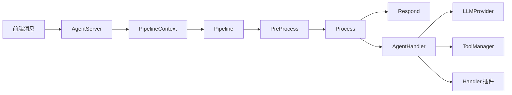

# NyaDeskPet — Copilot 开发指引

## 项目概述

跨平台 Electron 桌面宠物应用。前端以 PixiJS + Live2D Cubism SDK 渲染模型，主进程内运行 WebSocket Agent 服务器，通过 Pipeline 管线驱动 LLM 推理与工具调用。TypeScript 5.3 全栈开发。

## 架构设计

### 进程模型

| 层级 | 职责 | 入口 |
|------|------|------|
| **主进程** | Electron 窗口、IPC、Agent 服务器、ASR | `src/main.ts` → `dist/main.js` |
| **预加载** | 安全的 IPC 桥接 | `src/preload.ts` → `dist/preload.js` |
| **渲染进程** | Live2D、对话 UI、音频、设置、插件 | `renderer/js/*.ts` → `renderer/js/*.js` |

### Agent 框架



- **Provider 层**：`LLMProvider`（openai / deepseek / openrouter / siliconflow）、`TTSProvider`（fish-audio / edge-tts），均支持多实例共存
- **Pipeline 层**：`PreProcessStage`（日志/优先级）→ `ProcessStage`（Handler 派发）→ `RespondStage`（批量发送）
- **Context 层**：`PipelineContext`（单次消息上下文）、`SessionManager`（SQLite 持久化会话）
- **Handler 层**：业务逻辑处理 + Agent 插件机制，Handler 插件可完全接管消息处理
- **工具层**：`ToolManager`（FC 工具注册/执行）+ `MCPManager`（MCP 服务器工具发现）
- **指令层**：`CommandRegistry`（斜杠指令注册/执行，Discord 风格自动补全）

### 插件体系

| 类型 | 位置 | 语言 | 通信方式 |
|------|------|------|---------|
| **Agent 插件** | `agent-plugins/` | JS (CommonJS) | 主进程直接调用，继承 `AgentPlugin` 基类 |
| **前端插件** | `plugins/` | Python 等 | WebSocket 独立进程 |

**内置 Agent 插件**（10 个，均位于 `agent-plugins/`）：

| 插件 | 类型 | 说明 |
|------|------|------|
| `core-agent` | Handler | 核心协调器，组合下列 4 个核心插件 |
| `personality` | 普通 | 人格系统，构建结构化系统提示词 |
| `memory` | 普通 | 记忆管理，会话分离上下文 + 自动压缩 |
| `protocol-adapter` | 普通 | 协议适配，纯文本 + 动作 → 前端消息格式 |
| `expression-generator` | 普通 | 表情生成器，独立 LLM 将对话文本转化为 Live2D 控制指令 |
| `plugin-tool-bridge` | 普通 | 前端插件能力 → FC 工具桥接 |
| `info` | 普通 | `/info` 斜杠指令 |
| `web-tools` | 普通 | `fetch_url` + `search_web` 工具 |
| `input-collector` | 普通 | 输入抖动收集 |
| `image-transcriber` | 普通 | 图片转述 |

**内置前端插件**（2 个，位于 `plugins/`）：`terminal-plugin`、`ui-automation-plugin`

## 项目结构

```
src/                        主进程 TypeScript
  main.ts                   Electron 主进程、IPC Handler（~88 个）
  preload.ts                IPC 桥接
  agent-server.ts           WebSocket Agent 服务器
  asr-service.ts            Sherpa-ONNX 本地语音识别
  logger.ts                 主进程日志
  agent/                    Agent 框架核心
    index.ts                Barrel export
    provider.ts             LLM Provider 抽象 + 注册表
    tts-provider.ts         TTS Provider 抽象 + 注册表
    pipeline.ts             消息处理管线（3 Stage 洋葱模型）
    context.ts              PipelineContext + SessionManager
    handler.ts              业务逻辑处理器（含工具循环）
    database.ts             SQLite（conversations / messages / tool_definitions）
    tools.ts                Function Calling 工具管理
    mcp-client.ts           MCP 客户端（stdio / SSE）
    commands.ts             斜杠指令注册表
    agent-plugin.ts         Agent 插件框架（基类 + Manager）
    providers/              LLM: openai / deepseek / openrouter / siliconflow
    tts-providers/          TTS: fish-audio / edge-tts

renderer/                   渲染进程
  index.html                主页面
  styles.css                样式
  tsconfig.json             渲染进程编译配置
  types/global.d.ts         全局类型定义（所有接口唯一来源）
  locales/                  i18n：zh-CN.json / en-US.json
  lib/                      前端库：PixiJS / Live2D / Lucide Icons
  js/                       渲染进程模块
    renderer.ts             主协调（初始化、事件、对话管理、指令 UI）
    settings-manager.ts     设置管理（localStorage 持久化）
    live2d-manager.ts       Live2D 模型渲染与交互
    backend-client.ts       WebSocket + HTTP 后端通信
    dialogue-manager.ts     对话气泡显示
    audio-player.ts         MSE 流式音频 + 口型同步
    camera-manager.ts       摄像头管理
    microphone-manager.ts   麦克风 + ASR
    i18n-manager.ts         国际化（data-i18n 自动绑定）
    theme-manager.ts        主题（light / dark / system）
    plugin-connector.ts     前端插件进程 + WebSocket 管理
    plugin-ui.ts            插件管理面板 UI
    plugin-config-manager.ts  插件配置读写
    plugin-config-ui.ts     插件配置表单渲染
    plugin-permission-manager.ts  权限审批（5 级危险度）
    response-controller.ts  响应优先级控制
    logger.ts               渲染进程日志

agent-plugins/              Agent 插件（10 个，纯 JS CommonJS）
plugins/                    前端插件（独立进程）
models/                     Live2D 模型（含 param-map.json 参数映射表）+ ASR 模型
scripts/                    辅助脚本（check-i18n / migrate-logger / update-version）
assets/                     图标资源
docs/                       文档（固定 6 个，禁止新增）
```

## 开发原则

### 类型安全

- 所有接口类型统一在 `renderer/types/global.d.ts` 中定义
- 新增/修改接口必须同步更新类型定义

### IPC 三件套

新增 IPC 通道时，以下三处必须同步修改：

1. `src/main.ts` — `ipcMain.handle()` 处理器
2. `src/preload.ts` — `contextBridge` 桥接函数
3. `renderer/types/global.d.ts` — `ElectronAPI` 接口声明

### 消息协议

新增 WebSocket 消息类型时：

1. `renderer/types/global.d.ts` — 更新 `BackendMessage` 联合类型
2. `renderer/js/backend-client.ts` — `handleMessage` 的 switch case
3. `src/agent/pipeline.ts` — `PRIORITY_MAP` 和 `ProcessStage` case

### 国际化

- HTML 文本：使用 `data-i18n` 属性
- JS 代码：调用 `window.i18nManager.t(key)`
- 新增键必须同时更新 `zh-CN.json` 和 `en-US.json`

### 文档约束

`docs/` 下仅允许 5 个文档（API / DEVELOPMENT / USAGE / PLUGINS / AGENT_PLUGINS），严禁新增。

### 设备管理

摄像头和麦克风采用延迟初始化，仅在用户主动使用时请求权限。

## 编码规范

- 缩进：2 空格
- 命名：文件 `kebab-case`，类 `PascalCase`，变量/函数 `camelCase`，常量 `UPPER_SNAKE`
- Agent 插件：纯 JS（CommonJS），入口 `main.js`，继承 `AgentPlugin`
- 前端插件：WebSocket 通信，语言不限
- 常量：使用命名常量（`UPPER_SNAKE` 风格），禁止使用魔法数字 / 魔法字符串
- 类型：尽量避免使用 `any`，优先使用具体类型或泛型约束
- 代码卫生：避免冗余代码和死代码，删除未使用的变量、导入和不可达分支
- 日志：使用 `logger` 而非 `console`（渲染进程用 `window.logger`）

## 编译与检查

```bash
npm run compile          # tsc -p . && tsc -p renderer（src/ → dist/，renderer/js/*.ts → *.js 原地编译）
npm run check-i18n       # 校验 zh-CN / en-US 键一致性
npm run dev:mac          # macOS 开发模式（含 Sherpa-ONNX dylib 路径）
npm run dev:linux        # Linux 开发模式
npm run dev:win          # Windows 开发模式
```

修改主进程代码（src）需重启 Electron；修改渲染进程代码（js）可 Ctrl+R / Cmd+R 刷新。

## 核心文档

- README.md：项目总览
- API.md：WebSocket 消息协议规范
- DEVELOPMENT.md：架构设计与核心模块详解
- USAGE.md：用户使用指南
- PLUGINS.md：前端插件开发指南
- AGENT_PLUGINS.md：Agent 插件开发指南
