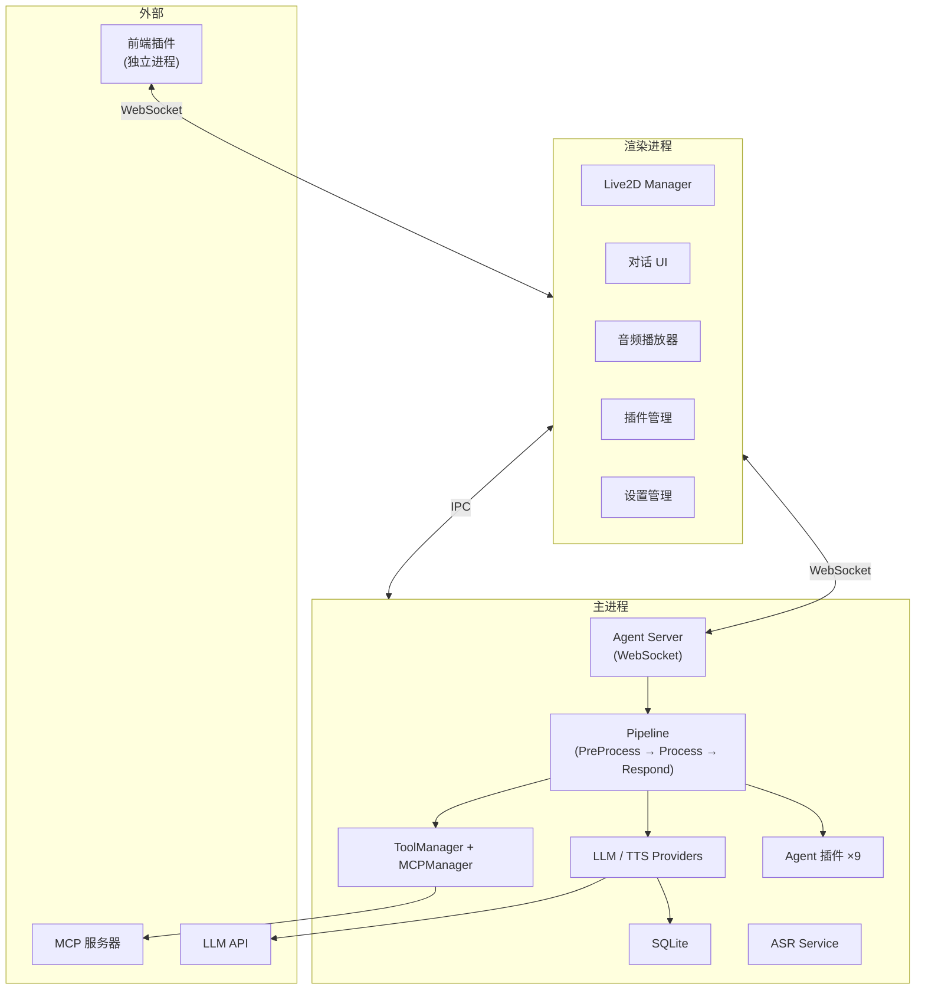

# NyaDeskPet

<div align="center">
  
  <p>基于 Electron + Live2D + AI Agent 的跨平台桌面宠物应用</p>
</div>

---

## 特性

- 🎭 **Live2D 交互** — 模型渲染、动作/表情/参数控制、视线跟随、触碰反应、滚轮缩放、口型同步
- 🤖 **内置 AI Agent** — Pipeline 管线架构，支持 5 种 LLM Provider、流式输出、Function Calling 工具循环
- 🗣️ **语音系统** — Sherpa-ONNX 离线 ASR（中英日韩粤）、双 TTS Provider（Fish Audio / Edge TTS）
- 🧩 **双插件体系** — 9 个 Agent 插件（主进程 JS）+ 2 个前端插件（独立进程 WebSocket）
- 🔧 **MCP 支持** — 连接外部 MCP 服务器，自动发现并注册工具
- 📷 **多模态输入** — 摄像头捕获、文件上传、图片转述
- 🌐 **国际化** — 中/英双语，自动跟随系统语言
- 🌙 **主题系统** — 浅色 / 深色 / 跟随系统
- 💬 **侧边栏对话** — 多会话管理、对话历史持久化、斜杠指令自动补全
- 🔒 **权限管理** — 5 级危险度审批，插件操作需用户确认
- 📥 **系统托盘** — 最小化到托盘、动态菜单、双击唤出
- 🖥️ **跨平台** — Windows / macOS / Linux

## 文档

| 文档 | 说明 |
|------|------|
| [使用指南](docs/USAGE.md) | 安装、配置、运行、打包 |
| [API 规范](docs/API.md) | WebSocket 消息协议 |
| [开发指南](docs/DEVELOPMENT.md) | 架构设计、核心模块 |
| [前端插件开发](docs/PLUGINS.md) | 前端插件 WebSocket 协议与开发流程 |
| [Agent 插件开发](docs/AGENT_PLUGINS.md) | Agent 插件基类、工具注册、Handler 插件 |

## 快速开始

```bash
# 安装依赖
npm install

# 编译 TypeScript
npm run compile

# 启动（按平台选择）
npm run dev:mac
npm run dev:linux
npm run dev:win
```

## 技术栈

| 组件 | 技术 |
|------|------|
| 应用框架 | Electron 28 |
| 开发语言 | TypeScript 5.3 |
| 渲染引擎 | PixiJS 7.3 + Live2D Cubism SDK |
| 数据持久化 | SQLite (better-sqlite3) |
| 语音识别 | Sherpa-ONNX (Sense-Voice-Small) |
| 音频格式转换 | FFmpeg |
| 图标 | Lucide Icons |

## 架构概览



## 开发辅助

```bash
npm run check-i18n              # 校验国际化键一致性
npm run migrate-logger:preview  # 预览 console → logger 迁移
npm run migrate-logger          # 执行迁移
npm run version                 # 版本号管理
```

## 许可证

[MIT License](LICENSE)
