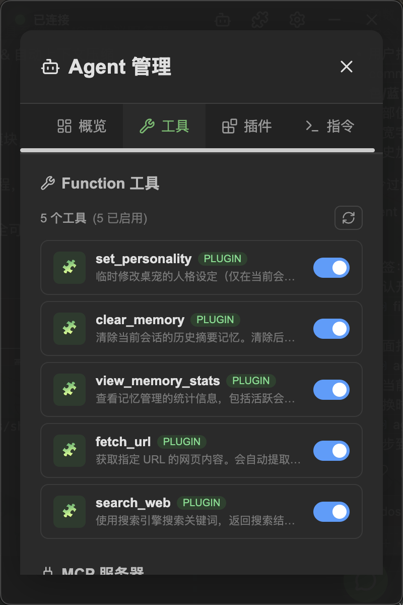
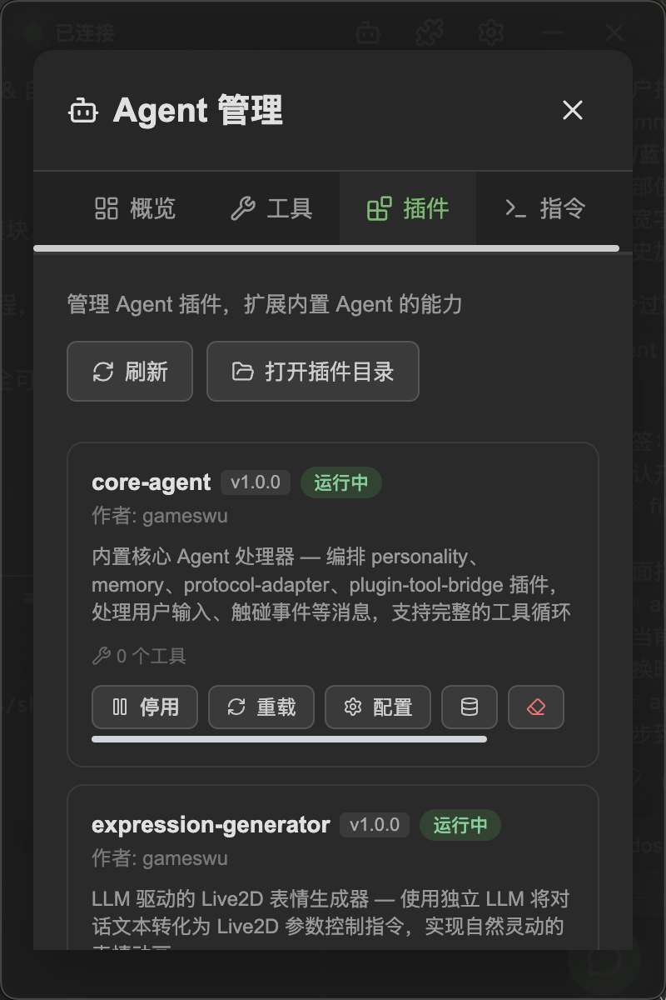
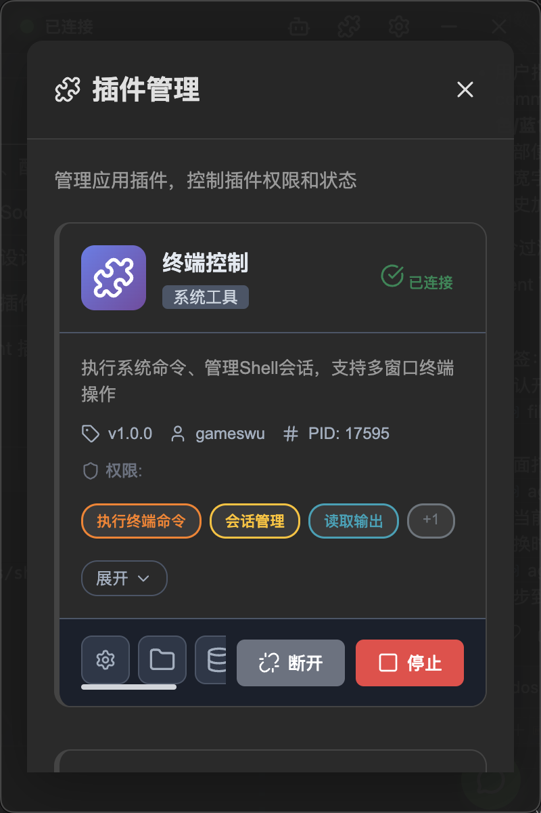
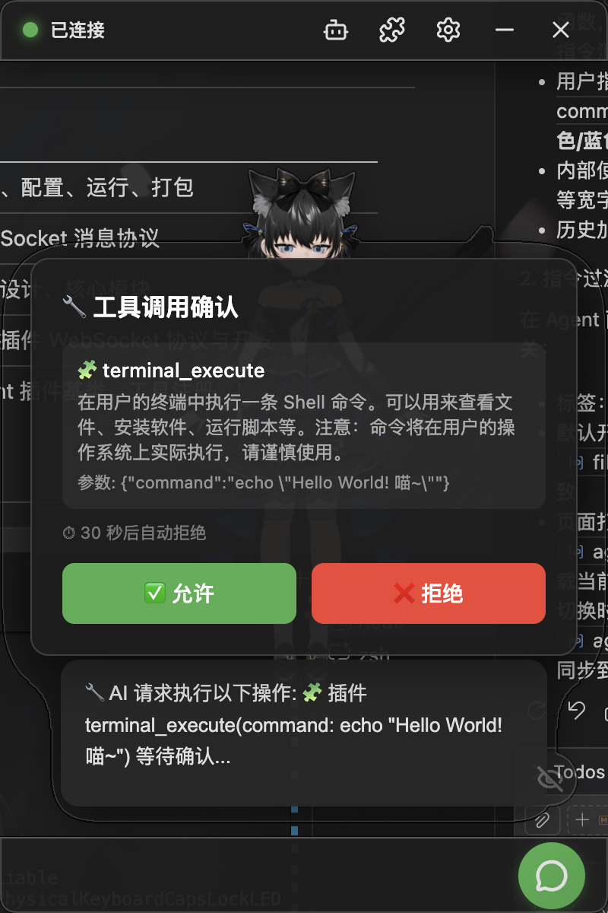
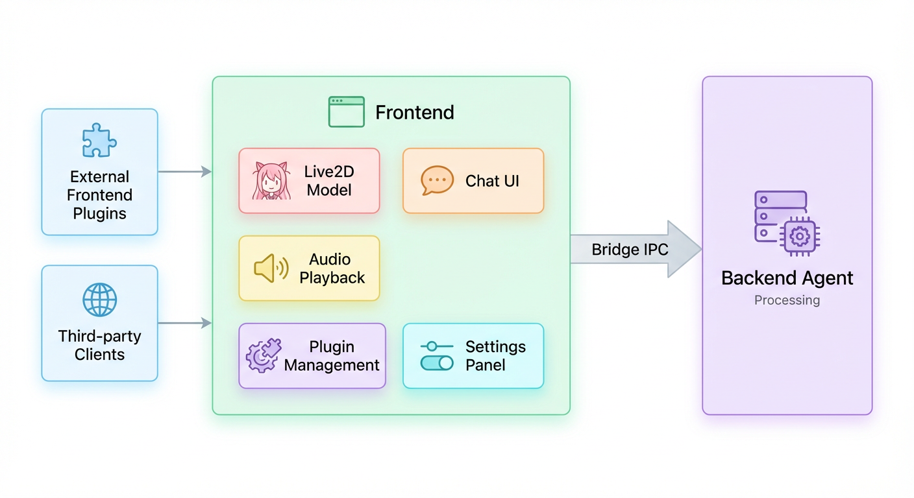

# NyaDeskPet

<div align="center">
  
  <p>基于 Live2D + AI Agent 的跨平台桌面宠物应用</p>
</div>

---

完全开源的模块化桌宠框架，支持 Live2D 交互、内置 AI Agent。开箱即用，亦可高度定制。欢迎贡献插件、模型和功能！

## 特性

### 🎭 AI 驱动 Live2D 模型

<div align="center">
  <video src="https://github.com/user-attachments/assets/1cfeda5e-88b6-4662-a4ea-d6bba0f59ebf" width="600" controls>
    您的浏览器不支持视频标签。
  </video>
</div>


- 透明无边框窗口，桌宠自然融入桌面
- AI 驱动的表情和动作，丰富生动的交互体验
- 触碰反应系统，按部位启用/禁用触碰交互
- TTS 驱动口型同步 & 流式音频播放

<details>
<summary>其他demo</summary>
<div align="center">
  
</div>
</details>

### 🤖 内置 AI Agent

<div align="center">
  <table>
    <tr>
      <td align="center">支持多个主流模型供应商</td>
      <td align="center">支持函数工具与MCP管理</td>
      <td align="center">插件化架构</td>
      <td align="center">支持自定义指令管理</td>
    </tr>
    <tr>
      <td align="center"></td>
      <td align="center"></td>
      <td align="center"></td>
      <td align="center"></td>
    </tr>
  </table>
</div>

### 🧩 插件体系

<div align="center">
  <table>
    <tr>
      <td align="center">完整的插件管理</td>
      <td align="center">插件工作鉴权</td>
    </tr>
    <tr>
      <td align="center"></td>
      <td align="center"></td>
    </tr>
  </table>
</div>

<details>
<summary>上述演示工作的结果</summary>
<div align="center">
  
  
</div>
</details>

## 文档

| 文档 | 说明 |
|------|------|
| [使用指南](docs/USAGE.md) | 安装、配置、运行、打包 |
| [API 规范](docs/API.md) | WebSocket 消息协议 |
| [开发指南](docs/DEVELOPMENT.md) | 架构设计、核心模块 |
| [前端插件开发](docs/PLUGINS.md) | 前端插件 WebSocket 协议与开发流程 |
| [Agent 插件开发](docs/AGENT_PLUGINS.md) | Agent 插件基类、工具注册、Handler 插件 |
| [更新日志](docs/CHANGELOG.md) | 版本更新记录 |

## 快速开始

```bash
# 安装依赖
npm install

# 编译 TypeScript
npm run compile

# 开发启动
npm run dev:mac
npm run dev:linux
npm run dev:win

# 打包
npm run build:mac
npm run build:linux
npm run build:win
```

## 架构

### 分离式架构

前端与后端 Agent 通过 WebSocket 完全解耦。前端仅负责展示与交互，后端独立运行 Agent 服务器，任何 WebSocket 客户端均可接入。

<div align="center">
  
</div>

### 内置 Agent 架构

内置 Agent 核心采用 Pipeline 架动设计，消息处理分为多个阶段（思考、工具调用、回复等），每个阶段可注册多个 Handler 插件，灵活定制 Agent 行为。
<div align="center">
  
</div>

## 支持

如果喜欢这个项目，欢迎点个 Star ⭐！如有任何问题或建议，请提交 Issue 或 Pull Request。

或者💗[赞助我](https://afdian.com/a/gameswu)💗

## 许可证

[MIT License](LICENSE)
