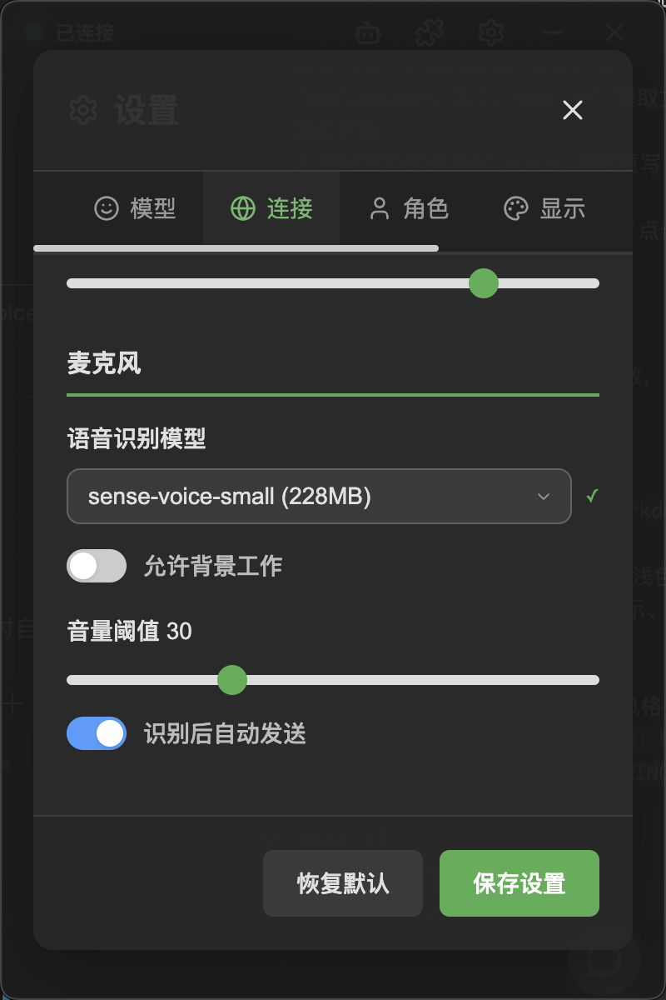

# ASR 配置

ASR（Automatic Speech Recognition，自动语音识别）功能让你可以通过语音和桌宠对话。NyaDeskPet 使用本地离线识别方案，无需联网。

## 目录
- [ASR 配置](#asr-配置)
  - [目录](#目录)
  - [前置要求](#前置要求)
    - [1. 安装 FFmpeg](#1-安装-ffmpeg)
    - [2. 下载 ASR 模型](#2-下载-asr-模型)
  - [启用语音识别](#启用语音识别)
  - [使用语音输入](#使用语音输入)
  - [麦克风设置](#麦克风设置)
    - [背景工作模式](#背景工作模式)
    - [音量阈值](#音量阈值)
  - [支持的语言](#支持的语言)
  - [常见问题](#常见问题)
  - [下一步](#下一步)

---

## 前置要求

使用语音识别需要准备两样东西：

### 1. 安装 FFmpeg

FFmpeg 是音频处理的基础工具。

**Windows：**
1. 从 [FFmpeg 官网](https://ffmpeg.org/download.html) 下载 Windows 构建版
2. 解压到任意目录（如 `C:\ffmpeg`）
3. 将 `bin` 子目录添加到系统 PATH 环境变量

**macOS：**
```bash
brew install ffmpeg
```

**Linux（Ubuntu/Debian）：**
```bash
sudo apt install ffmpeg
```

验证安装：
```bash
ffmpeg -version
```

### 2. 下载 ASR 模型

NyaDeskPet 默认使用 **Sherpa-ONNX Sense-Voice-Small** 模型，支持中文、英文、日文、韩文和粤语。

模型文件需放置在：

```
models/asr/sense-voice-small/
├── model.onnx         ← 模型文件（约 200MB）
└── tokens.txt         ← 词表文件
```

> [!TIP]
> 从 [Sherpa-ONNX 模型仓库](https://github.com/k2-fsa/sherpa-onnx) 下载对应模型。

---

## 启用语音识别

1. 确保已安装 FFmpeg 且模型文件就位
2. 打开 **设置 → 连接** 标签页
3. 在 **麦克风设置** 区域选择 ASR 模型
4. 保存设置

如果模型加载成功，对话区底栏的 **麦克风按钮** 会变为可用状态。如果模型不可用，按钮将显示为灰色。

---

## 使用语音输入

1. 点击 **麦克风按钮** 开始录音
2. 对着麦克风说话
3. **静音 1.5 秒**后自动停止识别
4. 识别结果会自动填入输入框（或直接发送，取决于设置）

---

## 麦克风设置

<div align="center">
    
</div>

在 **设置 → 连接** 标签页中，可以调整以下选项：

| 选项 | 说明 | 默认值 |
|------|------|--------|
| ASR 模型 | 选择语音识别模型 | sense-voice-small |
| 背景工作模式 | 持续监听麦克风输入 | 关闭 |
| 音量阈值 | 低于此阈值的声音被忽略 | 30 |
| 自动发送 | 识别完成后自动发送消息 | 开启 |

### 背景工作模式

开启后，麦克风会持续监听。当检测到超过阈值的声音时自动开始识别，静音后自动停止。适合解放双手的使用场景。

### 音量阈值

调整此值可以过滤环境噪音。如果在嘈杂环境中，可以适当调高阈值；在安静环境中可以调低。

---

## 支持的语言

| 语言 | 支持状态 |
|------|---------|
| 中文（普通话） | ✅ |
| 英文 | ✅ |
| 日文 | ✅ |
| 韩文 | ✅ |
| 粤语 | ✅ |

模型会自动识别语言，无需手动切换。

---

## 常见问题

**Q：麦克风按钮显示灰色**
- 检查 FFmpeg 是否安装：终端运行 `ffmpeg -version`
- 检查模型文件是否在正确位置：`models/asr/sense-voice-small/`
- 检查麦克风权限是否已授予应用

**Q：识别不准确**
- 确保周围环境安静
- 调低音量阈值
- 保持嘴巴距离麦克风适当距离

**Q：没有声音输入**
- 检查系统麦克风设置，确认默认输入设备
- macOS 用户需在系统设置中授予 NyaDeskPet 麦克风权限

---

## 下一步

配置完成后，你可以在 [对话](Conversation.md) 中使用语音输入功能了。
