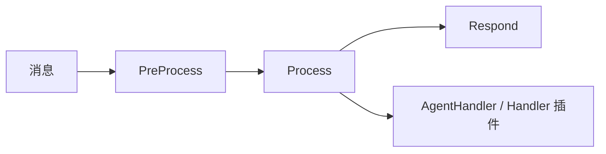
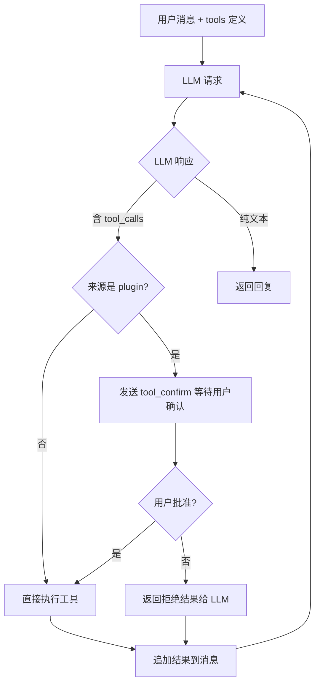

# Agent 框架

NyaDeskPet 内置了完整的 AI Agent 框架，运行在 Electron 主进程中。本文档详细介绍 Agent 框架的各个核心模块。

## 目录
- [Agent 框架](#agent-框架)
  - [目录](#目录)
  - [LLM Provider 层](#llm-provider-层)
  - [TTS Provider 层](#tts-provider-层)
  - [消息管线 (Pipeline)](#消息管线-pipeline)
  - [会话管理 (Context)](#会话管理-context)
  - [数据持久化 (Database)](#数据持久化-database)
  - [工具系统 (Tools)](#工具系统-tools)
  - [MCP 客户端](#mcp-客户端)
  - [业务处理器 (Handler)](#业务处理器-handler)
  - [多模态内容处理 (Multimodal)](#多模态内容处理-multimodal)
  - [Agent 插件系统](#agent-插件系统)
  - [斜杠指令系统](#斜杠指令系统)

---

## LLM Provider 层

**设计**：策略模式 + 注册表模式

- `LLMProvider` 抽象基类：定义 `chat()` / `chatStream()` 接口
- `providerRegistry`：全局注册表，`registerProvider()` 注册实现
- 12 种实现：`openai`、`deepseek`、`openrouter`、`siliconflow`、`gemini`、`dashscope`、`zhipu`、`volcengine`、`groq`、`mistral`、`anthropic`、`xai`
- 支持多实例共存，通过 `instanceId` 区分

扩展示例：

```typescript
class MyProvider extends LLMProvider {
  getMetadata(): ProviderMetadata {
    return {
      id: 'my-llm',
      name: 'My LLM',
      description: '自定义 LLM',
      configSchema: [
        { key: 'apiKey', label: 'API Key', type: 'password', required: true },
        { key: 'model', label: '模型', type: 'string', default: 'gpt-4' }
      ]
    };
  }
  async chat(request: LLMRequest): Promise<LLMResponse> {
    return { text: '回复', model: 'my-model' };
  }
}
registerProvider(new MyProvider({ id: 'my-llm', name: 'My LLM' }).getMetadata(), (config) => new MyProvider(config));
```

---

## TTS Provider 层

- `TTSProvider` 抽象基类：定义 `synthesize()` 流式音频合成接口
- 4 种实现：`fish-audio`、`edge-tts`、`openai-tts`、`elevenlabs`
- 同样支持多实例共存与注册表

---

## 消息管线 (Pipeline)

**设计**：洋葱模型，每条消息经过 3 个 Stage：

| 阶段 | 职责 |
|------|------|
| `PreProcessStage` | 优先级分配、消息日志 |
| `ProcessStage` | 按消息类型路由，调用 Handler 或 Agent 插件钩子 |
| `RespondStage` | 统一发送 `ctx.replies`，错误兜底 |



每个 Stage 可在 `next()` 前后执行逻辑。可通过 `insertStageBefore()` 插入自定义 Stage。

---

## 会话管理 (Context)

- **PipelineContext**：单次消息上下文，贯穿整个管线
  - `message`：原始消息
  - `replies`：回复缓冲
  - `state`：Stage 间共享数据
  - `abort()`：中止管线
- **SessionManager**：多轮对话管理
  - 固定 sessionId `'builtin'`（内置 Agent 服务器）
  - 支持新建 / 切换 / 删除对话
  - 对话历史持久化到 SQLite
  - 消息类型：text / image / file / tool_call / tool_result / system
  - 自动以第一条用户消息生成对话标题

---

## 数据持久化 (Database)

使用 `better-sqlite3`（同步 API），数据库位于 `appData/NyaDeskPet/data/agent.db`。

| 表 | 用途 |
|----|------|
| `conversations` | 对话记录（id, session_id, title, 时间戳, metadata） |
| `messages` | 消息记录（role, type, content, extra JSON, token_count） |
| `tool_definitions` | 工具定义（name, parameters JSON Schema, source, mcp_server） |

- WAL 模式提升并发性能
- 外键约束（删除对话级联删除消息）
- 全局单例 `agentDb`

---

## 工具系统 (Tools)

- `ToolManager`：工具注册表 + 执行器
  - `registerFunction(schema, handler)`：注册自定义工具
  - `registerMCPTool(schema, server, handler)`：注册 MCP 工具
  - `toOpenAITools()`：生成 OpenAI API `tools` 参数
  - `executeTool(toolCall, timeout)`：带超时执行
- 工具定义持久化到 SQLite
- 支持启用/禁用单个工具

---

## MCP 客户端

- `MCPManager`：管理多个 MCP 服务器连接
  - 支持 stdio / SSE 两种传输
  - 自动发现服务器工具并注册到 ToolManager
  - 断连自动重试
  - 配置持久化到 `appData/NyaDeskPet/data/mcp_servers.json`

MCP 服务器配置格式：

```json
{
  "name": "my-mcp-server",
  "transport": "stdio",
  "command": {
    "darwin": ["python3", "server.py"],
    "linux": ["python3", "server.py"],
    "win32": ["python", "server.py"]
  },
  "workingDirectory": "/path/to/server",
  "autoStart": true,
  "enabled": true
}
```

---

## 业务处理器 (Handler)

核心消息处理逻辑，若存在 Handler 插件则委托给插件处理：

| 方法 | 职责 |
|------|------|
| `processUserInput` | 调用 LLM，维护对话历史，工具循环，流式/非流式输出 |
| `processTapEvent` | 触碰反应（有 LLM 时智能回复，否则默认文案），持久化触碰记录 + AI 回复 |
| `processFileUpload` | 文件处理（图片转述、其他文件确认），持久化上传记录 + 响应 |
| `processCommandExecute` | 执行斜杠指令，持久化指令 + 结果 |
| `processPluginMessage` | 处理前端插件主动消息，经 LLM 处理后持久化 |
| `processModelInfo` | 存储模型状态 |
| `processCharacterInfo` | 存储角色人设 |
| `processToolConfirmResponse` | 处理工具调用确认/拒绝 |

**流式输出**：当 Provider 配置 `stream: true` 时，通过 `dialogue_stream_start/chunk/end` 三段式实时推送增量文本。流式模式下工具循环正常工作，`toolCallDeltas` 积累后统一执行。

**消息持久化**：所有产生对话内容的消息类型均自动写入会话历史，重启应用后可查看历史记录：

| 消息类型 | 持久化内容 |
|----------|------------|
| `user_input` | 用户文本 + LLM 回复 |
| `tap_event` | `[触碰] 用户触碰了 "hitArea" 部位` + AI 回复或默认反应 |
| `file_upload` | `[文件上传] 文件名 (类型)` + 转述结果或确认回复 |
| `command_execute` | `/command args` + 执行结果文本 |
| `plugin_message` | `[插件 name] text` + LLM 回复 |

`model_info`、`character_info` 等控制类消息不写入会话历史。

**工具循环**：



最大迭代 10 次。

---

## 多模态内容处理 (Multimodal)

`multimodal.ts` 提供统一的多模态内容处理工具：

- **`MultimodalContent`** 类型：统一表示图片/文件等附件内容（支持 Base64 和 URL 两种引用方式）
- **`ProviderCapabilities`** 类型：声明 Provider 的多模态能力（text / vision / file / toolCalling）
- `buildMultimodalMessage()`：构建带附件的聊天消息
- `toDataUrl()` / `fromDataUrl()`：Data URL 与 `MultimodalContent` 互转
- `isContentSupported()`：检查 Provider 是否支持指定内容类型
- `fromChatMessageImage()` / `toChatMessageImage()`：工具结果图片格式转换
- `describeContents()`：生成多模态内容的文本摘要

---

## Agent 插件系统

- `AgentPlugin`：插件基类，提供 `initialize()` / `terminate()` 生命周期钩子
- `AgentPluginManager`：扫描 agent-plugins 目录，加载、激活、管理插件
  - 自动激活（`autoActivate: true`）
  - 依赖拓扑排序（`dependencies` 数组）
  - 上下文注入（`AgentPluginContext`）
- `AgentPluginContext` 提供：工具/指令注册、Provider 调用（含 `getProviderConfig()` 获取配置详情）、多模态处理、技能系统、Handler 专用接口
- Handler 插件钩子：`onUserInput` / `onTapEvent` / `onFileUpload` / `onPluginMessage` / `onModelInfo` / `onCharacterInfo`
- 插件间通信：`ctx.getPluginInstance(name)` 获取已激活插件实例
- 内置 13 个 Agent 插件（含 planning、scheduler、image-gen 等）

详细开发指南见 [Agent 插件开发](AgentPluginDevelopment.md)

---

## 斜杠指令系统

- `CommandRegistry`：指令注册表
- Agent 插件通过 `ctx.registerCommand()` 注册指令
- 前端 Discord 风格自动补全 UI
- 连接建立时后端发送 `commands_register` 消息同步指令列表
