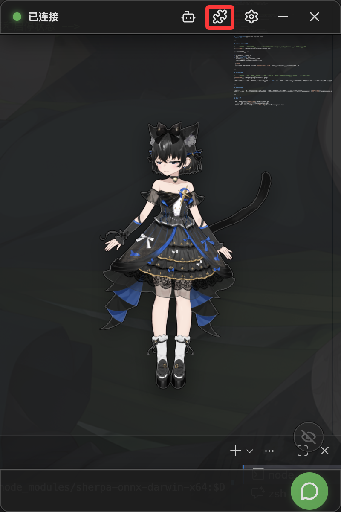
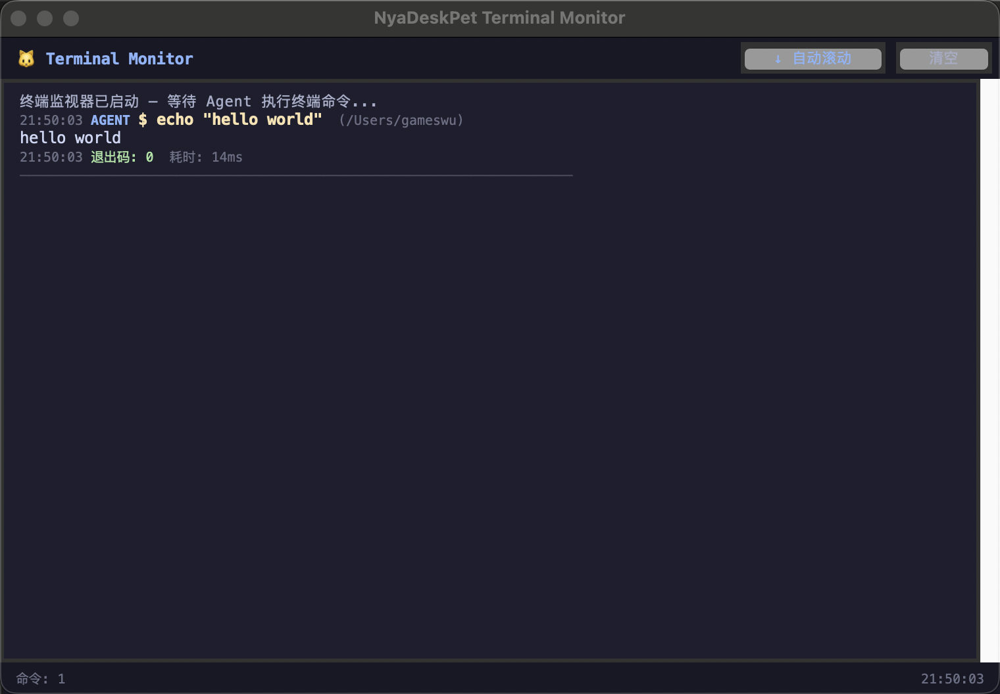
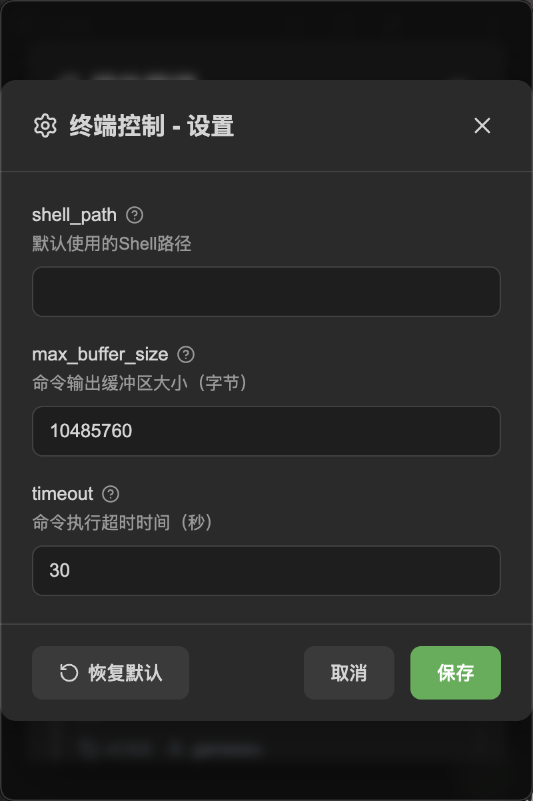

# 启用内置插件

NyaDeskPet 内置了 3 个前端插件，提供终端控制、UI 自动化和文件编辑能力。这些插件以独立进程运行，通过 WebSocket 与应用通信。

## 目录
- [启用内置插件](#启用内置插件)
  - [目录](#目录)
  - [查看插件面板](#查看插件面板)
  - [内置插件一览](#内置插件一览)
  - [终端控制插件](#终端控制插件)
  - [UI 自动化插件](#ui-自动化插件)
  - [文件编辑器插件](#文件编辑器插件)
  - [启动和停止插件](#启动和停止插件)
  - [插件配置](#插件配置)
  - [权限管理](#权限管理)
  - [下一步](#下一步)

---

## 查看插件面板

    

点击顶栏的 **插件按钮** 打开插件管理面板。在这里你可以看到所有已安装的插件及其状态。

---

## 内置插件一览

| 插件 | 功能 | 适用场景 |
|------|------|---------|
| 终端控制 | 执行系统命令、管理 Shell 会话 | 让 AI 帮你执行终端命令 |
| UI 自动化 | 鼠标键盘模拟、屏幕截图 | 让 AI 操控你的电脑界面 |
| 文件编辑器 | 读取、创建、编辑文件 | 让 AI 帮你处理文件 |

---

## 终端控制插件

    

终端控制插件允许 AI 在你的系统上执行命令。

**提供的权限：**

| 权限 | 危险等级 | 说明 |
|------|---------|------|
| `terminal.execute` | high | 执行终端命令 |
| `terminal.session` | medium | 管理 Shell 会话 |

**使用前提：** 系统需要有可用的 Shell（Windows: PowerShell/CMD，macOS/Linux: bash/zsh）。

> [!WARNING]
> 终端命令有较高的危险等级，AI 每次调用都需要你确认。请仔细阅读 AI 要执行的命令后再点击允许。

---

## UI 自动化插件

UI 自动化插件让 AI 能操控鼠标键盘和截取屏幕。

**提供的权限：**

| 权限 | 危险等级 | 说明 |
|------|---------|------|
| `ui-automation.mouse` | high | 鼠标移动和点击 |
| `ui-automation.keyboard` | high | 键盘输入和快捷键 |
| `ui-automation.screen` | medium | 屏幕截图 |

**使用前提：**
- 需要安装 Python 3 和 `pyautogui` 库
- macOS 需要在系统设置中授予辅助功能权限

---

## 文件编辑器插件

文件编辑器插件让 AI 能读取和修改你的文件。

**提供的权限：**

| 权限 | 危险等级 | 说明 |
|------|---------|------|
| `file.read` | low | 读取文件内容 |
| `file.write` | medium | 创建新文件 |
| `file.edit` | medium | 编辑现有文件 |

**使用前提：** 需要安装 Python 3。

---

## 启动和停止插件

在插件管理面板中：

1. 找到你想启用的插件
2. 点击 **启动** 按钮
3. 插件会启动独立进程并自动连接
4. 连接成功后，状态指示灯变为绿色

> [!TIP]
> 在插件的 metadata 中设置 `autoStart: true` 可以让插件在应用启动时自动运行。

---

## 插件配置

    

部分插件支持自定义配置。点击插件卡片上的 **配置** 按钮，可以修改插件特定的参数。配置项由插件自身定义，应用会自动生成对应的配置表单。

---

## 权限管理

插件在执行敏感操作时需要你的授权。首次使用某个权限时，应用会弹出确认对话框。详细信息请查看 [权限审批](Permissions.md)。

---

## 下一步

- 了解权限机制：[权限审批](Permissions.md)
- 开始和 AI 对话：[对话](Conversation.md)
- 想要开发自己的插件？查看 [插件开发](PluginDevelopment.md)
