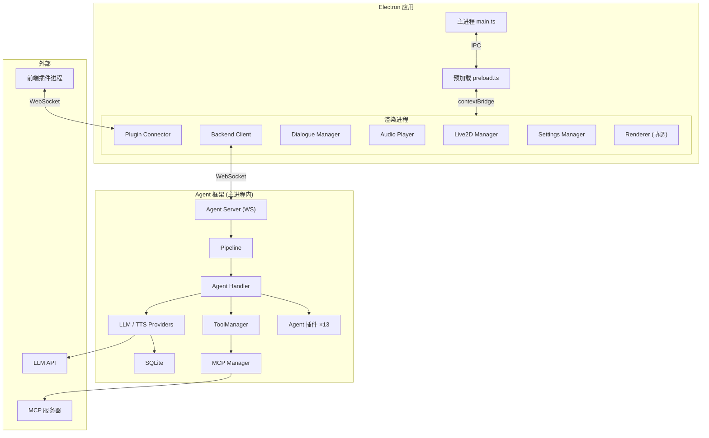

# 开发指南

本文档介绍 NyaDeskPet 的架构设计与文件结构。详细模块文档请查看：

- [Agent 框架](AgentFramework.md) — LLM/TTS Provider、消息管线、会话管理、工具系统、Handler、插件系统
- [渲染进程与其他模块](RendererModules.md) — Live2D、通信、音频、插件、ASR、版本管理、平台优化

## 目录
- [开发指南](#开发指南)
  - [目录](#目录)
  - [架构总览](#架构总览)
  - [文件结构](#文件结构)
  - [快速开始](#快速开始)
    - [环境要求](#环境要求)
    - [安装与启动](#安装与启动)
    - [打包分发](#打包分发)
  - [更多文档](#更多文档)

## 架构总览



## 文件结构

```
NyaDeskPet/
├── src/                        # 主进程源代码
│   ├── main.ts                 # Electron 主进程入口
│   ├── preload.ts              # IPC 安全桥接
│   ├── agent-server.ts         # 内置 WebSocket Agent 服务器
│   ├── asr-service.ts          # Sherpa-ONNX 离线语音识别服务
│   ├── logger.ts               # 主进程日志管理
│   └── agent/                  # Agent 核心逻辑框架
│       ├── index.ts            # 模块出口
│       ├── provider.ts         # LLM Provider 抽象层与注册表
│       ├── tts-provider.ts     # TTS Provider 抽象层与注册表
│       ├── pipeline.ts         # 消息处理管线
│       ├── context.ts          # Pipeline 上下文与会话管理
│       ├── handler.ts          # 业务逻辑
│       ├── database.ts         # SQLite 存储
│       ├── tools.ts            # Function Calling 工具管理器
│       ├── mcp-client.ts       # MCP 协议客户端 (stdio/SSE)
│       ├── commands.ts         # 斜杠指令注册表
│       ├── agent-plugin.ts     # Agent 插件基类与管理框架
│       ├── skills.ts           # Agent Skills 技能注册与管理
│       ├── multimodal.ts       # 多模态内容处理工具
│       ├── providers/          # LLM 各平台具体实现
│       └── tts-providers/      # TTS 各平台具体实现
├── renderer/                   # 渲染进程
│   ├── index.html              # 主窗口页面
│   ├── help.html               # 帮助文档页面（侧栏导航 + i18n）
│   ├── styles.css              # 全局样式
│   ├── tsconfig.json           # 渲染进程专属 TS 配置
│   ├── locales/                # 国际化多语言
│   ├── lib/                    # 核心库
│   ├── types/                  # 类型定义
│   │   └── global.d.ts         # 全局 IPC 接口与 API 类型定义
│   └── js/                     # 前端业务逻辑
│       ├── renderer.ts         # 渲染进程主协调器
│       ├── settings-manager.ts # localStorage 设置持久化
│       ├── live2d-manager.ts   # Live2D 模型加载、渲染与交互
│       ├── backend-client.ts   # 通信层
│       ├── dialogue-manager.ts # UI 对话气泡管理
│       ├── audio-player.ts     # 音频播放
│       ├── camera-manager.ts   # 视觉输入管理
│       ├── microphone-manager.ts # 音频采集与 ASR 调度
│       ├── i18n-manager.ts     # 语言切换管理
│       ├── theme-manager.ts    # 皮肤/主题切换
│       ├── plugin-connector.ts # 外部插件通信桥接
│       ├── plugin-ui.ts        # 插件中心交互界面
│       ├── plugin-config-manager.ts # 插件配置读写管理
│       ├── plugin-config-ui.ts # 动态插件配置表单
│       ├── plugin-permission-manager.ts # 插件权限审批管理
│       ├── response-controller.ts # 响应优先级状态机
│       └── logger.ts           # 渲染进程日志记录
├── agent-plugins/              # Agent 功能扩展插件
├── plugins/                    # 渲染进程独立插件
├── models/                     # 资源目录 (Live2D 模型、ASR 模型文件)
├── scripts/                    # 开发与构建辅助脚本
├── assets/                     # 静态资源
│   └── docs/                   # 应用内帮助文档 + 侧栏导航
├── docs/                       # 项目文档
├── package.json                # 项目元数据与依赖配置
└── tsconfig.json               # 全局 TypeScript 配置
```

## 快速开始

### 环境要求

- Node.js 18+
- npm
- FFmpeg（语音识别需要，用于音频格式转换）

### 安装与启动

```bash
npm install
npm run compile

# 开发模式（按平台选择）
npm run dev:mac
npm run dev:linux
npm run dev:win

# 生产模式
npm start
```

| 模式 | 特点 |
|------|------|
| 开发模式 | 窗口可调整大小、显示在任务栏、适合调试 |
| 生产模式 | 无边框透明窗口、置顶显示、系统托盘、关闭时隐藏到托盘 |

### 打包分发

```bash
npm run build:win     # Windows
npm run build:mac     # macOS
npm run build:linux   # Linux
```

---

## 更多文档

- **[Agent 框架](AgentFramework.md)** — LLM/TTS Provider、消息管线、会话管理、数据持久化、工具系统、MCP、Handler、多模态处理、Agent 插件系统、斜杠指令
- **[渲染进程与其他模块](RendererModules.md)** — Live2D、后端通信、音频、对话、设置、插件系统、国际化、主题、摄像头、麦克风、ASR、版本管理、平台优化、技术栈
