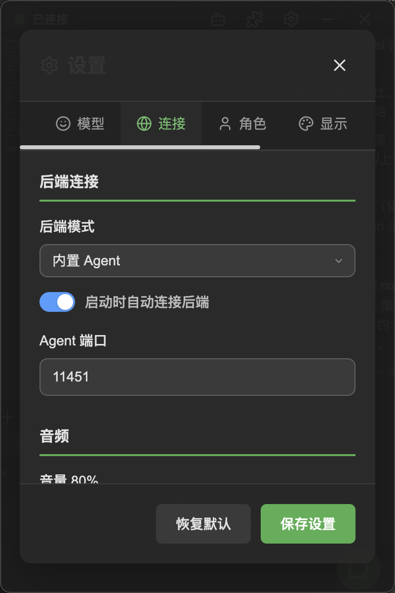
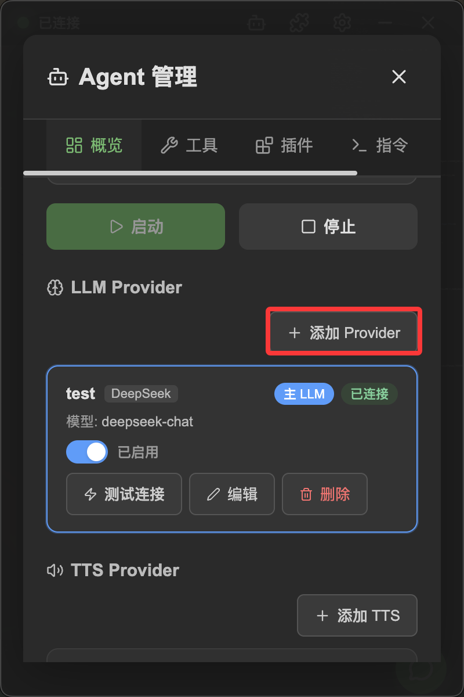
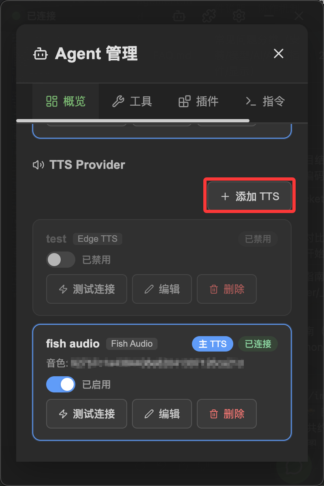
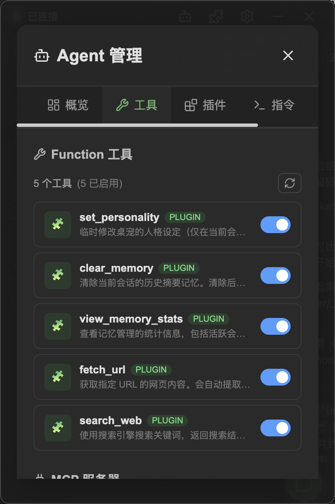
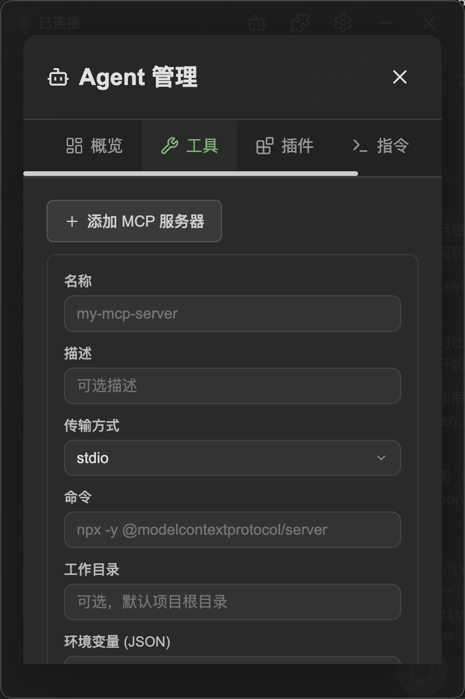
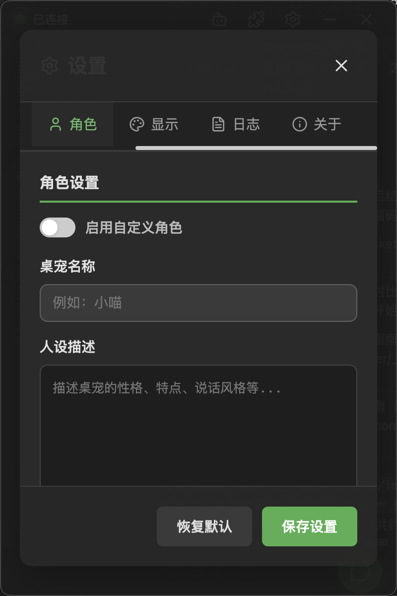

# Configure Backend Agent

The backend Agent is NyaDeskPet's "brain" — it understands what you say and generates responses. This page explains how to configure LLM (Large Language Model) providers, TTS (Text-to-Speech) providers, tools, and MCP services.

## Table of Contents
- [Configure Backend Agent](#configure-backend-agent)
  - [Table of Contents](#table-of-contents)
  - [Connection Settings](#connection-settings)
  - [Open the Agent Panel](#open-the-agent-panel)
  - [Configure LLM Providers](#configure-llm-providers)
    - [Supported Providers](#supported-providers)
    - [Add a Provider Instance](#add-a-provider-instance)
    - [Set Primary Provider](#set-primary-provider)
  - [Configure TTS Providers](#configure-tts-providers)
    - [Supported TTS Providers](#supported-tts-providers)
    - [Add a TTS Provider](#add-a-tts-provider)
  - [Tool Management](#tool-management)
    - [View Registered Tools](#view-registered-tools)
    - [Enable / Disable Tools](#enable--disable-tools)
  - [MCP Server Management](#mcp-server-management)
    - [Add an MCP Server](#add-an-mcp-server)
  - [Character Persona](#character-persona)
  - [Next Steps](#next-steps)

---

## Connection Settings

    

In the **Settings → Connection** tab, you can configure:

| Option | Description | Default |
|--------|------------|---------|
| Backend Mode | Built-in Agent or custom backend | Built-in Agent |
| Agent Port | WebSocket port for the built-in Agent | 8765 |
| Auto Connect | Automatically connect on startup | Enabled |
| Volume | TTS playback volume | 80% |

> [!TIP]
> In most cases, keep the default "Built-in Agent" mode. If you have your own backend service, switch to "Custom" mode and enter the address.

---

## Open the Agent Panel

Click the **Agent button** in the top bar to open the Agent management panel. The panel is divided into:

- **LLM Provider Management**: Configure AI models
- **TTS Provider Management**: Configure text-to-speech
- **Tool Management**: Manage tools available to the AI
- **MCP Server Management**: Manage MCP protocol tool sources

---

## Configure LLM Providers

LLM providers supply the AI conversation capability. You need to configure at least one LLM provider for the character to hold conversations.

### Supported Providers

| Provider | Description |
|----------|------------|
| OpenAI | GPT series models |
| Anthropic | Claude series models |
| Google Gemini | Gemini series models |
| DeepSeek | DeepSeek series models |
| OpenRouter | Multi-model aggregation platform |
| SiliconFlow | SiliconFlow |
| DashScope | Alibaba Tongyi Qianwen |
| Zhipu AI | GLM series models |
| Volcengine | ByteDance AI platform |
| Groq | High-speed inference platform |
| Mistral AI | Mistral series models |
| xAI | Grok series models |

### Add a Provider Instance

    

1. In the Agent panel, find the **LLM Providers** section
2. Select a provider type from the dropdown
3. Click the **Add** button
4. Fill in the configuration form:
   - **API Key**: The key obtained from the provider's website
   - **Model Name**: The model to use (e.g., `gpt-4o`, `deepseek-chat`)
   - **Base URL** (optional): Custom API address for proxies or private deployments
   - Other provider-specific options

    

1. Click **Save** to complete the configuration

### Set Primary Provider

When multiple providers are configured, you need to select one as the **Primary** provider. The primary provider is the default AI model used by the character:

- Click the **Set as Primary** button on the provider instance card
- The primary provider will display a special badge

> [!TIP]
> You can add multiple instances of the same provider type with different configurations (e.g., different OpenAI model instances) and flexibly invoke them through Agent plugins.

---

## Configure TTS Providers

TTS (Text-to-Speech) providers let the character "speak". Once configured, the character's responses will not only be displayed as text but also read aloud with synchronized lip animation.

### Supported TTS Providers

| Provider | Description | Features |
|----------|------------|----------|
| Fish Audio | High-quality speech synthesis | Excellent sound quality, requires API Key |
| Edge TTS | Microsoft Edge speech | Free, no API Key required |
| OpenAI TTS | OpenAI speech synthesis | Requires OpenAI API Key |
| ElevenLabs | ElevenLabs speech | Highly realistic, requires API Key |

### Add a TTS Provider

    

1. In the Agent panel, find the **TTS Providers** section
2. Select a provider type and add it
3. Fill in the API Key and voice parameters (e.g., voice, speed)
4. Set as the primary TTS provider

> [!TIP]
> Not configuring TTS won't affect normal conversations — the character will respond in text only. Want to quickly try voice? Use the free **Edge TTS**.

---

## Tool Management

Tools give the AI the ability to "take action" — not just answer questions, but perform actual operations (like searching the web, invoking plugin functions, etc.).

    

### View Registered Tools

Tools come from three sources:
- **function**: Built-in tools registered by Agent plugins
- **mcp**: External tools provided by MCP servers
- **plugin**: Tools bridged from frontend plugins

### Enable / Disable Tools

Each tool has a toggle — you can enable or disable as needed. Disabled tools will not appear in the AI's available tool list.

> [!WARNING]
> Tools from frontend plugins require your confirmation before execution. See [Permissions](Permissions.md) for details.

---

## MCP Server Management

[MCP (Model Context Protocol)](https://modelcontextprotocol.io) is a standard protocol that allows AI to connect to external tool servers. NyaDeskPet supports connecting to MCP servers, automatically discovering and registering tools.

    

### Add an MCP Server

1. In the Agent panel, find the **MCP Servers** section
2. Click the **Add** button
3. Select the transport method:
   - **stdio**: Local command-line tool (requires command and arguments)
   - **SSE**: Remote HTTP server (requires URL)
4. Fill in the server configuration and save

Once connected, tools provided by the MCP server will automatically appear in the tools list.

---

## Character Persona

    

In the **Settings → Character** tab, you can customize the character's personality:

1. Enable the **Custom Character** toggle
2. Fill in the **Character Name**
3. In the **Persona Description**, describe the personality traits you want the character to have

The persona description is sent to the AI as part of the system prompt, influencing the character's speaking style and behavior.

---

## Next Steps

- Want to change the character model? See [Live2D Model Configuration](ModelConfig.md)
- Want to enable voice input? See [ASR Configuration](ASRConfig.md)
- Ready to go? Start a [Conversation](Conversation.md)!
