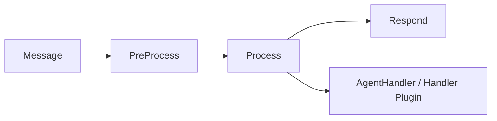
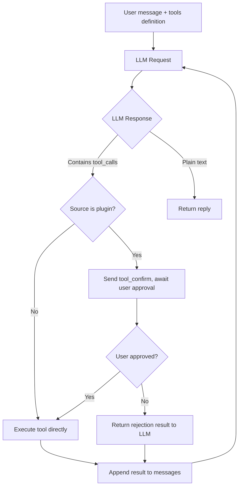

# Agent Framework

NyaDeskPet includes a complete AI Agent framework running in the Electron main process. This document details each core module of the Agent framework.

## Table of Contents
- [Agent Framework](#agent-framework)
  - [Table of Contents](#table-of-contents)
  - [LLM Provider Layer](#llm-provider-layer)
  - [TTS Provider Layer](#tts-provider-layer)
  - [Message Pipeline](#message-pipeline)
  - [Session Management (Context)](#session-management-context)
  - [Data Persistence (Database)](#data-persistence-database)
  - [Tool System (Tools)](#tool-system-tools)
  - [MCP Client](#mcp-client)
  - [Business Handler](#business-handler)
  - [Multimodal Content Processing](#multimodal-content-processing)
  - [Agent Plugin System](#agent-plugin-system)
  - [Slash Command System](#slash-command-system)

---

## LLM Provider Layer

**Design**: Strategy pattern + Registry pattern

- `LLMProvider` abstract base class: defines `chat()` / `chatStream()` interfaces
- `providerRegistry`: global registry, `registerProvider()` registers implementations
- 12 implementations: `openai`, `deepseek`, `openrouter`, `siliconflow`, `gemini`, `dashscope`, `zhipu`, `volcengine`, `groq`, `mistral`, `anthropic`, `xai`
- Supports multiple instance coexistence, distinguished by `instanceId`

Extension example:

```typescript
class MyProvider extends LLMProvider {
  getMetadata(): ProviderMetadata {
    return {
      id: 'my-llm',
      name: 'My LLM',
      description: 'Custom LLM',
      configSchema: [
        { key: 'apiKey', label: 'API Key', type: 'password', required: true },
        { key: 'model', label: 'Model', type: 'string', default: 'gpt-4' }
      ]
    };
  }
  async chat(request: LLMRequest): Promise<LLMResponse> {
    return { text: 'Reply', model: 'my-model' };
  }
}
registerProvider(new MyProvider({ id: 'my-llm', name: 'My LLM' }).getMetadata(), (config) => new MyProvider(config));
```

---

## TTS Provider Layer

- `TTSProvider` abstract base class: defines `synthesize()` streaming audio synthesis interface
- 4 implementations: `fish-audio`, `edge-tts`, `openai-tts`, `elevenlabs`
- Also supports multiple instance coexistence and registry

---

## Message Pipeline

**Design**: Onion model, each message passes through 3 Stages:

| Stage | Responsibility |
|-------|---------------|
| `PreProcessStage` | Priority assignment, message logging |
| `ProcessStage` | Routes by message type, invokes Handler or Agent plugin hooks |
| `RespondStage` | Sends `ctx.replies` uniformly, error fallback |



Each Stage can execute logic before and after `next()`. Custom Stages can be inserted via `insertStageBefore()`.

---

## Session Management (Context)

- **PipelineContext**: Single message context, flows through the entire pipeline
  - `message`: Original message
  - `replies`: Reply buffer
  - `state`: Shared data between Stages
  - `abort()`: Abort the pipeline
- **SessionManager**: Multi-turn conversation management
  - Fixed sessionId `'builtin'` (built-in Agent server)
  - Supports creating / switching / deleting conversations
  - Conversation history persisted to SQLite
  - Message types: text / image / file / tool_call / tool_result / system
  - Auto-generates conversation title from the first user message

---

## Data Persistence (Database)

Uses `better-sqlite3` (synchronous API), database located at `appData/NyaDeskPet/data/agent.db`.

| Table | Purpose |
|-------|---------|
| `conversations` | Conversation records (id, session_id, title, timestamps, metadata) |
| `messages` | Message records (role, type, content, extra JSON, token_count) |
| `tool_definitions` | Tool definitions (name, parameters JSON Schema, source, mcp_server) |

- WAL mode for improved concurrency
- Foreign key constraints (cascade delete messages when conversation is deleted)
- Global singleton `agentDb`

---

## Tool System (Tools)

- `ToolManager`: Tool registry + executor
  - `registerFunction(schema, handler)`: Register custom tools
  - `registerMCPTool(schema, server, handler)`: Register MCP tools
  - `toOpenAITools()`: Generate OpenAI API `tools` parameter
  - `executeTool(toolCall, timeout)`: Execute with timeout
- Tool definitions persisted to SQLite
- Supports enabling/disabling individual tools

---

## MCP Client

- `MCPManager`: Manages multiple MCP server connections
  - Supports stdio / SSE transports
  - Auto-discovers server tools and registers them with ToolManager
  - Auto-retry on disconnect
  - Configuration persisted to `appData/NyaDeskPet/data/mcp_servers.json`

MCP server configuration format:

```json
{
  "name": "my-mcp-server",
  "transport": "stdio",
  "command": {
    "darwin": ["python3", "server.py"],
    "linux": ["python3", "server.py"],
    "win32": ["python", "server.py"]
  },
  "workingDirectory": "/path/to/server",
  "autoStart": true,
  "enabled": true
}
```

---

## Business Handler

Core message processing logic. If a Handler plugin exists, processing is delegated to the plugin:

| Method | Responsibility |
|--------|---------------|
| `processUserInput` | Invokes LLM, maintains conversation history, tool loop, streaming/non-streaming output |
| `processTapEvent` | Touch reaction (smart reply with LLM, otherwise default text), persists touch record + AI reply |
| `processFileUpload` | File processing (image transcription, other file confirmation), persists upload record + response |
| `processCommandExecute` | Executes slash commands, persists command + result |
| `processPluginMessage` | Processes frontend plugin active messages, processes via LLM then persists |
| `processModelInfo` | Stores model state |
| `processCharacterInfo` | Stores character persona |
| `processToolConfirmResponse` | Handles tool call approval/rejection |

**Streaming Output**: When Provider is configured with `stream: true`, incremental text is pushed in real-time via `dialogue_stream_start/chunk/end` three-phase protocol. Tool loops work normally in streaming mode, with `toolCallDeltas` accumulated before batch execution.

**Message Persistence**: All message types that produce conversation content are automatically written to session history, viewable after app restart:

| Message Type | Persisted Content |
|-------------|-------------------|
| `user_input` | User text + LLM reply |
| `tap_event` | `[Touch] User touched "hitArea" area` + AI reply or default reaction |
| `file_upload` | `[File Upload] filename (type)` + transcription result or confirmation reply |
| `command_execute` | `/command args` + execution result text |
| `plugin_message` | `[Plugin name] text` + LLM reply |

Control messages like `model_info`, `character_info` are not written to session history.

**Tool Loop**:



Maximum 10 iterations.

---

## Multimodal Content Processing

`multimodal.ts` provides unified multimodal content processing utilities:

- **`MultimodalContent`** type: Unified representation of attachments like images/files (supports both Base64 and URL references)
- **`ProviderCapabilities`** type: Declares Provider multimodal capabilities (text / vision / file / toolCalling)
- `buildMultimodalMessage()`: Builds chat messages with attachments
- `toDataUrl()` / `fromDataUrl()`: Convert between Data URL and `MultimodalContent`
- `isContentSupported()`: Checks if a Provider supports the specified content type
- `fromChatMessageImage()` / `toChatMessageImage()`: Convert tool result image formats
- `describeContents()`: Generates text summaries of multimodal content

---

## Agent Plugin System

- `AgentPlugin`: Plugin base class, provides `initialize()` / `terminate()` lifecycle hooks
- `AgentPluginManager`: Scans agent-plugins directory, loads, activates, and manages plugins
  - Auto-activation (`autoActivate: true`)
  - Dependency topological sorting (`dependencies` array)
  - Context injection (`AgentPluginContext`)
- `AgentPluginContext` provides: tool/command registration, Provider invocation (including `getProviderConfig()` for configuration details), multimodal processing, skills system, Handler-exclusive interfaces
- Handler plugin hooks: `onUserInput` / `onTapEvent` / `onFileUpload` / `onPluginMessage` / `onModelInfo` / `onCharacterInfo`
- Inter-plugin communication: `ctx.getPluginInstance(name)` to get activated plugin instances
- 13 built-in Agent plugins (including planning, scheduler, image-gen, etc.)

For detailed development guide, see Agent Plugin Development

---

## Slash Command System

- `CommandRegistry`: Command registry
- Agent plugins register commands via `ctx.registerCommand()`
- Frontend Discord-style autocomplete UI
- Backend sends `commands_register` message to sync command list on connection establishment
