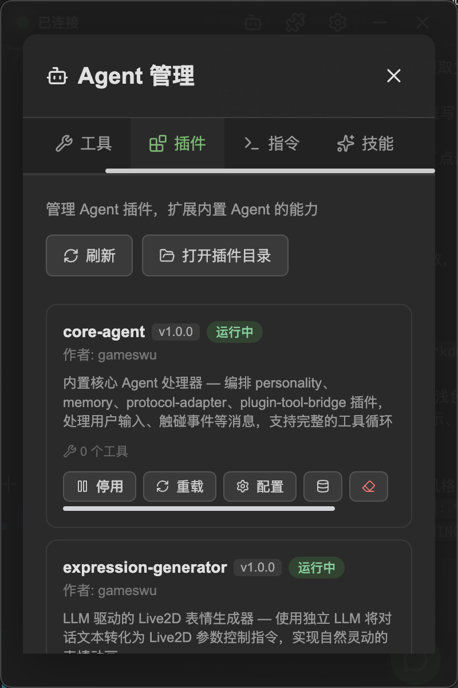
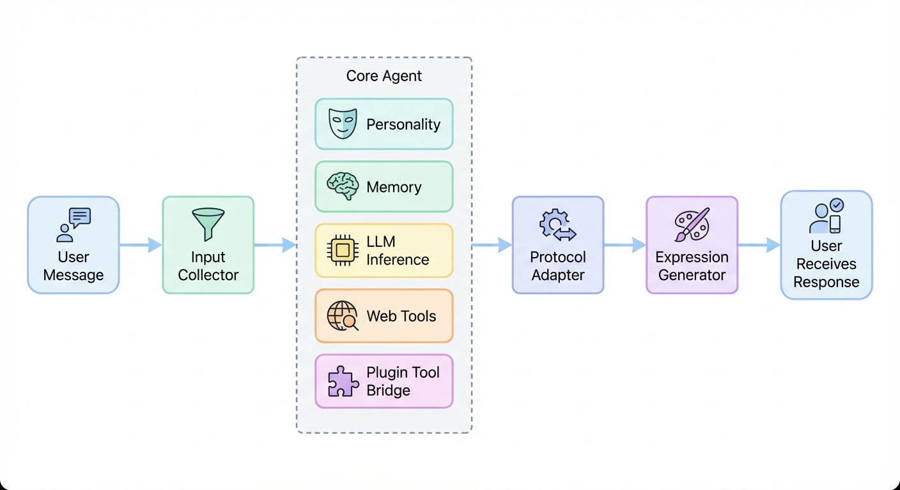
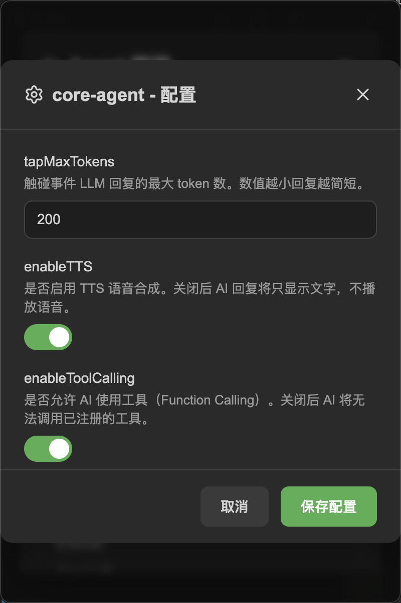

# Agent Management

Agent plugins are extension modules running in the main process, responsible for enhancing AI's reasoning and tool capabilities. NyaDeskPet includes 10 built-in Agent plugins that work together to implement the character's core functionality.

## Table of Contents
- [Agent Management](#agent-management)
  - [Table of Contents](#table-of-contents)
  - [Open Agent Plugin Management](#open-agent-plugin-management)
  - [Built-in Plugin Descriptions](#built-in-plugin-descriptions)
    - [Core Handler Plugin](#core-handler-plugin)
    - [Regular Plugins](#regular-plugins)
  - [Plugin Collaboration Mechanism](#plugin-collaboration-mechanism)
  - [Activate and Deactivate Plugins](#activate-and-deactivate-plugins)
  - [Plugin Configuration](#plugin-configuration)
  - [Plugin Dependencies](#plugin-dependencies)
  - [Install Third-Party Agent Plugins](#install-third-party-agent-plugins)
  - [Next Steps](#next-steps)

---

## Open Agent Plugin Management

<div align="center">
    
</div>

1. Click the **Agent button** in the bottom bar
2. In the Agent panel, find the **Agent Plugins** section
3. You can see all installed Agent plugins and their status

---

## Built-in Plugin Descriptions

NyaDeskPet's 10 built-in Agent plugins are divided into two categories:

### Core Handler Plugin

| Plugin | Type | Description |
|--------|------|-------------|
| **core-agent** | Handler Plugin | Core coordinator that combines other core plugins to handle conversation processing |

Handler plugins can **fully take over** the message processing flow. `core-agent` is the default Handler — it coordinates the regular plugins below to implement complete conversation functionality.

### Regular Plugins

| Plugin | Description |
|--------|-------------|
| **personality** | Personality system — builds structured system prompts that define character personality |
| **memory** | Memory management — session-separated context + automatic long conversation compression |
| **protocol-adapter** | Protocol adapter — converts plain text + actions into frontend-renderable message format |
| **expression-generator** | Expression generator — uses an independent LLM to convert dialogue text into Live2D control instructions |
| **plugin-tool-bridge** | Plugin bridge — registers frontend plugin capabilities as Function Calling tools |
| **info** | Info viewer — provides the `/info` slash command to view system status |
| **web-tools** | Web tools — provides `fetch_url` and `search_web` tools |
| **input-collector** | Input collector — debounce-collects consecutive inputs to avoid message fragmentation |
| **image-transcriber** | Image transcriber — transcribes uploaded images into text descriptions |

---

## Plugin Collaboration Mechanism

When you send a message, the plugin collaboration flow is roughly as follows:

<div align="center">
    
</div>

---

## Activate and Deactivate Plugins

Each plugin can be individually activated or deactivated:

- **Activate**: The plugin participates in message processing
- **Deactivate**: The plugin does not participate in processing; its registered tools and commands are also unavailable

> [!WARNING]
> Deactivating core plugins (like `core-agent`) will prevent the AI from responding to conversations normally. Unless you know what you're doing, it is recommended to keep all built-in plugins activated.

---

## Plugin Configuration

<div align="center">
    
</div>

Some Agent plugins support configuration. Click the **Configure** button on the plugin card to modify parameters.

For example, the `expression-generator` plugin can be configured to use a specific LLM instance for generating expression instructions, allowing you to use a different model from the main conversation for expression generation.

---

## Plugin Dependencies

Agent plugins may have dependencies on each other. The app automatically performs **topological sorting** when loading plugins, ensuring that dependent plugins are loaded before their dependents.

For example, `core-agent` depends on `personality`, `memory`, `protocol-adapter`, and other plugins — these plugins are initialized before `core-agent`.

---

## Install Third-Party Agent Plugins

In addition to built-in plugins, you can install third-party Agent plugins:

1. Place the plugin folder in the app's `agent-plugins/` directory
2. Restart the app
3. The new plugin will automatically appear in the Agent plugins list

Plugin directory structure:

```
agent-plugins/my-plugin/
├── metadata.json    ← Plugin metadata
├── main.js          ← Entry file (CommonJS)
└── _conf_schema.json ← Configuration template (optional)
```

Developers can check [Agent Plugin Development](AgentPluginDevelopment.md) for a detailed development guide.

---

## Next Steps

- Want to develop your own plugin? See the [Developer Guide](DEVELOPMENT.md)
- Having issues? See the [FAQ](FAQ.md)
