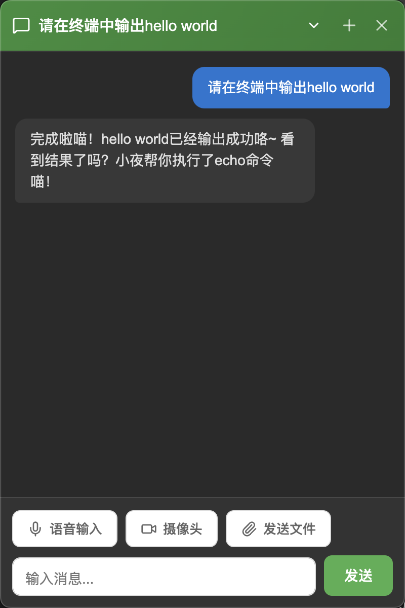
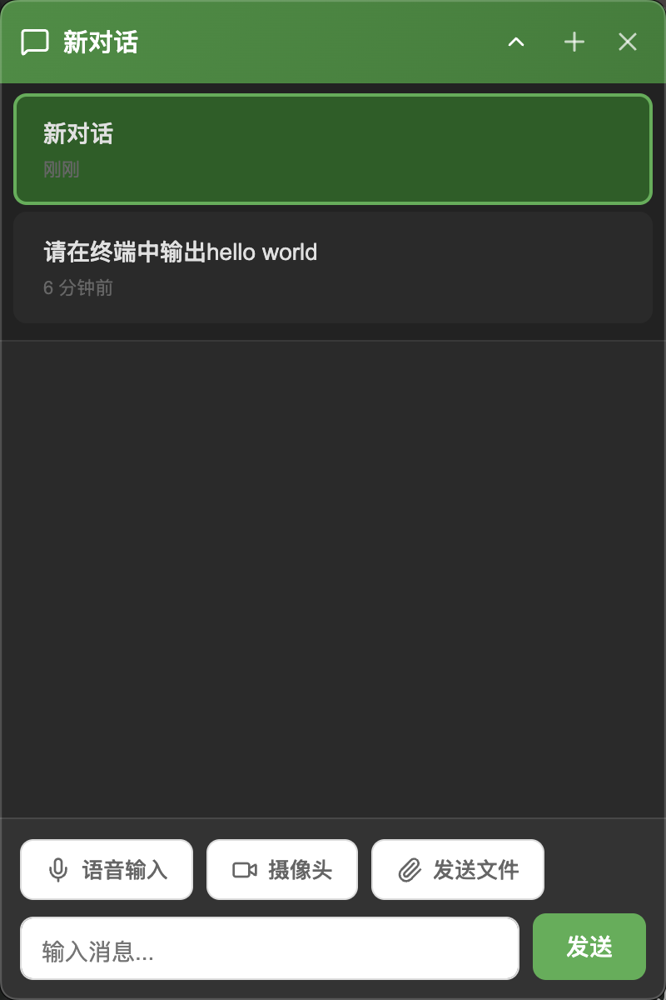
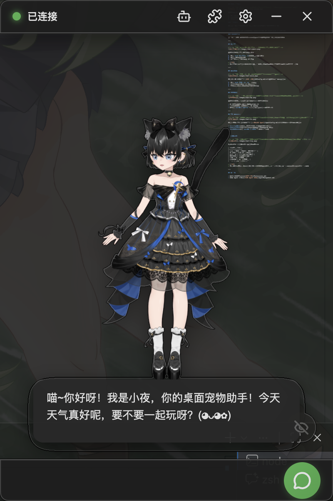
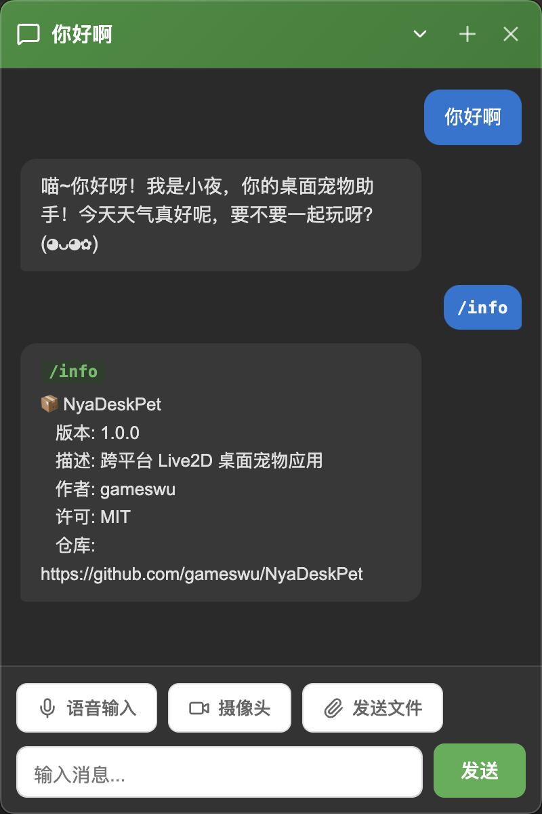

# Conversation

The core experience of NyaDeskPet is chatting with your AI desktop pet. This page explains how to use the conversation features.

## Table of Contents
- [Conversation](#conversation)
  - [Table of Contents](#table-of-contents)
  - [Basic Conversation](#basic-conversation)
  - [Conversation Management](#conversation-management)
    - [Multiple Sessions](#multiple-sessions)
    - [Subtitle Mode](#subtitle-mode)
  - [Slash Commands](#slash-commands)
    - [How to Use](#how-to-use)
  - [File and Image Upload](#file-and-image-upload)
    - [Image Understanding](#image-understanding)
    - [Large File Warning](#large-file-warning)
  - [Camera](#camera)
  - [Voice Input](#voice-input)
  - [Touch Interaction](#touch-interaction)
  - [TTS Voice Reply](#tts-voice-reply)
  - [System Tray](#system-tray)
  - [Next Steps](#next-steps)

---

## Basic Conversation

    

1. Type what you want to say in the **Input box** at the bottom
2. Press **Enter** or click the **Send button** to send the message
3. The character will reply in chat bubbles
4. If TTS is configured, the character will also read the reply aloud with synchronized lip movement

> [!TIP]
> While the reply is being generated, you can see the AI "typing" in real time — this is the streaming output effect.

---

## Conversation Management

### Multiple Sessions

    

NyaDeskPet supports multiple independent conversation sessions:

- Click the **Chat button** to open the sidebar
- Click **+** to create a new conversation
- Click on a conversation in the list to switch to it
- Each conversation has its own independent context

### Subtitle Mode

    

In **Settings → Display**, you can toggle the **Subtitle switch**. When enabled, the character's reply text appears as subtitles near the model.

---

## Slash Commands

    

Type `/` in the input box to trigger **slash command** autocomplete. Slash commands are shortcuts for quickly performing specific actions.

### How to Use

1. Type `/` in the input box
2. Select a command from the popup list, or continue typing to filter
3. Some commands require parameters — parameter hints will be displayed
4. Press Enter to execute the command

> [!TIP]
> Commands are registered by Agent plugins — different plugins may provide different commands.

---

## File and Image Upload

You can send files or images to the AI:

1. Click the **Upload button** next to the input box
2. Select a file (100MB limit)
3. The file will be sent to the AI for processing

### Image Understanding

If the uploaded file is an image, the AI will use its vision capabilities to understand the image content and respond.

> [!WARNING]
> Image understanding requires an LLM provider that supports multimodal capabilities (e.g., GPT-4o, Claude 3 series).

### Large File Warning

A confirmation prompt appears when uploading files larger than 10MB to avoid processing slowdowns from oversized files.

---

## Camera

You can capture camera images and send them to the AI:

1. Click the **Camera button** (permission required on first use)
2. Preview the image and confirm capture
3. The screenshot is sent to the AI as an image for analysis

> [!TIP]
> The camera uses lazy initialization — it only requests camera permission when you first click. It will not secretly activate in the background.

---

## Voice Input

If ASR is configured (see [ASR Configuration](ASRConfig.md)), you can chat by voice:

1. Click the **Microphone button** to start recording
2. After speaking, 1.5 seconds of silence will automatically stop recording
3. The recognized text is automatically filled into the input box or sent directly

---

## Touch Interaction

You can click different parts of the Live2D model to trigger interactions:

- The AI will generate a reaction based on the part you clicked
- Reaction content depends on the character persona and AI judgment
- You can enable/disable touch reactions for specific parts in **Settings → Model**

---

## TTS Voice Reply

If a TTS provider is configured (see [Configure Backend Agent](AgentConfig.md)), the character's replies will be read aloud:

- **Streaming audio**: Voice and text output synchronize — no need to wait for the full reply
- **Lip sync**: The model's mouth shape changes in real time based on audio frequency
- **Volume control**: Adjust playback volume in **Settings → Connection**

---

## System Tray

NyaDeskPet provides quick actions through the system tray:

| Menu Item | Description |
|-----------|------------|
| Show / Hide | Toggle desktop pet window visibility |
| UI Toggle | Full UI / Model only |
| Chat Toggle | Enable/disable chat functionality |
| Always on Top | Keep window in front |
| Settings | Open settings panel |
| Plugin Management | Open plugin panel |
| Quit | Fully exit the application |

---

## Next Steps

- Learn about plugin permission system: [Permissions](Permissions.md)
- Manage Agent plugins: [Agent Management](AgentManagement.md)
