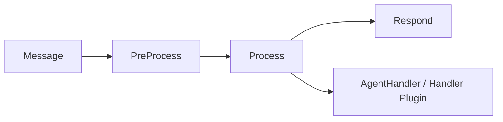
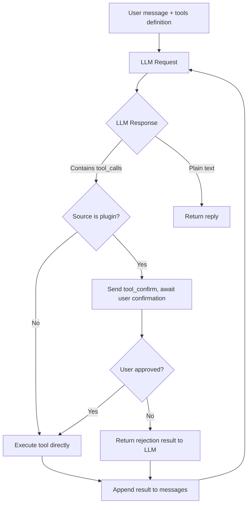

# Developer Guide

This document covers the architecture design, core modules, and technical details of NyaDeskPet development.

## Table of Contents
- [Developer Guide](#developer-guide)
  - [Table of Contents](#table-of-contents)
  - [Architecture Overview](#architecture-overview)
  - [File Structure](#file-structure)
  - [Quick Start](#quick-start)
    - [Requirements](#requirements)
    - [Install and Launch](#install-and-launch)
    - [Package and Distribute](#package-and-distribute)
  - [Agent Framework](#agent-framework)
    - [LLM Provider Layer](#llm-provider-layer)
    - [TTS Provider Layer](#tts-provider-layer)
    - [Message Pipeline](#message-pipeline)
    - [Session Management (Context)](#session-management-context)
    - [Data Persistence (Database)](#data-persistence-database)
    - [Tool System (Tools)](#tool-system-tools)
    - [MCP Client](#mcp-client)
    - [Business Handler](#business-handler)
    - [Agent Plugin System](#agent-plugin-system)
    - [Slash Command System](#slash-command-system)
  - [Renderer Modules](#renderer-modules)
    - [Live2D Manager](#live2d-manager)
    - [Backend Communication Client](#backend-communication-client)
    - [Audio Player](#audio-player)
    - [Dialogue Manager](#dialogue-manager)
    - [Settings Manager](#settings-manager)
    - [Plugin System](#plugin-system)
    - [Internationalization System](#internationalization-system)
    - [Theme Manager](#theme-manager)
    - [Camera Manager](#camera-manager)
    - [Microphone Manager](#microphone-manager)
    - [Response Priority Control](#response-priority-control)
  - [ASR Service](#asr-service)
  - [Version Management](#version-management)
  - [Development Scripts](#development-scripts)
  - [Platform Optimization](#platform-optimization)
    - [Windows GPU Rendering](#windows-gpu-rendering)
  - [Tech Stack](#tech-stack)
  - [Adding New Modules](#adding-new-modules)

## Architecture Overview


## File Structure

```
NyaDeskPet/
├── src/                        # Main process source code
│   ├── main.ts                 # Electron main process entry
│   ├── preload.ts              # IPC secure bridge
│   ├── agent-server.ts         # Built-in WebSocket Agent server
│   ├── asr-service.ts          # Sherpa-ONNX offline speech recognition service
│   ├── logger.ts               # Main process logging
│   └── agent/                  # Agent core logic framework
│       ├── index.ts            # Module exports
│       ├── provider.ts         # LLM Provider abstraction & registry
│       ├── tts-provider.ts     # TTS Provider abstraction & registry
│       ├── pipeline.ts         # Message processing pipeline
│       ├── context.ts          # Pipeline context & session management
│       ├── handler.ts          # Business logic
│       ├── database.ts         # SQLite storage
│       ├── tools.ts            # Function Calling tool manager
│       ├── mcp-client.ts       # MCP protocol client (stdio/SSE)
│       ├── commands.ts         # Slash command registry
│       ├── agent-plugin.ts     # Agent plugin base class & management framework
│       ├── skills.ts           # Agent Skills registration & management
│       ├── providers/          # LLM platform implementations
│       └── tts-providers/      # TTS platform implementations
├── renderer/                   # Renderer process
│   ├── index.html              # Main window page
│   ├── help.html               # Help documentation page (sidebar nav + i18n)
│   ├── styles.css              # Global styles
│   ├── tsconfig.json           # Renderer-specific TS config
│   ├── locales/                # Internationalization / multilingual
│   ├── lib/                    # Core libraries
│   ├── types/                  # Type definitions
│   │   └── global.d.ts         # Global IPC interface & API type definitions
│   └── js/                     # Frontend business logic
│       ├── renderer.ts         # Renderer process main coordinator
│       ├── settings-manager.ts # localStorage settings persistence
│       ├── live2d-manager.ts   # Live2D model loading, rendering & interaction
│       ├── backend-client.ts   # Communication layer
│       ├── dialogue-manager.ts # UI chat bubble management
│       ├── audio-player.ts     # Audio playback
│       ├── camera-manager.ts   # Visual input management
│       ├── microphone-manager.ts # Audio capture & ASR scheduling
│       ├── i18n-manager.ts     # Language switching management
│       ├── theme-manager.ts    # Skin/theme switching
│       ├── plugin-connector.ts # External plugin communication bridge
│       ├── plugin-ui.ts        # Plugin center UI
│       ├── plugin-config-manager.ts # Plugin config read/write management
│       ├── plugin-config-ui.ts # Dynamic plugin config forms
│       ├── plugin-permission-manager.ts # Plugin permission approval management
│       ├── response-controller.ts # Response priority state machine
│       └── logger.ts           # Renderer process logging
├── agent-plugins/              # Agent extension plugins
├── plugins/                    # Renderer process standalone plugins
├── models/                     # Resources (Live2D models, ASR model files)
├── scripts/                    # Development & build helper scripts
├── assets/                     # Static resources
│   └── docs/                   # In-app help documentation + sidebar navigation
├── docs/                       # Project documentation
├── package.json                # Project metadata & dependency configuration
└── tsconfig.json               # Global TypeScript configuration
```

## Quick Start

### Requirements

- Node.js 18+
- npm
- FFmpeg (required for speech recognition, used for audio format conversion)

### Install and Launch

```bash
npm install
npm run compile

# Development mode (choose by platform)
npm run dev:mac
npm run dev:linux
npm run dev:win

# Production mode
npm start
```

| Mode | Features |
|------|----------|
| Development | Resizable window, shows in taskbar, suitable for debugging |
| Production | Borderless transparent window, always on top, system tray, hide to tray on close |

### Package and Distribute

```bash
npm run build:win     # Windows
npm run build:mac     # macOS
npm run build:linux   # Linux
```

## Agent Framework

### LLM Provider Layer

**Design**: Strategy pattern + Registry pattern

- `LLMProvider` abstract base class: defines `chat()` / `chatStream()` interfaces
- `providerRegistry`: global registry, `registerProvider()` registers implementations
- 12 implementations: `openai`, `deepseek`, `openrouter`, `siliconflow`, `gemini`, `dashscope`, `zhipu`, `volcengine`, `groq`, `mistral`, `anthropic`, `xai`
- Supports multiple instances coexisting, distinguished by `instanceId`

Extension example:

```typescript
class MyProvider extends LLMProvider {
  getMetadata(): ProviderMetadata {
    return {
      id: 'my-llm',
      name: 'My LLM',
      description: 'Custom LLM',
      configSchema: [
        { key: 'apiKey', label: 'API Key', type: 'password', required: true },
        { key: 'model', label: 'Model', type: 'string', default: 'gpt-4' }
      ]
    };
  }
  async chat(request: LLMRequest): Promise<LLMResponse> {
    return { text: 'Response', model: 'my-model' };
  }
}
registerProvider(new MyProvider({ id: 'my-llm', name: 'My LLM' }).getMetadata(), (config) => new MyProvider(config));
```

### TTS Provider Layer

- `TTSProvider` abstract base class: defines `synthesize()` streaming audio synthesis interface
- 4 implementations: `fish-audio`, `edge-tts`, `openai-tts`, `elevenlabs`
- Also supports multiple instances and registry

### Message Pipeline

**Design**: Onion model — each message passes through 3 Stages:

| Stage | Responsibility |
|-------|---------------|
| `PreProcessStage` | Priority assignment, message logging |
| `ProcessStage` | Route by message type, invoke Handler or Agent plugin hooks |
| `RespondStage` | Batch send `ctx.replies`, error fallback |



Each Stage can execute logic before and after `next()`. Custom Stages can be inserted via `insertStageBefore()`.

### Session Management (Context)

- **PipelineContext**: Single-message context that travels through the entire pipeline
  - `message`: Original message
  - `replies`: Reply buffer
  - `state`: Shared data between Stages
  - `abort()`: Abort the pipeline
- **SessionManager**: Multi-turn conversation management
  - Fixed sessionId `'builtin'` (built-in Agent server)
  - Supports create / switch / delete conversations
  - Conversation history persisted to SQLite
  - Message types: text / image / file / tool_call / tool_result / system
  - Auto-generates conversation title from the first user message

### Data Persistence (Database)

Uses `better-sqlite3` (synchronous API), database located at `appData/NyaDeskPet/data/agent.db`.

| Table | Purpose |
|-------|---------|
| `conversations` | Conversation records (id, session_id, title, timestamps, metadata) |
| `messages` | Message records (role, type, content, extra JSON, token_count) |
| `tool_definitions` | Tool definitions (name, parameters JSON Schema, source, mcp_server) |

- WAL mode for improved concurrency
- Foreign key constraints (cascade delete messages when conversation is deleted)
- Global singleton `agentDb`

### Tool System (Tools)

- `ToolManager`: Tool registry + executor
  - `registerFunction(schema, handler)`: Register custom tools
  - `registerMCPTool(schema, server, handler)`: Register MCP tools
  - `toOpenAITools()`: Generate OpenAI API `tools` parameter
  - `executeTool(toolCall, timeout)`: Execute with timeout
- Tool definitions persisted to SQLite
- Supports enabling/disabling individual tools

### MCP Client

- `MCPManager`: Manages multiple MCP server connections
  - Supports stdio / SSE transport
  - Auto-discovers server tools and registers them with ToolManager
  - Auto-retry on disconnection
  - Configuration persisted to `appData/NyaDeskPet/data/mcp_servers.json`

MCP server configuration format:

```json
{
  "name": "my-mcp-server",
  "transport": "stdio",
  "command": {
    "darwin": ["python3", "server.py"],
    "linux": ["python3", "server.py"],
    "win32": ["python", "server.py"]
  },
  "workingDirectory": "/path/to/server",
  "autoStart": true,
  "enabled": true
}
```

### Business Handler

Core message processing logic — delegates to Handler plugins if one exists:

| Method | Responsibility |
|--------|---------------|
| `processUserInput` | Call LLM, maintain conversation history, tool loop, streaming/non-streaming output |
| `processTapEvent` | Touch reaction (smart reply with LLM, default text without), persist touch record + AI reply |
| `processFileUpload` | File handling (image transcription, other file confirmation), persist upload record + response |
| `processCommandExecute` | Execute slash commands, persist command + result |
| `processPluginMessage` | Handle frontend plugin active messages, process through LLM and persist |
| `processModelInfo` | Store model state |
| `processCharacterInfo` | Store character persona |
| `processToolConfirmResponse` | Handle tool call approve/reject |

**Streaming output**: When Provider is configured with `stream: true`, incremental text is pushed in real time via `dialogue_stream_start/chunk/end` three-phase protocol. Tool loop works normally in streaming mode — `toolCallDeltas` accumulate and execute after completion.

**Message persistence**: All message types that produce conversation content are automatically written to session history, viewable after app restart:

| Message Type | Persisted Content |
|-------------|-------------------|
| `user_input` | User text + LLM reply |
| `tap_event` | `[Touch] User touched "hitArea" area` + AI reply or default reaction |
| `file_upload` | `[File Upload] filename (type)` + transcription result or confirmation reply |
| `command_execute` | `/command args` + execution result text |
| `plugin_message` | `[Plugin name] text` + LLM reply |

Control messages like `model_info`, `character_info` are not written to session history.

**Tool loop**:



Maximum 10 iterations.

### Agent Plugin System

- `AgentPlugin`: Plugin base class with `initialize()` / `terminate()` lifecycle hooks
- `AgentPluginManager`: Scans agent-plugins directory, loads, activates, and manages plugins
  - Auto-activate (`autoActivate: true`)
  - Dependency topological sorting (`dependencies` array)
  - Context injection (`AgentPluginContext`)
- Handler plugin hooks: `onUserInput` / `onTapEvent` / `onFileUpload` / `onPluginMessage` / `onModelInfo` / `onCharacterInfo`
- Inter-plugin communication: `ctx.getPluginInstance(name)` to get activated plugin instances

> See AGENT_PLUGINS.md for detailed development guide

### Slash Command System

- `CommandRegistry`: Command registry
- Agent plugins register commands via `ctx.registerCommand()`
- Frontend Discord-style autocomplete UI
- Backend sends `commands_register` message to sync command list on connection

## Renderer Modules

### Live2D Manager

- Model loading, motion/expression/parameter control
- **Parameter mapping table** (`param-map.json`): Reads semantic alias mappings from model directory, builds LLM-friendly model info
- **Parameter animation system**: Three-phase lifecycle (transition → hold → fade-out release), auto-calculates transition duration
  - Transition duration linearly maps from `|Δvalue| / paramRange` to 200~900ms
  - Holds for 2000ms, then smoothly hands back SDK control via 500ms weight decay
  - All parameter animations are persistently injected every frame through the `beforeModelUpdate` event hook
- Gaze following (mouse coordinates → model coordinate mapping, auto-suppressed during parameter animations)
- Scroll wheel zoom (0.3x ~ 3.0x)
- Touch system (per-model per-region enable/disable configuration)
- Lip sync (Web Audio API AnalyserNode, 30 FPS update of `ParamMouthOpenY`)
- Auto-sends `model_info` message after model loads (including mapping info)

### Backend Communication Client

- WebSocket real-time communication + HTTP fallback
- Auto-reconnection mechanism
- Streaming conversation text accumulation & UI sync
- Plugin call forwarding (`plugin_invoke` → PluginConnector → `plugin_response`)

### Audio Player

- MSE (MediaSource Extensions) streaming playback
- Three-phase audio transport: `audio_stream_start` → `audio_chunk` × N → `audio_stream_end`
- Timeline system: Triggers motions/expressions/parameters at progress percentages
- Lip sync: Real-time frequency analysis driving mouth parameter

### Dialogue Manager

- Chat bubble display and auto-hide
- Subtitle mode (floating at bottom when chat window is closed)

### Settings Manager

- localStorage persistence
- Config items: model path, backend URL, auto-connect, volume, character customization, etc.
- Two-way binding with settings panel
- Character customization (name + persona) auto-sent on connection

### Plugin System

- **PluginConnector**: Scans plugins directory metadata, manages plugin process start/stop and WebSocket connections
- **PluginUI**: Plugin management panel card rendering
- **PluginConfigManager / PluginConfigUI**: Config read/write + dynamic form rendering (9 config types: string / text / int / float / bool / object / list / dict / template_list)
- **PluginPermissionManager**: 5-level danger rating permission approval, permission records persisted

Frontend plugin file structure:
```
plugins/terminal-plugin/
  ├── metadata.json     # Metadata (id, url, command, permissions, i18n)
  ├── config.json       # Config schema
  ├── main.py           # Plugin main program
  └── requirements.txt  # Dependencies
```

### Internationalization System

- `data-i18n` attribute auto-binding
- `window.i18nManager.t(key)` code API
- Language packs: zh-CN.json, en-US.json
- Auto-detects system language, supports manual switching

### Theme Manager

- Three modes: `light` / `dark` / `system`
- Switching via `body` class name + CSS variables

### Camera Manager

- Lazy initialization — only requests permission when used
- Device enumeration and selection
- Real-time preview window (240px)
- Auto-captures frame as Base64 when sending message

### Microphone Manager

- Lazy initialization
- Real-time volume detection + silence detection (1.5s auto-stop recording)
- MediaRecorder API recording WebM
- ASR integration (IPC calls to main process Sherpa-ONNX)
- Background mode support

### Response Priority Control

- High-priority messages can interrupt low-priority streaming output
- Ensures user input always gets a timely response

## ASR Service

Offline speech recognition in the main process:

- **Model**: Sherpa-ONNX Sense-Voice-Small (Chinese, English, Japanese, Korean, Cantonese)
- **Pipeline**: Base64 audio → FFmpeg convert to 16kHz WAV → PCM Float32 → Recognition
- **IPC**: `asr-initialize` / `asr-is-ready` / `asr-recognize`
- **Model path**: `models/asr/sense-voice-small/model.onnx` + `tokens.txt`

## Version Management

```bash
npm run version release 1.0.0   # Release → v1.0.0
npm run version beta 1.0.0      # Beta → v1.0.0-beta-YYMMDDHHMM
npm run version hotfix 1.0.0    # Hotfix → v1.0.0-hotfix-YYMMDDHHMM
npm run version patch           # Patch +1
npm run version minor           # Minor +1
npm run version major           # Major +1
```

Automatically updates package.json version number and creates version.json.

## Development Scripts

| Command | Description |
|---------|------------|
| `npm run check-i18n` | Verify zh-CN / en-US key consistency |
| `npm run migrate-logger:preview` | Preview console → logger migration |
| `npm run migrate-logger` | Execute migration (excludes logger.ts itself) |
| `npm run version` | Generate version.json (version number + build time) |
| `npm run check-live2d` | Verify param-map.json mapping completeness for models in models/ |

## Platform Optimization

### Windows GPU Rendering

Windows + NVIDIA GPU may encounter GPU compatibility issues. Implemented optimizations:

- Main process: Disable GPU sandbox, use ANGLE/D3D11, limit VRAM to 2GB
- PixiJS: `powerPreference: 'high-performance'`, `preserveDrawingBuffer: false`
- Frame rate limit: 60 FPS on Windows

If issues persist, call `app.disableHardwareAcceleration()` before `app.whenReady()` to fully disable hardware acceleration.

## Tech Stack

| Component | Version/Technology |
|-----------|-------------------|
| Electron | 28.0 |
| TypeScript | 5.3 |
| PixiJS | 7.3 |
| Live2D | Cubism SDK for Web |
| SQLite | better-sqlite3 |
| ASR | Sherpa-ONNX v1.6 |
| Icons | Lucide Icons |
| Audio conversion | FFmpeg (system dependency) |

## Adding New Modules

1. Create a `.ts` file in js/
2. Define interfaces and `Window` extensions in global.d.ts
3. Include the compiled `.js` in index.html
4. Initialize in `renderer.ts` startup logic