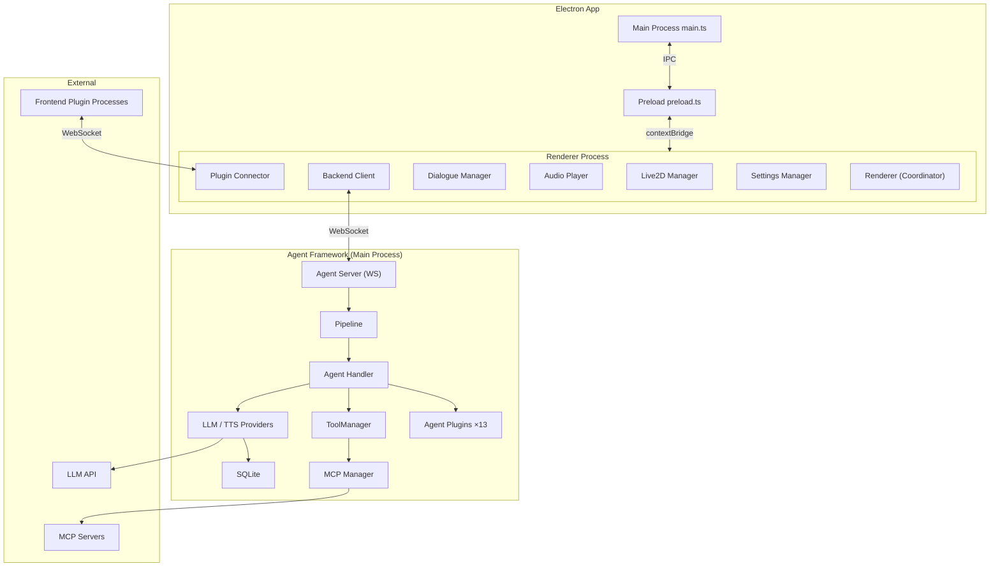

# Developer Guide

This document covers the architecture design and file structure of NyaDeskPet. For detailed module documentation, see:

- [Agent Framework](AgentFramework.md) — LLM/TTS Provider, Message Pipeline, Session Management, Tool System, Handler, Plugin System
- [Renderer & Other Modules](RendererModules.md) — Live2D, Communication, Audio, Plugins, ASR, Version Management, Platform Optimization

## Table of Contents
- [Developer Guide](#developer-guide)
  - [Table of Contents](#table-of-contents)
  - [Architecture Overview](#architecture-overview)
  - [File Structure](#file-structure)
  - [Quick Start](#quick-start)
    - [Requirements](#requirements)
    - [Install and Launch](#install-and-launch)
    - [Package and Distribute](#package-and-distribute)
  - [More Documentation](#more-documentation)

## Architecture Overview



## File Structure

```
NyaDeskPet/
├── src/                        # Main process source code
│   ├── main.ts                 # Electron main process entry
│   ├── preload.ts              # IPC secure bridge
│   ├── agent-server.ts         # Built-in WebSocket Agent server
│   ├── asr-service.ts          # Sherpa-ONNX offline speech recognition service
│   ├── logger.ts               # Main process logging
│   └── agent/                  # Agent core logic framework
│       ├── index.ts            # Module exports
│       ├── provider.ts         # LLM Provider abstraction & registry
│       ├── tts-provider.ts     # TTS Provider abstraction & registry
│       ├── pipeline.ts         # Message processing pipeline
│       ├── context.ts          # Pipeline context & session management
│       ├── handler.ts          # Business logic
│       ├── database.ts         # SQLite storage
│       ├── tools.ts            # Function Calling tool manager
│       ├── mcp-client.ts       # MCP protocol client (stdio/SSE)
│       ├── commands.ts         # Slash command registry
│       ├── agent-plugin.ts     # Agent plugin base class & management framework
│       ├── skills.ts           # Agent Skills registration & management
│       ├── multimodal.ts       # Multimodal content processing utilities
│       ├── providers/          # LLM platform implementations
│       └── tts-providers/      # TTS platform implementations
├── renderer/                   # Renderer process
│   ├── index.html              # Main window page
│   ├── help.html               # Help documentation page (sidebar nav + i18n)
│   ├── styles.css              # Global styles
│   ├── tsconfig.json           # Renderer-specific TS config
│   ├── locales/                # Internationalization / multilingual
│   ├── lib/                    # Core libraries
│   ├── types/                  # Type definitions
│   │   └── global.d.ts         # Global IPC interface & API type definitions
│   └── js/                     # Frontend business logic
│       ├── renderer.ts         # Renderer process main coordinator
│       ├── settings-manager.ts # localStorage settings persistence
│       ├── live2d-manager.ts   # Live2D model loading, rendering & interaction
│       ├── backend-client.ts   # Communication layer
│       ├── dialogue-manager.ts # UI chat bubble management
│       ├── audio-player.ts     # Audio playback
│       ├── camera-manager.ts   # Visual input management
│       ├── microphone-manager.ts # Audio capture & ASR scheduling
│       ├── i18n-manager.ts     # Language switching management
│       ├── theme-manager.ts    # Skin/theme switching
│       ├── plugin-connector.ts # External plugin communication bridge
│       ├── plugin-ui.ts        # Plugin center UI
│       ├── plugin-config-manager.ts # Plugin config read/write management
│       ├── plugin-config-ui.ts # Dynamic plugin config forms
│       ├── plugin-permission-manager.ts # Plugin permission approval management
│       ├── response-controller.ts # Response priority state machine
│       └── logger.ts           # Renderer process logging
├── agent-plugins/              # Agent extension plugins
├── plugins/                    # Renderer process standalone plugins
├── models/                     # Resources (Live2D models, ASR model files)
├── scripts/                    # Development & build helper scripts
├── assets/                     # Static resources
│   └── docs/                   # In-app help documentation + sidebar navigation
├── docs/                       # Project documentation
├── package.json                # Project metadata & dependency configuration
└── tsconfig.json               # Global TypeScript configuration
```

## Quick Start

### Requirements

- Node.js 18+
- npm
- FFmpeg (required for speech recognition, used for audio format conversion)

### Install and Launch

```bash
npm install
npm run compile

# Development mode (choose by platform)
npm run dev:mac
npm run dev:linux
npm run dev:win

# Production mode
npm start
```

| Mode | Features |
|------|----------|
| Development | Resizable window, shows in taskbar, suitable for debugging |
| Production | Borderless transparent window, always on top, system tray, hide to tray on close |

### Package and Distribute

```bash
npm run build:win     # Windows
npm run build:mac     # macOS
npm run build:linux   # Linux
```

---

## More Documentation

- [Agent Framework](AgentFramework.md) — LLM/TTS Provider, Message Pipeline, Session Management, Tool System, Handler, Plugin System
- [Renderer & Other Modules](RendererModules.md) — Live2D, Communication, Audio, Plugins, ASR, Version Management, Platform Optimization
