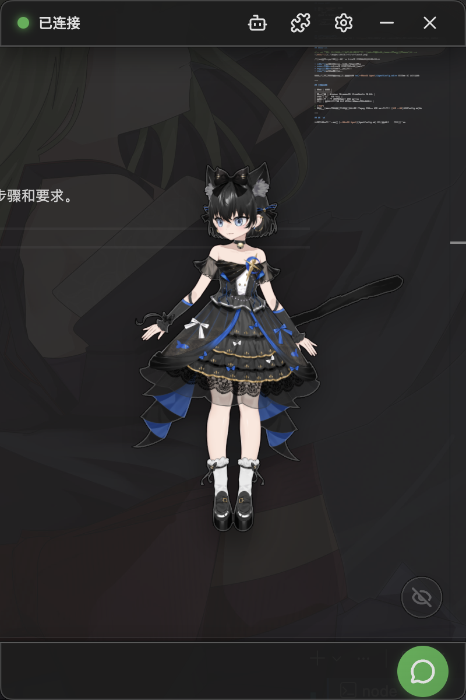

# Installation

This page explains how to download and install NyaDeskPet.

## Table of Contents
- [Installation](#installation)
  - [Table of Contents](#table-of-contents)
  - [Download](#download)
  - [Windows Installation](#windows-installation)
  - [macOS Installation](#macos-installation)
  - [Linux Installation](#linux-installation)
  - [Build from Source](#build-from-source)
  - [First Launch](#first-launch)
  - [Next Steps](#next-steps)

---

## Download

Go to the GitHub Releases page to download the installer for your system:

| Platform | File Format | Notes |
|----------|------------|-------|
| Windows | `.exe` installer | Double-click to run the setup wizard |
| macOS | `.dmg` disk image | Drag into the Applications folder |
| Linux | `.AppImage` | Grant execute permission and run directly |

If there is no installer for your system, refer to the packaging section in the [Developer Guide](DEVELOPMENT.md) to learn how to build the application from source.

> [!TIP]
> You can also find the GitHub link in the app's **Settings → About** page.

---

## Windows Installation

1. Download the `.exe` installer
2. Double-click to run and follow the setup wizard
3. After installation, launch from the desktop shortcut or Start menu

> [!WARNING]
> Windows Defender may show a security warning on first run. Select "Run anyway" to proceed.

---

## macOS Installation

1. Download the `.dmg` file
2. Double-click to open the disk image
3. Drag NyaDeskPet into the **Applications** folder
4. Launch from Launchpad or Applications

> [!WARNING]
> macOS may show "Cannot verify developer". Go to **System Settings → Privacy & Security** and click "Open Anyway".

---

## Linux Installation

1. Download the `.AppImage` file
2. Grant execute permission:
   ```bash
   chmod +x NyaDeskPet-*.AppImage
   ```
3. Double-click or run from the terminal:
   ```bash
   ./NyaDeskPet-*.AppImage
   ```

---

## Build from Source

If you want to build the application from source, refer to the packaging section in the [Developer Guide](DEVELOPMENT.md) for detailed build steps and requirements.

---

## First Launch

<div align="center">
    
</div>

After launching, you'll see a Live2D character appear on your desktop. The default interface includes:

- **Top bar**: Window controls and function buttons
- **Model area**: Live2D character, draggable and zoomable
- **Bottom bar**: Chat button, hide border button

The character cannot chat on first launch — you need to **[configure the backend Agent](AgentConfig.md)** to connect an AI provider first.

---

## Next Steps

After installation, continue reading [Configure Backend Agent](AgentConfig.md) to make your desktop pet start talking!
