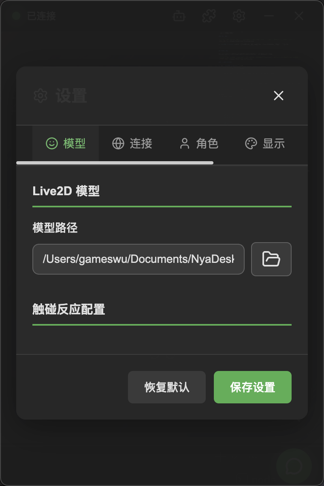

# Live2D Model Configuration

NyaDeskPet supports Live2D Cubism 3 and above models as desktop characters. You can use the included default model or load your own.

## Table of Contents
- [Live2D Model Configuration](#live2d-model-configuration)
  - [Table of Contents](#table-of-contents)
  - [Select a Model](#select-a-model)
    - [Via the Settings Panel](#via-the-settings-panel)
    - [Manually Place Model Files](#manually-place-model-files)
  - [Model File Structure](#model-file-structure)
  - [Model Interaction](#model-interaction)
    - [Zoom](#zoom)
    - [Drag to Move](#drag-to-move)
    - [Gaze Following](#gaze-following)
  - [Touch Configuration](#touch-configuration)
    - [Configure Touch Regions](#configure-touch-regions)
  - [Parameter Mapping Table](#parameter-mapping-table)
    - [File Location](#file-location)
    - [File Format](#file-format)
  - [Display Modes](#display-modes)
  - [Next Steps](#next-steps)

---

## Select a Model

### Via the Settings Panel

<div align="center">
    
</div>

1. Click the **Settings button** in the top bar
2. In the **Model** tab, click the **Select File** button
3. Choose the model's `.model3.json` file
4. Click **Save Settings** — the model will load automatically

### Manually Place Model Files

You can also place the model folder directly in the app's `models/` directory, then enter the appropriate path in the settings.

---

## Model File Structure

A standard Live2D Cubism 3 model contains the following files:

```
my-model/
├── my-model.model3.json    ← Entry file (select this one)
├── my-model.moc3            ← Model data
├── my-model.cdi3.json       ← Display information
├── my-model.physics3.json   ← Physics simulation
├── expressions/              ← Expression files
│   ├── exp_01.exp3.json
│   └── ...
├── motions/                  ← Motion files
│   ├── mtn_01.motion3.json
│   └── ...
└── my-model.8192/            ← Texture directory
    └── texture_00.png
```

> [!TIP]
> Just point to the `.model3.json` file — the app will automatically find other resources in the same directory.

---

## Model Interaction

### Zoom

- Use the **mouse scroll wheel** to zoom the model
- Zoom range: 0.3x ~ 3.0x
- Zoom ratio is automatically saved

### Drag to Move

- Drag the **top bar** to move the entire window
- The model position follows the window

### Gaze Following

In **Settings → Display**, you can enable/disable the "Gaze Following" feature. When enabled, the character's eyes will follow the mouse cursor.

---

## Touch Configuration

Clicking different parts of the model triggers different touch events, and the character will generate AI-powered reactions accordingly.

### Configure Touch Regions

1. Open the **Settings → Model** tab
2. In the **Touch Reaction Configuration** area, you'll see all touch regions supported by the model
3. Use toggles to enable/disable touch reactions for specific regions

> [!TIP]
> Available touch regions depend on the model itself. Different models may have different touch regions.

---

## Parameter Mapping Table

The parameter mapping table (`param-map.json`) provides semantic information about model parameters to the AI, enabling it to understand how to control the model's expressions and motions.

### File Location

Place `param-map.json` in the same directory as the model's `.model3.json` file:

```
my-model/
├── my-model.model3.json
├── param-map.json          ← Parameter mapping table
└── ...
```

### File Format

```json
{
  "parameters": [
    {
      "id": "ParamEyeLOpen",
      "alias": "left_eye_open",
      "description": "Left eye open degree, 0 = closed, 1 = open"
    },
    {
      "id": "ParamMouthOpenY",
      "alias": "mouth_open",
      "description": "Mouth open degree"
    }
  ],
  "expressions": [
    {
      "file": "expressions/exp_01.exp3.json",
      "alias": "happy",
      "description": "Happy expression"
    }
  ],
  "motions": [
    {
      "group": "Idle",
      "index": 0,
      "alias": "wave",
      "description": "Waving hello motion"
    }
  ]
}
```

| Field | Description |
|-------|------------|
| `parameters` | Semantic aliases and descriptions for model parameters, helping AI understand their meanings |
| `expressions` | Aliases and descriptions for expression files |
| `motions` | Aliases and descriptions for motion groups and indices |

> [!TIP]
> The parameter mapping table is not required, but it helps the AI control the model more accurately. After the model loads, the complete parameter information (including the mapping table) is automatically sent to the backend.

---

## Display Modes

NyaDeskPet supports two display modes:

| Mode | Description | How to Switch |
|------|------------|---------------|
| Full UI | Shows top bar, bottom bar, chat area | Default mode |
| Model Only | Shows only the Live2D character | Bottom bar button / Tray menu |

---

## Next Steps

- Need voice input? See [ASR Configuration](ASRConfig.md)
- Ready to start chatting? See [Conversation](Conversation.md)
