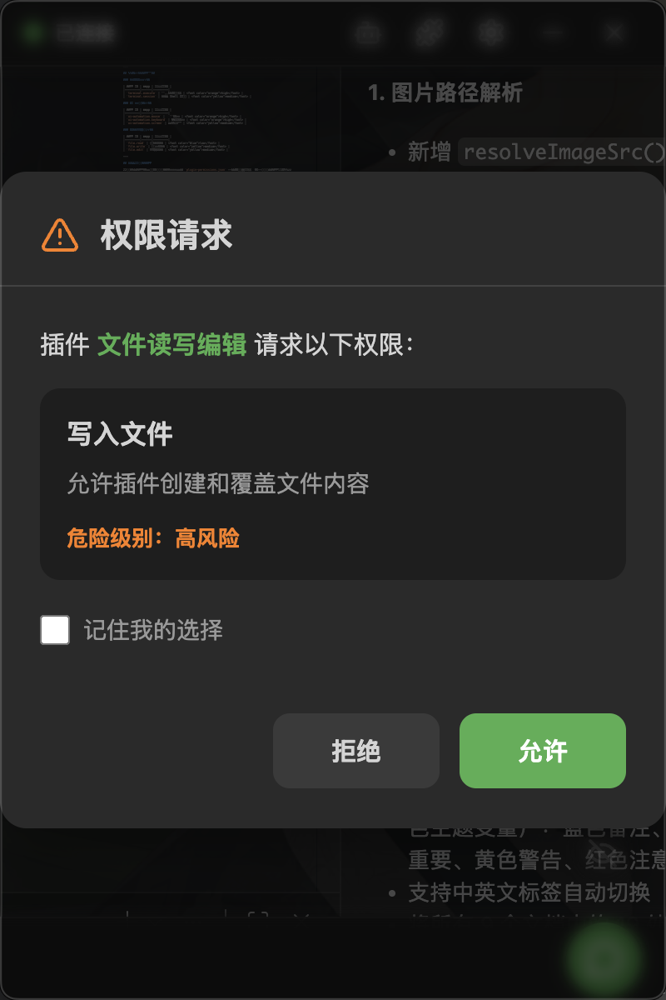
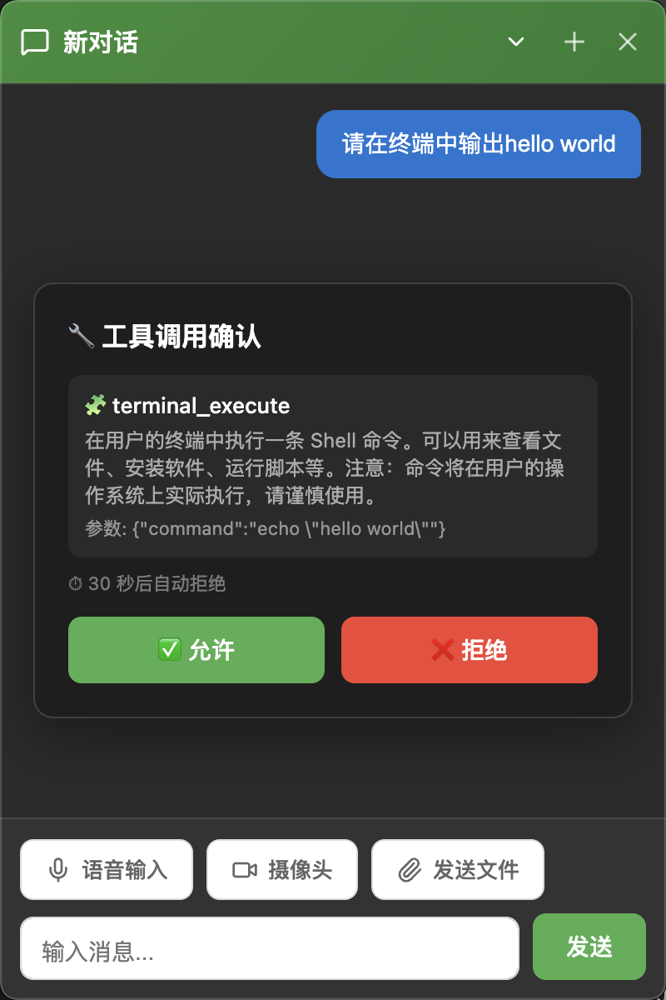

# Permissions

NyaDeskPet's frontend plugins require your authorization when performing sensitive operations. The permission system ensures plugins cannot perform dangerous operations without your consent.

## Table of Contents
- [Permissions](#permissions)
  - [Table of Contents](#table-of-contents)
  - [Permission Levels](#permission-levels)
  - [Approval Process](#approval-process)
    - [1. Confirmation Dialog](#1-confirmation-dialog)
    - [2. Make a Decision](#2-make-a-decision)
    - [3. Remember Choice (Optional)](#3-remember-choice-optional)
  - [Tool Call Confirmation](#tool-call-confirmation)
  - [Built-in Plugin Permission Reference](#built-in-plugin-permission-reference)
    - [Terminal Control Plugin](#terminal-control-plugin)
    - [UI Automation Plugin](#ui-automation-plugin)
    - [File Editor Plugin](#file-editor-plugin)
  - [Manage Authorized Permissions](#manage-authorized-permissions)
  - [Security Recommendations](#security-recommendations)
  - [Next Steps](#next-steps)

---

## Permission Levels

Each plugin permission has a **danger level** that determines the approval policy:

| Level | Color | Confirmation Policy | Description |
|-------|-------|-------------------|-------------|
| safe | Green | Auto-allow | No-risk operation, no confirmation needed |
| low | Blue | First-time confirmation | Low risk, can remember choice after first prompt |
| medium | Yellow | First-time confirmation | Medium risk, can remember choice after first prompt |
| high | Orange | Every-time confirmation | High risk, confirmation dialog on every execution |
| critical | Red | Every-time confirmation | Extreme risk, explicit authorization required every time |

---

## Approval Process

When a plugin requests to perform an operation that requires permission:

### 1. Confirmation Dialog

    

The dialog displays the following information:
- **Plugin name**: Which plugin is making the request
- **Permission name**: The specific permission being requested
- **Operation description**: What will be done
- **Danger level**: Color-coded risk indication

### 2. Make a Decision

You have two choices:
- ✅ **Allow**: Authorize this operation
- ❌ **Deny**: Reject this operation

### 3. Remember Choice (Optional)

For `low` and `medium` level permissions, you can check **"Remember this choice"**:
- Once checked, the same permission from the same plugin won't prompt again
- `high` and `critical` level permissions **always** require confirmation every time

---

## Tool Call Confirmation

    

When AI wants to call a tool from a frontend plugin, a confirmation window also appears. The window displays:

- **Tool name**: The tool AI wants to call
- **Call arguments**: The specific parameter content
- **Source plugin**: Which plugin the tool belongs to

When there are many detailed parameters, the window supports **collapsible display** — click to expand and view the full content.

> [!TIP]
> Built-in tools registered by Agent plugins (like `fetch_url`, `search_web`) do not require user confirmation — only frontend plugin tools require confirmation.

---

## Built-in Plugin Permission Reference

### Terminal Control Plugin

| Permission ID | Name | Danger Level |
|--------------|------|-------------|
| `terminal.execute` | Execute terminal commands | high |
| `terminal.session` | Manage Shell sessions | medium |

### UI Automation Plugin

| Permission ID | Name | Danger Level |
|--------------|------|-------------|
| `ui-automation.mouse` | Mouse control | high |
| `ui-automation.keyboard` | Keyboard control | high |
| `ui-automation.screen` | Screenshots | medium |

### File Editor Plugin

| Permission ID | Name | Danger Level |
|--------------|------|-------------|
| `file.read` | Read files | low |
| `file.write` | Create files | medium |
| `file.edit` | Edit files | medium |

---

## Manage Authorized Permissions

Authorized permission records are saved in the `plugin-permissions.json` file in the user data directory. To revoke previously granted permissions:

1. Delete or edit the `plugin-permissions.json` file
2. After restarting the app, plugins will request permissions again

---

## Security Recommendations

- 🔍 **Read carefully**: Carefully read the operation description before approving, understand what the plugin will do
- ⚠️ **Authorize cautiously**: For high/critical operations, confirm the need before authorizing
- 🔄 **Review regularly**: Periodically check authorized permissions, revoke those no longer needed
- 📦 **Trust sources**: Only use plugins from trusted sources

---

## Next Steps

- Learn how to manage Agent plugins: [Agent Management](AgentManagement.md)
- Go back to built-in plugin details: [Enable Built-in Plugins](BuiltInPlugins.md)
