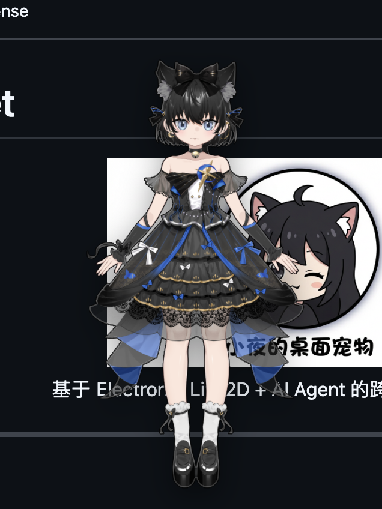
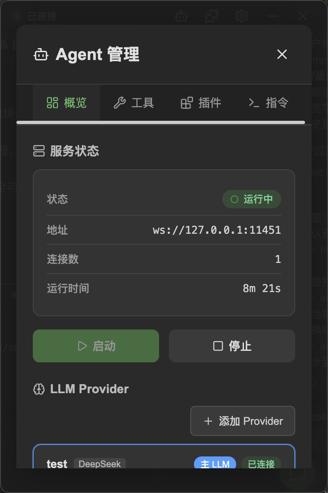
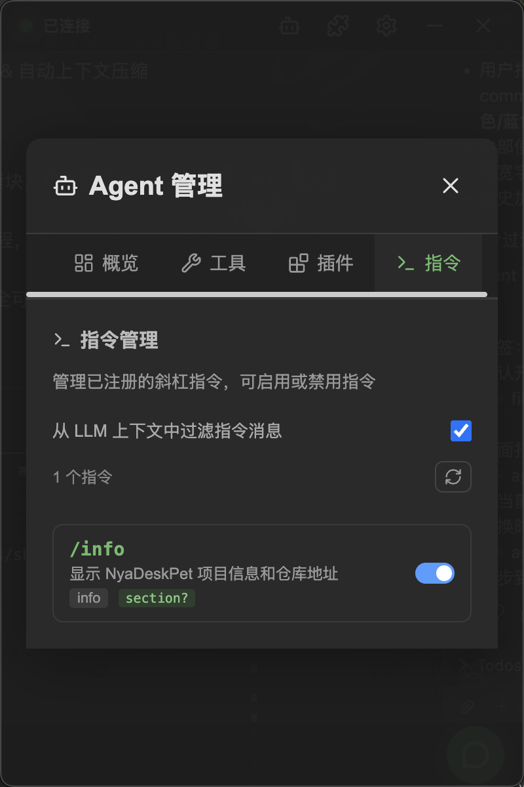
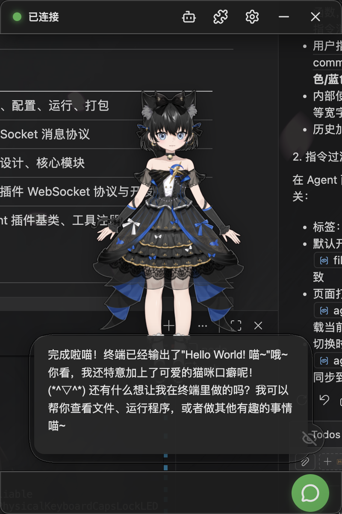
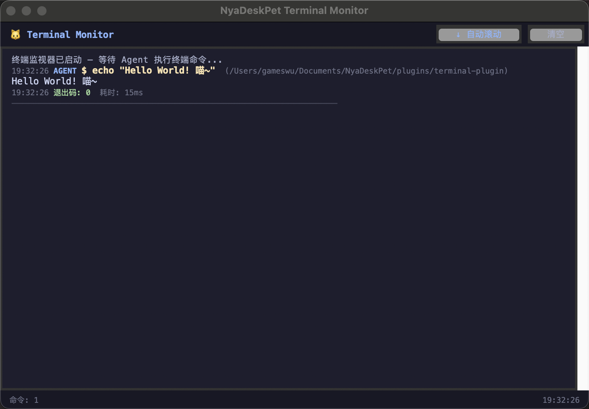
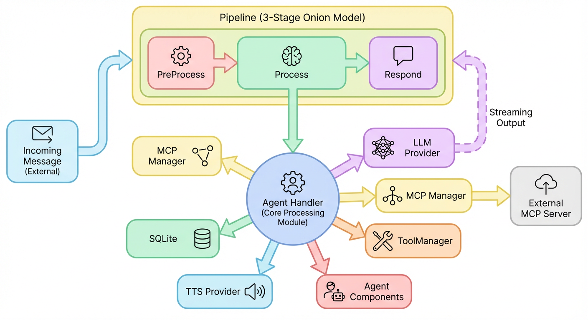

# NyaDeskPet

<div align="center">
  
  <p>Cross-platform desktop pet application powered by Live2D + AI Agent</p>
</div>

---

A fully open-source, modular desktop pet framework with Live2D interaction and a built-in AI Agent. Ready to use out of the box, yet highly customizable. Contributions of plugins, models, and features are welcome!

## Features

### 🎭 AI-Driven Live2D Model

- Transparent borderless window — the pet blends naturally into your desktop
- AI-driven expressions and motions for rich, lively interactions
- Touch reaction system with per-region enable/disable controls
- TTS-driven lip sync & streaming audio playback

<details>
<summary>More demos</summary>
<div align="center">
  
</div>
</details>

### 🤖 Built-in AI Agent

<div align="center">
  <table>
    <tr>
      <td align="center">Multiple mainstream model providers</td>
      <td align="center">Function tools & MCP management</td>
      <td align="center">Plugin architecture</td>
      <td align="center">Custom command management</td>
    </tr>
    <tr>
      <td align="center"></td>
      <td align="center"></td>
      <td align="center"></td>
      <td align="center"></td>
    </tr>
  </table>
</div>

### 🧩 Plugin System

<div align="center">
  <table>
    <tr>
      <td align="center">Full plugin management</td>
      <td align="center">Plugin authentication</td>
    </tr>
    <tr>
      <td align="center"></td>
      <td align="center"></td>
    </tr>
  </table>
</div>

<details>
<summary>Results of the demos above</summary>
<div align="center">
  
  
</div>
</details>

## Quick Start

```bash
# Install dependencies
npm install

# Compile TypeScript
npm run compile

# Development launch
npm run dev:mac
npm run dev:linux
npm run dev:win

# Build
npm run build:mac
npm run build:linux
npm run build:win
```

## Architecture

### Decoupled Architecture

The frontend and backend Agent are fully decoupled via WebSocket. The frontend handles only display and interaction, while the backend runs an independent Agent server. Any WebSocket client can connect.

<div align="center">
  
</div>

### Built-in Agent Architecture

The built-in Agent core uses a Pipeline-driven design. Message processing is divided into multiple stages (think, tool call, respond, etc.), with each stage supporting multiple Handler plugins for flexible Agent behavior customization.

<div align="center">
  
</div>

## Support

If you like this project, please give it a Star ⭐! For any questions or suggestions, feel free to submit an Issue or Pull Request.

Or 💗[Sponsor me](https://afdian.com/a/gameswu)💗

## License

MIT License
