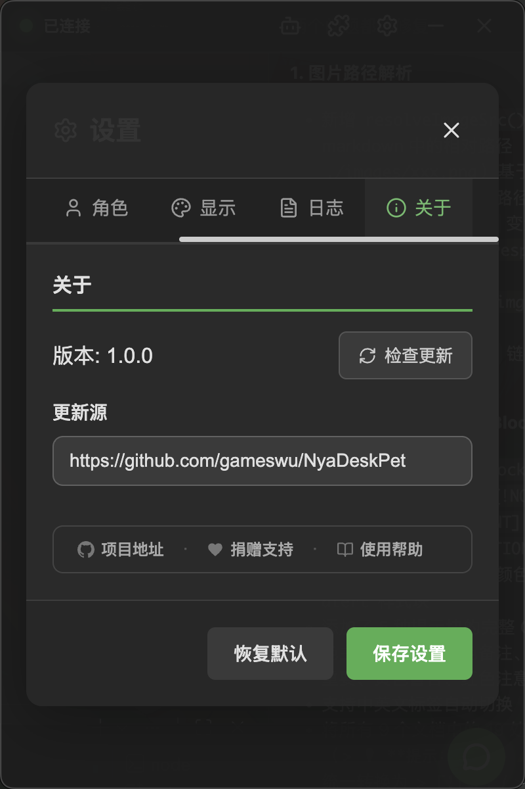

# Update

NyaDeskPet supports in-app update checking, and you can also download new versions manually.

## Table of Contents
- [Update](#update)
  - [Table of Contents](#table-of-contents)
  - [Check for Updates In-App](#check-for-updates-in-app)
  - [Update Source Settings](#update-source-settings)
  - [Manual Update](#manual-update)
  - [Data Retention](#data-retention)
  - [Next Steps](#next-steps)

---

## Check for Updates In-App

    

1. Click the **Settings button** in the top bar to open the settings panel
2. Switch to the **About** tab
3. Click the **Check for Updates** button

The app will automatically compare the current version with the latest version. If a new version is available, an update prompt will be displayed.

---

## Update Source Settings

The default update source is the GitHub repository URL. If you cannot access GitHub in your network environment, you can change the update source URL in the **About** tab.

---

## Manual Update

If automatic update checking is unavailable, you can update manually:

1. Go to the GitHub Releases page and download the latest version
2. **Windows**: Run the new installer — it will automatically overwrite the old version
3. **macOS**: Drag the new version into the Applications folder to replace the old one
4. **Linux**: Replace the old file with the new AppImage

> [!TIP]
> Updates will not affect your settings or chat history — this data is stored in the user data directory.

---

## Data Retention

The following data is preserved during updates:

| Data | Storage Location | Preserved |
|------|-----------------|-----------|
| App settings | User data directory | ✅ Yes |
| Chat history | SQLite database | ✅ Yes |
| Plugin config | User data directory | ✅ Yes |
| Plugin permissions | User data directory | ✅ Yes |
| Custom models | models directory | ✅ Yes |

---

## Next Steps

Check the [Changelog](CHANGELOG.md) to see detailed changes for each version.
