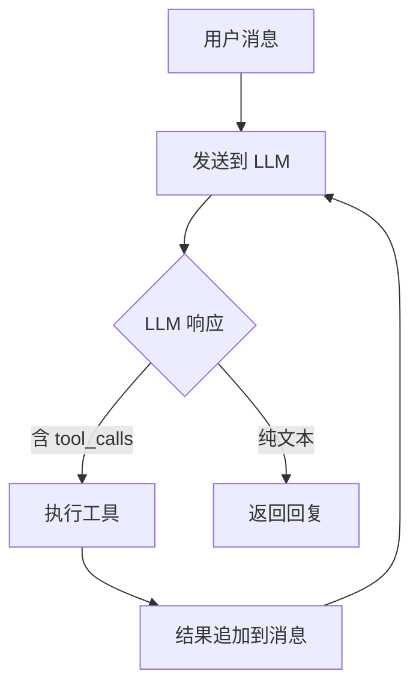

# Agent 插件开发指南

本文档介绍如何为 NyaDeskPet 内置 Agent 开发插件。Agent 插件运行在 Electron 主进程中，可注册 Function Calling 工具供 LLM 调用，或作为 Handler 插件接管核心消息处理逻辑。

## 目录
- [Agent 插件开发指南](#agent-插件开发指南)
  - [目录](#目录)
  - [插件类型](#插件类型)
  - [内置插件一览](#内置插件一览)
  - [快速开始](#快速开始)
    - [目录结构](#目录结构)
    - [metadata.json](#metadatajson)
    - [main.js 示例](#mainjs-示例)
  - [插件 API](#插件-api)
    - [AgentPlugin 基类](#agentplugin-基类)
    - [AgentPluginContext](#agentplugincontext)
      - [通用能力](#通用能力)
      - [LLM Provider 操作](#llm-provider-操作)
      - [Handler 插件专用](#handler-插件专用)
    - [工具定义 (ToolSchema)](#工具定义-toolschema)
    - [工具返回值 (ToolResult)](#工具返回值-toolresult)
  - [配置系统](#配置系统)
  - [Handler 插件开发](#handler-插件开发)
    - [消息处理钩子](#消息处理钩子)
    - [MessageContext](#messagecontext)
    - [会话持久化](#会话持久化)
    - [工具循环](#工具循环)
  - [插件间通信](#插件间通信)
  - [多 Provider 调用](#多-provider-调用)
  - [常见问题](#常见问题)

## 插件类型

| 类型 | 说明 | 标记 |
|------|------|------|
| **普通插件** | 注册工具供 LLM 调用 | 默认 |
| **Handler 插件** | 拦截并替换 `user_input`、`tap_event` 等核心消息处理 | `handlerPlugin: true` |

## 内置插件一览

| 插件 | 类型 | 自动激活 | 说明 |
|------|------|---------|------|
| `core-agent` | Handler | ✅ | 核心协调器 |
| `personality` | 普通 | ✅ | 人格系统，构建结构化系统提示词 |
| `memory` | 普通 | ✅ | 记忆管理，会话分离上下文 + 自动压缩 |
| `protocol-adapter` | 普通 | ✅ | 协议适配，纯文本 + 动作 → 前端消息格式 |
| `expression-generator` | 普通 | ✅ | 表情生成器，独立 LLM 调用将对话文本转化为 Live2D 控制指令 |
| `plugin-tool-bridge` | 普通 | ✅ | 前端插件能力 → FC 工具桥接 |
| `info` | 普通 | ✅ | `/info` 斜杠指令 |
| `web-tools` | 普通 | ✅ | `fetch_url` + `search_web` 工具 |
| `input-collector` | 普通 | ✅ | 输入抖动收集 |
| `image-transcriber` | 普通 | ✅ | 图片转述 |
| `planning` | 普通 | ✅ | 任务规划，基于 LLM 的多步任务分解与执行，支持 Sub-Agent |
| `scheduler` | 普通 | ✅ | 任务调度，基于时间的一次性/周期性任务调度 |
| `image-gen` | 普通 | ✅ | 图像生成，调用支持图像生成的 Provider 生成图片 |

## 快速开始

### 目录结构

```
agent-plugins/
  my-plugin/
    ├── metadata.json       # [必须] 插件元信息
    ├── main.js             # [必须] 插件入口（CommonJS）
    └── _conf_schema.json   # [可选] 配置 UI 表单定义
```

### metadata.json

```json
{
  "name": "my-plugin",
  "author": "YourName",
  "desc": "插件功能描述",
  "version": "1.0.0",
  "repo": "https://github.com/...",
  "entry": "main.js",
  "autoActivate": true,
  "dependencies": [],
  "handlerPlugin": false
}
```

| 字段 | 必须 | 说明 |
|------|------|------|
| `name` | ✅ | 插件唯一标识 |
| `author` | ✅ | 作者 |
| `desc` | ✅ | 描述 |
| `version` | ✅ | 版本号 |
| `repo` | ❌ | 仓库地址 |
| `entry` | ❌ | 入口文件，默认 `main.js` |
| `handlerPlugin` | ❌ | 是否为 Handler 插件，默认 `false` |
| `autoActivate` | ❌ | 是否随应用启动自动激活，默认 `false` |
| `dependencies` | ❌ | 依赖的插件名称列表，系统按拓扑排序确保依赖先激活 |

### main.js 示例

```javascript
const { AgentPlugin } = require('../../dist/agent/agent-plugin');

module.exports = class MyPlugin extends AgentPlugin {

  async initialize() {
    this.ctx.logger.info('插件初始化');

    this.ctx.registerTool({
      name: 'my_tool',
      description: '工具功能描述（对 LLM 很重要）',
      parameters: {
        type: 'object',
        properties: {
          query: { type: 'string', description: '查询内容' }
        },
        required: ['query']
      }
    }, this.handleMyTool.bind(this));
  }

  async handleMyTool(args) {
    const result = `处理结果: ${args.query}`;
    return { content: result, success: true };
  }

  async terminate() {
    this.ctx.logger.info('插件已停止');
  }
};
```

## 插件 API

### AgentPlugin 基类

```typescript
abstract class AgentPlugin {
  protected ctx: AgentPluginContext;
  async initialize(): Promise<void>;   // 激活时调用
  async terminate(): Promise<void>;    // 停用时调用
}
```

### AgentPluginContext

`this.ctx` 提供的能力：

#### 通用能力

| 方法 | 说明 |
|------|------|
| `registerTool(schema, handler)` | 注册 FC 工具 |
| `unregisterTool(name)` | 注销工具 |
| `registerCommand(schema, handler)` | 注册斜杠指令 |
| `logger.debug/info/warn/error(msg)` | 日志（自动带插件名前缀） |
| `getConfig()` | 获取插件配置 |
| `saveConfig(config)` | 保存配置到磁盘 |
| `getDataPath()` | 获取插件专属数据目录 |
| `getPluginInstance(name)` | 获取其他已激活插件实例 |

#### LLM Provider 操作

| 方法 | 说明 |
|------|------|
| `getProviders()` | 获取所有 Provider 摘要列表 |
| `getPrimaryProviderId()` | 获取主 LLM 的 instanceId |
| `callProvider(instanceId, request)` | 调用指定 Provider（`'primary'` 为快捷方式） |
| `getProviderConfig(instanceId)` | 获取 Provider 配置详情（返回 `PluginProviderConfig`） |

`PluginProviderConfig` 类型：

```typescript
interface PluginProviderConfig {
  instanceId: string;
  providerId: string;
  displayName: string;
  apiKey?: string;
  baseUrl?: string;
  model?: string;
}
```

#### 多模态能力

| 方法 | 说明 |
|------|------|
| `getPrimaryCapabilities()` | 获取主 LLM 的多模态能力声明 |
| `buildMultimodalMessage(role, text, content?)` | 构建带附件的聊天消息 |
| `toDataUrl(content)` | 将 `MultimodalContent` 转为 Data URL |
| `fromDataUrl(dataUrl, fileName?)` | 从 Data URL 解析为 `MultimodalContent` |
| `isContentSupported(content)` | 检查主 Provider 是否支持指定内容类型 |

#### Skills 技能系统

| 方法 | 说明 |
|------|------|
| `registerSkill(schema, handler)` | 注册技能 |
| `unregisterSkill(name)` | 注销技能 |
| `invokeSkill(name, params, ctx)` | 调用技能 |
| `listSkills()` | 列出所有已注册技能 |

#### Handler 插件专用

| 方法 | 说明 |
|------|------|
| `getSessions()` | 获取会话管理器 |
| `getModelInfo()` | 获取当前 Live2D 模型信息 |
| `getCharacterInfo()` | 获取当前角色人设 |
| `synthesizeAndStream(text, ctx)` | TTS 合成并推流到前端 |
| `hasTTS()` | 是否有可用 TTS Provider |
| `getPluginInvokeSender()` | 获取前端插件调用发送器 |
| `isToolCallingEnabled()` | 工具系统是否启用 |
| `getOpenAITools()` | 获取 OpenAI 格式工具列表 |
| `hasEnabledTools()` | 是否有已注册工具 |
| `executeWithToolLoop(request, mctx)` | 执行含工具循环的 LLM 调用 |

### 工具定义 (ToolSchema)

遵循 OpenAI Function Calling 格式：

```typescript
interface ToolSchema {
  name: string;          // 工具名（唯一，建议蛇形命名）
  description: string;   // 功能描述（LLM 依赖此信息决定是否调用）
  parameters: {          // JSON Schema 格式
    type: 'object';
    properties: { ... };
    required: string[];
  };
}
```

### 工具返回值 (ToolResult)

```typescript
interface ToolResult {
  content: string;             // 返回给 LLM 的文本
  success: boolean;            // 是否成功
  data?: Record<string, any>;  // 可选结构化数据
}
```

## 配置系统

提供 `_conf_schema.json` 即可自动生成配置 UI，无需编写前端代码。

```json
{
  "apiKey": {
    "type": "string",
    "description": "API Key",
    "default": ""
  },
  "refreshInterval": {
    "type": "number",
    "description": "刷新间隔（分钟）",
    "default": 30
  },
  "enabled": {
    "type": "boolean",
    "description": "启用功能",
    "default": true
  },
  "provider": {
    "type": "select",
    "description": "数据源",
    "default": "openweathermap",
    "options": [
      { "value": "openweathermap", "label": "OpenWeatherMap" },
      { "value": "qweather", "label": "和风天气" }
    ]
  }
}
```

代码中使用：

```javascript
async initialize() {
  const config = this.ctx.getConfig();
  this.apiKey = config.apiKey || '';
}
```

> 配置由框架自动持久化。数据文件应存放在 `this.ctx.getDataPath()` 目录下，勿写入插件源码目录（打包后只读）。

## Handler 插件开发

Handler 插件可拦截 `AgentHandler` 的核心消息处理。同一时间仅一个 Handler 插件可激活。

支持的钩子：

| 钩子 | 消息类型 | 说明 |
|------|----------|------|
| `onUserInput(mctx)` | `user_input` | 处理用户文本输入 |
| `onTapEvent(mctx)` | `tap_event` | 处理模型触碰事件 |
| `onFileUpload(mctx)` | `file_upload` | 处理文件上传 |
| `onPluginMessage(mctx)` | `plugin_message` | 处理前端插件主动消息 |
| `onModelInfo(mctx)` | `model_info` | 处理模型信息更新 |
| `onCharacterInfo(mctx)` | `character_info` | 处理角色信息更新 |

### 消息处理钩子

返回 `true` 表示已处理（跳过默认逻辑），返回 `false` 则回退到默认处理：

```javascript
module.exports = class MyAgent extends AgentPlugin {

  async onUserInput(mctx) {
    // 处理用户文本输入
    mctx.addReply({ type: 'dialogue', data: { text: '回复', duration: 3000 } });
    return true;
  }

  async onTapEvent(mctx) {
    // 处理触碰事件
    const hitArea = mctx.message.data?.hitArea;
    return true;
  }

  async onFileUpload(mctx) {
    // 处理文件上传
    const { fileName, fileType, fileData } = mctx.message.data;
    return true;
  }

  async onPluginMessage(mctx) {
    // 处理前端插件主动发送的消息
    const { pluginId, pluginName, text, metadata } = mctx.message.data;
    return true;
  }

  onModelInfo(mctx) {
    // 处理模型信息更新
    return true;
  }

  onCharacterInfo(mctx) {
    // 处理角色信息更新
    return true;
  }
};
```

### MessageContext

| 属性/方法 | 说明 |
|-----------|------|
| `message` | 原始消息（含 `type`、`text`、`data`） |
| `sessionId` | 当前会话 ID |
| `addReply(msg)` | 添加回复到缓冲（Respond 阶段统一发送） |
| `send(msg)` | 立即发送消息（用于流式场景） |
| `ws` | WebSocket 连接引用 |

### 会话持久化

Handler 插件应确保对话内容持久化到会话历史中，以便用户重启应用后可查阅。通过 `ctx.getSessions()` 获取 SessionManager：

```javascript
async onTapEvent(mctx) {
  const sessions = this.ctx.getSessions();
  const hitArea = mctx.message.data?.hitArea || 'unknown';

  // 持久化用户触碰记录
  sessions.addMessage(mctx.sessionId, {
    role: 'user',
    content: `[触碰] 用户触碰了 "${hitArea}" 部位`
  });

  // ... 生成回复 ...

  // 持久化 AI 回复
  sessions.addMessage(mctx.sessionId, {
    role: 'assistant',
    content: replyText
  });

  return true;
}
```

以下消息类型均应持久化：

| 钩子 | 用户消息格式 | AI 回复 |
|------|-------------|--------|
| `onUserInput` | 原始文本 | LLM 回复 |
| `onTapEvent` | `[触碰] ...` | LLM 回复或默认反应 |
| `onFileUpload` | `[文件上传] ...` | 转述结果或确认回复 |
| `onPluginMessage` | `[插件 name] ...` | LLM 回复 |

> `onModelInfo`、`onCharacterInfo` 为控制类消息，无需持久化。

### 工具循环

`executeWithToolLoop(request, mctx)` 封装完整的工具循环：



最大迭代 10 次，超过自动终止。插件来源的工具调用需前端用户确认后才执行。

## 插件间通信

通过 `ctx.getPluginInstance(name)` 获取已激活插件实例，直接调用其公开方法：

```javascript
async initialize() {
  this.personality = this.ctx.getPluginInstance('personality');
  this.memory = this.ctx.getPluginInstance('memory');
}

async onUserInput(mctx) {
  const systemPrompt = this.personality.buildSystemPrompt();
  const messages = this.memory.buildContextMessages(mctx.sessionId, ...);
  const response = await this.ctx.executeWithToolLoop({ messages, systemPrompt }, mctx);
  return true;
}
```

> 使用 `dependencies` 字段确保目标插件先于当前插件激活。

## 多 Provider 调用

```javascript
async someMethod() {
  // 列出所有 Provider
  const providers = this.ctx.getProviders();
  // [{ instanceId, providerId, displayName, status, isPrimary }, ...]

  // 调用主 LLM
  const res = await this.ctx.callProvider('primary', {
    messages: [{ role: 'user', content: '你好' }],
    systemPrompt: '你是助手',
  });

  // 调用指定 Provider
  const secondary = providers.find(p => !p.isPrimary && p.status === 'active');
  if (secondary) {
    await this.ctx.callProvider(secondary.instanceId, { messages: [...] });
  }
}
```

> `callProvider()` 在 Provider 未初始化时自动尝试初始化，失败时抛异常。

## 常见问题

**Q: 插件可以引用 Electron 模块吗？**
A: 可以，插件运行在主进程中，可 `require('electron')`。但推荐通过 Agent 接口操作。

**Q: 如何调试？**
A: 开发模式 (`npm run dev`) 下日志输出到终端。也可用 VS Code 附加到主进程打断点。

**Q: 如何打日志？**
A: `this.ctx.logger.debug/info/warn/error()`，自动带 `[Plugin:插件名]` 前缀。

**Q: 循环依赖怎么办？**
A: 系统会检测并记录警告，跳过相关插件的自动激活。请重新设计依赖关系。
