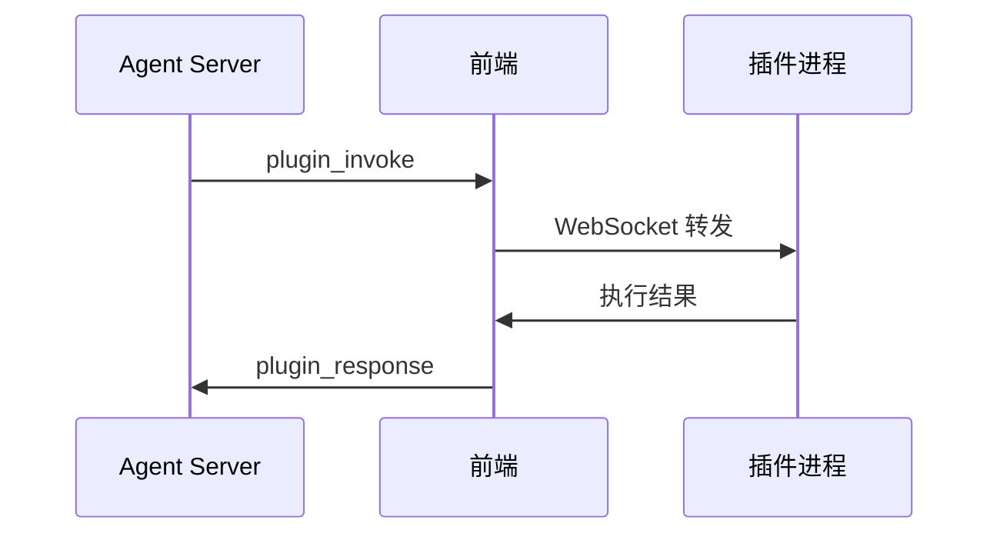

# API 接口规范

本文档定义 NyaDeskPet 前后端 WebSocket 通信协议与消息格式。

## 目录
- [API 接口规范](#api-接口规范)
  - [目录](#目录)
  - [通信概述](#通信概述)
  - [前端 - 后端消息](#前端---后端消息)
    - [user\_input — 用户输入](#user_input--用户输入)
    - [model\_info — 模型信息](#model_info--模型信息)
    - [tap\_event — 触碰事件](#tap_event--触碰事件)
    - [character\_info — 角色信息](#character_info--角色信息)
    - [file\_upload — 文件上传](#file_upload--文件上传)
    - [plugin\_response — 插件响应转发](#plugin_response--插件响应转发)
    - [plugin\_status — 插件状态通知](#plugin_status--插件状态通知)
    - [tool\_confirm\_response — 工具确认响应](#tool_confirm_response--工具确认响应)
    - [command\_execute — 斜杠指令执行](#command_execute--斜杠指令执行)
    - [plugin\_message — 插件主动消息](#plugin_message--插件主动消息)
  - [后端 - 前端消息](#后端---前端消息)
    - [dialogue — 对话消息](#dialogue--对话消息)
    - [流式对话](#流式对话)
    - [tool\_confirm — 工具调用确认请求](#tool_confirm--工具调用确认请求)
    - [流式音频传输](#流式音频传输)
      - [时间轴 timing 格式](#时间轴-timing-格式)
    - [live2d — Live2D 控制](#live2d--live2d-控制)
    - [sync\_command — 组合指令](#sync_command--组合指令)
    - [plugin\_invoke — 插件调用请求](#plugin_invoke--插件调用请求)
    - [commands\_register — 指令注册](#commands_register--指令注册)
    - [command\_response — 指令执行结果](#command_response--指令执行结果)
    - [system — 系统消息](#system--系统消息)
    - [tool\_status — 工具执行状态](#tool_status--工具执行状态)
  - [响应优先级系统](#响应优先级系统)
  - [前端插件协议](#前端插件协议)
    - [连接握手](#连接握手)
    - [配置请求](#配置请求)
    - [权限请求](#权限请求)
    - [语言切换](#语言切换)
    - [富内容响应类型](#富内容响应类型)
  - [消息优先级](#消息优先级)
  - [消息持久化](#消息持久化)

## 通信概述

- 传输协议：WebSocket
- 消息格式：JSON，所有消息包含 `type` 字段
- 内置 Agent 服务器地址：`ws://localhost:8011`（可在设置中修改）

## 前端 - 后端消息

### user_input — 用户输入

```json
{
  "type": "user_input",
  "text": "用户输入的文本",
  "timestamp": 1234567890,
  "attachment": {
    "type": "image",
    "data": "<base64 图片数据>",
    "source": "camera"
  }
}
```

- `attachment`：可选，多模态附件。当摄像头启用时自动附带截图
  - `type`：附件类型（`image` / `file`）
  - `data`：Base64 编码数据
  - `source`：来源标识（如 `camera`）

### model_info — 模型信息

模型加载完成后自动发送，通知后端当前模型的全部控制能力。WebSocket 连接成功后也会重发：

```json
{
  "type": "model_info",
  "data": {
    "available": true,
    "modelPath": "models/nya/nya.model3.json",
    "dimensions": { "width": 2048, "height": 2048 },
    "motions": {
      "TapBody": { "count": 8, "files": ["mtn_01.motion3.json", "..."] }
    },
    "expressions": ["exp_01", "exp_02"],
    "hitAreas": ["Head", "Body"],
    "availableParameters": [
      { "id": "ParamEyeLOpen", "value": 1.0, "min": 0.0, "max": 1.0, "default": 1.0 },
      { "id": "ParamMouthOpenY", "value": 0.0, "min": 0.0, "max": 1.0, "default": 0.0 },
      { "id": "ParamAngleX", "value": 0.0, "min": -30.0, "max": 30.0, "default": 0.0 }
    ],
    "parameters": {
      "canScale": true,
      "currentScale": 1.5,
      "userScale": 1.0,
      "baseScale": 1.5
    },
    "mappedParameters": [
      { "id": "ParamAngleX", "alias": "head_turn_x", "description": "头部左右转动", "min": -30, "max": 30, "default": 0 },
      { "id": "ParamEyeLOpen", "alias": "left_eye_open", "description": "左眼睁开程度", "min": 0, "max": 1, "default": 1 }
    ],
    "mappedExpressions": [
      { "id": "exp_01", "alias": "normal", "description": "默认表情" },
      { "id": "exp_02", "alias": "happy", "description": "开心" }
    ],
    "mappedMotions": [
      { "group": "Idle", "alias": "idle", "description": "待机休闲动作", "count": 1 }
    ]
  }
}
```

- `mappedParameters` / `mappedExpressions` / `mappedMotions`：当模型目录存在 `param-map.json` 参数映射表时自动填充，提供语义别名和描述。不存在时这三个字段省略
- `availableParameters`：始终包含模型全量参数（不受映射表影响）

### tap_event — 触碰事件

用户点击模型时发送，具体反应由后端决定：

```json
{
  "type": "tap_event",
  "data": {
    "hitArea": "Head",
    "position": { "x": 100, "y": 150 },
    "timestamp": 1234567890
  }
}
```

- `hitArea`：触碰部位名称，未命中时为 `"unknown"`

### character_info — 角色信息

连接成功后自动发送用户自定义角色设定：

```json
{
  "type": "character_info",
  "data": {
    "useCustom": true,
    "name": "小喵",
    "personality": "活泼开朗，喜欢卖萌..."
  }
}
```

- `useCustom` 为 `false` 时使用后端默认配置

### file_upload — 文件上传

```json
{
  "type": "file_upload",
  "data": {
    "fileName": "photo.jpg",
    "fileType": "image/jpeg",
    "fileSize": 102400,
    "fileData": "<base64>",
    "timestamp": 1234567890
  }
}
```

- 前端限制 100MB 以内

### plugin_response — 插件响应转发

前端将插件执行结果转发给后端 Agent：

```json
{
  "type": "plugin_response",
  "data": {
    "pluginId": "terminal",
    "requestId": "uuid",
    "success": true,
    "action": "execute",
    "result": { "type": "text", "content": { "output": "...", "exitCode": 0 } },
    "error": null,
    "timestamp": 1234567890
  }
}
```

### plugin_status — 插件状态通知

插件连接/断开时发送当前已连接的前端插件列表：

```json
{
  "type": "plugin_status",
  "data": {
    "plugins": [
      {
        "pluginId": "terminal",
        "pluginName": "Terminal Plugin",
        "capabilities": ["execute"]
      }
    ]
  }
}
```

后端据此注册/注销 Function Calling 工具。

### tool_confirm_response — 工具确认响应

用户对工具调用确认请求的批准/拒绝：

```json
{
  "type": "tool_confirm_response",
  "data": {
    "confirmId": "tc_123_abc",
    "approved": true,
    "remember": false
  }
}
```

- `remember`：可选，用户是否选择「记住此操作」，后续相同工具自动批准/拒绝

### command_execute — 斜杠指令执行

```json
{
  "type": "command_execute",
  "data": {
    "command": "/info",
    "args": []
  }
}
```

### plugin_message — 插件主动消息

前端插件主动向 Agent 发送的消息（非工具调用响应），经前端 PluginConnector 转发：

```json
{
  "type": "plugin_message",
  "data": {
    "pluginId": "my-plugin",
    "pluginName": "我的插件",
    "text": "检测到用户桌面发生了变化",
    "metadata": {
      "source": "monitor",
      "details": "窗口切换至 VSCode"
    }
  }
}
```

- `pluginName`：可选，用于日志和上下文标识
- `text`：消息正文，将作为用户消息发送给 LLM
- `metadata`：可选，附加结构化数据
- 消息会被持久化到会话历史中（格式：`[插件 pluginName] text`）

## 后端 - 前端消息

### dialogue — 对话消息

```json
{
  "type": "dialogue",
  "data": {
    "text": "回复文本",
    "duration": 5000,
    "reasoningContent": "思维链内容（可选）",
    "attachment": {
      "type": "image",
      "url": "base64 或 URL",
      "name": "图片名.png"
    }
  }
}
```

- `reasoningContent`：可选，非流式模式下的思维链/推理过程（如 DeepSeek thinking mode）
- `attachment`：可选，附件（图片或文件）

### 流式对话

LLM 配置 `stream: true` 时使用，实现逐字输出：

**dialogue_stream_start**
```json
{
  "type": "dialogue_stream_start",
  "data": { "streamId": "stream_123_abc" }
}
```

**dialogue_stream_chunk**（可多次发送）
```json
{
  "type": "dialogue_stream_chunk",
  "data": {
    "streamId": "stream_123_abc",
    "delta": "增量文本",
    "reasoningDelta": "思维链增量（可选）"
  }
}
```

**dialogue_stream_end**
```json
{
  "type": "dialogue_stream_end",
  "data": {
    "streamId": "stream_123_abc",
    "fullText": "完整文本（可选）",
    "duration": 5000
  }
}
```

### tool_confirm — 工具调用确认请求

LLM 请求调用插件来源的工具时，先向前端发送确认：

```json
{
  "type": "tool_confirm",
  "data": {
    "confirmId": "tc_123_abc",
    "toolCalls": [
      {
        "id": "call_abc",
        "name": "terminal_execute",
        "arguments": { "command": "ls -la" },
        "source": "plugin",
        "description": "在终端中执行命令"
      }
    ],
    "timeout": 30000
  }
}
```

- `source`：`function`（内置）/ `mcp`（MCP 服务器）/ `plugin`（前端插件）
- 仅 `plugin` 来源需要确认，超时自动视为拒绝

### 流式音频传输

**audio_stream_start**
```json
{
  "type": "audio_stream_start",
  "data": {
    "mimeType": "audio/mpeg",
    "totalDuration": 5000,
    "text": "同步显示的文字",
    "timeline": [
      { "timing": "start", "action": "expression", "expressionId": "happy" },
      { "timing": 25, "action": "motion", "group": "TapHead", "index": 0 },
      { "timing": "middle", "action": "parameter", "parameters": [
        { "id": "ParamMouthOpenY", "value": 0.8, "blend": 0.5 }
      ]}
    ]
  }
}
```

**audio_chunk**（可多次发送）
```json
{
  "type": "audio_chunk",
  "data": { "chunk": "<base64>", "sequence": 0 }
}
```

**audio_stream_end**
```json
{
  "type": "audio_stream_end",
  "data": { "complete": true }
}
```

#### 时间轴 timing 格式

| 格式 | 说明 |
|------|------|
| `"start"` | 0% |
| `"early"` | 15% |
| `"middle"` | 50% |
| `"late"` | 85% |
| `"end"` | 98% |
| `0-100` 数字 | 精确百分比 |

### live2d — Live2D 控制

**动作**
```json
{
  "type": "live2d",
  "data": { "command": "motion", "group": "TapBody", "index": 0, "priority": 2 }
}
```

**表情**
```json
{
  "type": "live2d",
  "data": { "command": "expression", "expressionId": "smile" }
}
```

**参数控制（单个）**
```json
{
  "type": "live2d",
  "data": {
    "command": "parameter",
    "parameterId": "ParamEyeLOpen",
    "value": 0.5,
    "weight": 1.0
  }
}
```

**参数控制（批量）**
```json
{
  "type": "live2d",
  "data": {
    "command": "parameter",
    "parameters": [
      { "id": "ParamEyeLOpen", "value": 0.5, "blend": 0.3 },
      { "id": "ParamMouthOpenY", "value": 0.8, "blend": 0.5 },
      { "id": "ParamAngleX", "value": 10.0, "blend": 1.0 }
    ]
  }
}
```

常用参数：

| 参数 ID | 说明 | 范围 |
|---------|------|------|
| `ParamEyeLOpen` / `ParamEyeROpen` | 左右眼开合 | 0 ~ 1 |
| `ParamMouthOpenY` | 嘴巴张开 | 0 ~ 1 |
| `ParamAngleX/Y/Z` | 头部旋转 | -30 ~ 30 |
| `ParamEyeBallX/Y` | 眼珠位置 | -1 ~ 1 |
| `ParamBrowLY` / `ParamBrowRY` | 眉毛高度 | -1 ~ 1 |

### sync_command — 组合指令

同时执行多个动作：

```json
{
  "type": "sync_command",
  "data": {
    "actions": [
      { "type": "expression", "expressionId": "happy", "waitComplete": false },
      { "type": "motion", "group": "TapHead", "index": 0, "waitComplete": false },
      { "type": "dialogue", "text": "好开心~", "duration": 3000, "waitComplete": false }
    ]
  }
}
```

- `type`：`motion` / `expression` / `dialogue`
- `waitComplete`：是否等待当前动作完成后再执行下一个
- `dialogue` 类型的 action 也支持 `reasoningContent` 和 `attachment` 字段

### plugin_invoke — 插件调用请求

后端 Agent 请求前端调用插件：

```json
{
  "type": "plugin_invoke",
  "data": {
    "requestId": "uuid",
    "pluginId": "terminal",
    "action": "execute",
    "params": { "command": "ls -la" },
    "timeout": 30000
  }
}
```

调用流程：



### commands_register — 指令注册

连接建立后后端发送可用斜杠指令列表：

```json
{
  "type": "commands_register",
  "data": {
    "commands": [
      {
        "name": "info",
        "description": "显示系统信息",
        "options": []
      }
    ]
  }
}
```

### command_response — 指令执行结果

斜杠指令执行后后端返回结果：

```json
{
  "type": "command_response",
  "data": {
    "command": "info",
    "success": true,
    "text": "指令执行结果文本",
    "error": null
  }
}
```

- `text`：执行成功时的结果文本
- `error`：执行失败时的错误信息

### system — 系统消息

后端发送的系统级通知消息：

```json
{
  "type": "system",
  "data": {
    "message": "系统消息内容"
  }
}
```

### tool_status — 工具执行状态

工具循环中每次工具执行完成后发送，通知前端当前工具调用进度：

```json
{
  "type": "tool_status",
  "data": {
    "iteration": 1,
    "calls": [
      { "name": "search_web", "id": "call_abc" }
    ],
    "results": [
      { "id": "call_abc", "success": true }
    ]
  }
}
```

- `iteration`：当前工具循环迭代次数
- `calls`：本次迭代调用的工具列表
- `results`：各工具的执行结果（成功/失败）

## 响应优先级系统

后端发出的响应消息可携带优先级信息，用于前端中断控制：

```json
{
  "responseId": "resp_123_abc",
  "priority": 10,
  "type": "dialogue",
  "data": { "text": "..." }
}
```

- `responseId`：同一次回复的所有消息共享相同 ID（对话、流式、音频等）
- `priority`：数值越高优先级越高，高优先级响应可中断正在播放的低优先级响应

## 前端插件协议

前端插件作为独立进程运行，通过 WebSocket 与前端通信。

### 连接握手

前端连接后发送 `getMetadata` 获取插件信息：

**前端 → 插件**
```json
{ "action": "getMetadata", "locale": "zh-CN" }
```

**插件 → 前端**
```json
{
  "type": "metadata",
  "plugin": "terminal",
  "locale": "zh-CN",
  "defaultLocale": "en-US",
  "metadata": {
    "name": "terminal",
    "version": "1.0.0",
    "displayName": "终端控制插件",
    "description": "执行终端命令",
    "author": "NyaDeskPet",
    "type": "external",
    "permissions": ["terminal.execute"],
    "capabilities": ["execute"]
  }
}
```

### 配置请求

**插件 → 前端**
```json
{ "action": "getConfig", "pluginId": "terminal" }
```

**前端 → 插件**
```json
{ "type": "plugin_config", "config": { "commandTimeout": 30 } }
```

### 权限请求

**插件 → 前端**
```json
{
  "type": "permission_request",
  "requestId": "uuid",
  "permissionId": "terminal.execute",
  "operation": "execute_command",
  "details": { "command": "rm -rf /" }
}
```

**前端 → 插件**
```json
{
  "type": "permission_response",
  "requestId": "uuid",
  "granted": true
}
```

### 语言切换

```json
{ "action": "setLocale", "params": { "locale": "en-US" } }
```

### 富内容响应类型

插件响应的 `result` 字段支持以下类型：

| type | 说明 | content 结构 |
|------|------|-------------|
| `text` | 文本 | `{ text, format? }` — format: `plain` / `markdown` / `html` |
| `image` | 图片 | `{ data, format, width, height, filename? }` |
| `file` | 文件 | `{ filename, size, mimeType, data, path? }` |
| `data` | 结构化数据 | 任意 JSON 对象 |
| `mixed` | 混合内容 | 上述类型的数组 |

示例（混合内容）：
```json
{
  "result": {
    "type": "mixed",
    "content": [
      { "type": "text", "content": { "text": "执行完成" } },
      { "type": "image", "content": { "data": "<base64>", "format": "png", "width": 800, "height": 600 } }
    ]
  }
}
```

## 消息优先级

Pipeline 按优先级处理消息，高优先级消息可中断低优先级的流式输出：

| 优先级 | 消息类型 |
|--------|---------|
| 高 | `user_input`、`command_execute` |
| 中 | `tap_event`、`file_upload`、`plugin_message` |
| 低 | `model_info`、`character_info`、`plugin_status` |

## 消息持久化

以下消息类型会自动写入会话历史（SQLite），重启应用后可查阅：

| 消息类型 | 用户消息格式 | AI 回复 |
|----------|-------------|--------|
| `user_input` | 原始文本 | LLM 回复（流式/非流式） |
| `tap_event` | `[触碰] 用户触碰了 "hitArea" 部位` | LLM 回复或默认反应文案 |
| `file_upload` | `[文件上传] 文件名 (类型)` | 图片转述结果 / 确认回复 |
| `command_execute` | `/command args` | 指令执行结果文本 |
| `plugin_message` | `[插件 name] text` | LLM 回复 |

`model_info`、`character_info`、`plugin_status`、`plugin_response` 等控制类消息不写入会话历史。
