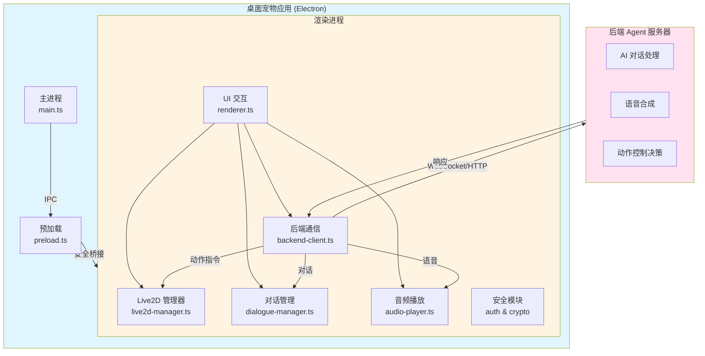

# 开发指南

本文档包含 NyaDeskPet 的底层架构、核心模块实现、安全系统设计以及开发者相关的技术细节。

## 🏗️ 架构设计

### 核心架构图



---

## 📁 文件结构

```
NyaDeskPet/
├── src/                    # TypeScript 源码（主进程）
│   ├── main.ts            # Electron 主进程，负责窗口管理和 IPC
│   └── preload.ts         # 预加载脚本，安全的 IPC 桥接
├── dist/                   # 编译后的 JS（主进程）
├── renderer/               # 渲染进程
│   ├── index.html         # 主页面入口
│   ├── styles.css         # 全局样式
│   ├── types/             # TypeScript 类型定义
│   │   └── global.d.ts    # 全局接口和类型定义
│   └── js/                # 渲染进程核心模块
│       ├── renderer.ts        # 主协调脚本，初始化应用
│       ├── settings-manager.ts  # 设置管理器，配置存储和读取
│       ├── live2d-manager.ts  # Live2D 模型加载、渲染和动画控制
│       ├── backend-client.ts  # WebSocket/HTTP 后端通信
│       ├── dialogue-manager.ts# 对话框和文本展示
│       └── audio-player.ts    # 音频播放和 TTS 支持
├── docs/                   # 项目文档
│   ├── API.md              # 接口协议规范
│   ├── USAGE.md            # 安装和使用说明
│   └── DEVELOPMENT.md      # 开发细节（本文档）
├── models/                # 本地测试模型文件
├── assets/                # 图标和静态资源
├── package.json           # 项目配置和依赖
└── tsconfig.json          # TypeScript 编译配置
```

---
## 🎨 核心模块说明

### 设置管理器 (settings-manager.ts)

负责应用配置的持久化存储和管理：

- **存储方式**: localStorage
- **配置项**: 模型路径、后端URL、自动连接、音量等
- **角色自定义 (v1.5)**: 
  - 支持自定义桌宠名称和人设描述
  - 配置项: `useCustomCharacter`, `customName`, `customPersonality`
  - 连接时自动发送给后端，用于调整 AI 对话风格
- **验证**: 自动验证配置有效性（URL格式、路径等）
- **API**: 提供 get/set/update/reset 等操作
- **UI集成**: 与设置面板双向绑定

### Live2D 管理器 (live2d-manager.ts)

负责 Live2D 模型的加载、渲染与交互：

- **依赖**: PixiJS 7.3 + Live2D Cubism SDK。
- **功能**: 模型加载、动作播放、表情控制、视线跟随、实时缩放。
- **状态管理**: 维护当前动作、表情及用户缩放系数。
- **窗口自适应与交互**: 
  - **基础缩放**: 初始化时根据窗口高度自动计算 `baseScale`，确保模型始终居中且高度合适。
  - **交互缩放**: 支持鼠标滚轮事件，动态调整 `userScale` (0.3x - 3.0x)，缩放过程平滑。
  - **Resize 处理**: 监听窗口大小变化，实时同步画布尺寸并重新计算模型位移值，保持模型视觉一致性。
  - **视线追踪**: 将鼠标位置映射至 Pixi 局部坐标系，驱动模型头部和眼睛追踪。
- **模型信息同步 (v1.4)**:
  - 模型加载完成后，自动提取动作组、表情列表、命中区域等信息。
  - 通过 `model_info` 消息将模型元数据发送给后端 Agent，让后端掌握可用的控制参数。
- **触碰系统 (v1.4)**:
  - 支持可视化配置触碸区域，通过设置面板启用/禁用特定部位的触摸反应。
  - 每个模型拥有独立的触碸配置，存储在 `localStorage` 中。
  - 点击模型时，前端检测命中区域并发送 `tap_event` 到后端，包含触碰部位和位置信息。
  - **触摸反应由后端Agent处理**：后端接收触摸事件后，决定播放的动作、表情和消息，并通过 `sync_command` 返回给前端执行。
- **同步指令系统 (v1.4)**:
  - 支持执行组合指令 (`sync_command`)，可同时或顺序播放文字、音频、动作、表情。
  - 通过 `waitComplete` 和 `duration` 参数精确控制各个元素的播放时序。
- **口型同步 (v1.5)**:
  - 集成 Web Audio API 频率分析，实现音频播放时的实时口型动画。
  - 通过 `AnalyserNode` 分析音频频率数据，30 FPS 更新 `ParamMouthOpenY` 参数。
  - 支持平滑插值，确保口型动画自然流畅。
  - 音频播放结束后自动停止口型同步。

### 国际化系统 (i18n-manager.ts)

支持多语言动态切换：

- **实现**: 基于 `data-i18n` 属性的自动绑定系统。
- **语言包**: 存放于 `renderer/locales/*.json`。
- **特性**: 
  - 支持嵌套键值（如 `settings.tabs.general`）。
  - 支持 JS 代码中通过 `t(key)` 手动获取翻译。
  - 自动检测系统语言，并支持用户在设置中手动切换。
  - 与设置管理器联动，修改语言后立即刷新 UI 文本。

### 主题管理器 (theme-manager.ts)

可扩展的主题切换系统：

- **模式**: 支持 `light` (浅色), `dark` (深色), `system` (跟随系统)。
- **实现**: 通过在 `body` 标签切换 `theme-light`/`theme-dark` 类名，并配合 CSS 变量实现无缝切换。
- **颜色规范**: 深色模式统一使用优雅的 `#2a2a2a` 作为背景色调，确保视觉舒适。

### 后端通信客户端 (backend-client.ts)

WebSocket 和 HTTP 双协议支持：

- **WebSocket**: 实时双向通信
- **HTTP**: Fallback 和 REST API 调用
- **自动重连**: 断线后自动重连机制
- **配置热更新**: 从设置管理器读取最新配置

---
## 🛠️ 技术栈

- **Electron 28.0**: 应用外壳。
- **TypeScript 5.3**: 开发语言。
- **PixiJS 7.3**: 2D 渲染引擎，用于承载 Live2D 画布。
- **Live2D Cubism SDK**: Live2D 原生支持层。
- **Lucide Icons**: 现代化 SVG 图标库，提供一致的视觉体验。
- **Web Crypto API**: 用于本地高性能加解密。
- **IndexedDB**: 用于存储大数据块（10MB+ 模型）。

---

## 🛠️ 后续开发

### 添加新模块

1. 在 `renderer/js/` 创建新 `.ts` 文件。
2. 在 `renderer/types/global.d.ts` 定义接口和 `Window` 扩展。
3. 在 `renderer/index.html` 中引入编译后的 `.js` 文件。
4. 在 `renderer.ts` 的初始化逻辑中启动。

### 核心功能迭代计划

- [x] 实现 Live2D 视线跟随鼠标（已完成）
- [x] Live2D 模型窗口大小自适应（已完成）
- [x] 系统托盘支持和快速交互菜单（已完成）
- [x] 对话界面和多模态输入支持（v1.2）
- [x] 现代化UI布局和拖动控制（v1.2）
- [ ] 语音输入识别功能
- [ ] 视频输入和视觉识别功能
- [ ] 增加自定义快捷键
- [ ] 优化模型切换时的内存释放
- [ ] 增加开机自启动配置项

### 系统托盘功能（v1.1）

主进程（main.ts）新增功能：

- **托盘图标**: 应用启动时创建系统托盘图标
- **动态托盘菜单 (v1.5)**: 
  - 菜单按钕根据当前状态动态更新文字
  - “显示UI”/“隐藏UI” 单个按钮切换
  - “打开对话”/“关闭对话” 单个按钮切换
  - 通过 IPC 消息 (`ui-state-changed`) 同步渲染进程状态
- **窗口生命周期**: 
  - 关闭窗口时隐藏到托盘而不是退出
  - 通过托盘菜单完全退出应用
  - 支持双击托盘图标切换窗口显示
- **图标配置**: 
  - macOS: `assets/tray-icon-mac.png`（模板图标，黑白）
  - Windows/Linux: `assets/tray-icon.png`
  - 未提供图标时使用默认占位图标
- **IPC通信**: 新增 `show-window`、`hide-window`、`toggle-window`、`ui-state-changed` 等IPC方法

### 对话界面功能 (v1.3)

渲染进程 (`renderer.ts`) 对话系统升级：

- **侧边栏 UI**: 对话窗口改为左侧滑出式，采用 Flex 布局。
- **对话逻辑**: 由 `dialogue-manager.ts` 管理历史记录，支持深色模式气泡。
- **字幕显示**: 支持在对话框关闭时，于屏幕底部浮现最近一次对话的字幕预览。

### 辅助工具

#### i18n 检查工具 (scripts/check-i18n.js)

扫描 `index.html` 中的 `data-i18n` 并校验语言包完整性。
运行：`npm run check-i18n`

### UI 图标系统 (Lucide Icons)

集成专业图标库，提供一致的几何风格图标体验。使用方式：`<i data-lucide="icon-name"></i>`。

---

**注意**: 本项目已建立严格的文档规范。后续开发细节请在此文档内更新，严禁创建新的文档。
