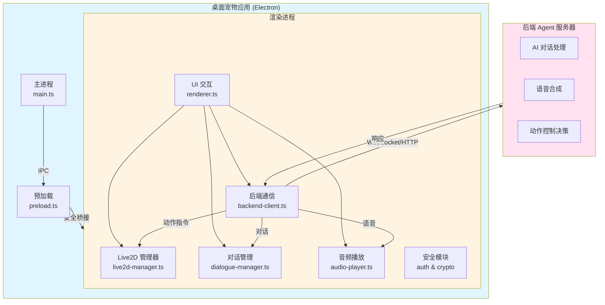

# 开发指南

本文档包含 NyaDeskPet 的底层架构、核心模块实现、安全系统设计以及开发者相关的技术细节。

## 🏗️ 架构设计

### 核心架构图



---

## 📁 文件结构

```
NyaDeskPet/
├── src/                    # TypeScript 源码（主进程）
│   ├── main.ts            # Electron 主进程，负责窗口管理和 IPC
│   └── preload.ts         # 预加载脚本，安全的 IPC 桥接
├── dist/                   # 编译后的 JS（主进程）
├── renderer/               # 渲染进程
│   ├── index.html         # 主页面入口
│   ├── styles.css         # 全局样式
│   ├── types/             # TypeScript 类型定义
│   │   └── global.d.ts    # 全局接口和类型定义
│   └── js/                # 渲染进程核心模块
│       ├── renderer.ts        # 主协调脚本，初始化应用
│       ├── settings-manager.ts  # 设置管理器，配置存储和读取
│       ├── live2d-manager.ts  # Live2D 模型加载、渲染和动画控制
│       ├── backend-client.ts  # WebSocket/HTTP 后端通信
│       ├── dialogue-manager.ts# 对话框和文本展示
│       └── audio-player.ts    # 音频播放和 TTS 支持
├── docs/                   # 项目文档
│   ├── API.md              # 接口协议规范
│   ├── USAGE.md            # 安装和使用说明
│   └── DEVELOPMENT.md      # 开发细节（本文档）
├── models/                # 本地测试模型文件
├── assets/                # 图标和静态资源
├── package.json           # 项目配置和依赖
└── tsconfig.json          # TypeScript 编译配置
```

---
## 🎨 核心模块说明

### 设置管理器 (settings-manager.ts)

负责应用配置的持久化存储和管理：

- **存储方式**: localStorage
- **配置项**: 模型路径、后端URL、自动连接、音量等
- **验证**: 自动验证配置有效性（URL格式、路径等）
- **API**: 提供 get/set/update/reset 等操作
- **UI集成**: 与设置面板双向绑定

### Live2D 管理器 (live2d-manager.ts)

负责 Live2D 模型的加载和渲染：

- **依赖**: PixiJS 7.3 + Live2D Cubism SDK
- **功能**: 模型加载、动画播放、表情控制、视线跟随
- **状态管理**: 当前动作、表情状态追踪
- **窗口自适应**: 
  - 初始化时自动根据窗口大小调整模型位置和缩放
  - 监听窗口resize事件，实时调整模型显示
  - 模型始终居中显示，占用约75%窗口空间
  - 防抖处理避免频繁调整导致的性能问题

### 后端通信客户端 (backend-client.ts)

WebSocket 和 HTTP 双协议支持：

- **WebSocket**: 实时双向通信
- **HTTP**: Fallback 和 REST API 调用
- **自动重连**: 断线后自动重连机制
- **配置热更新**: 从设置管理器读取最新配置

---
## 🛠️ 技术栈

- **Electron 28.0**: 应用外壳。
- **TypeScript 5.3**: 开发语言。
- **PixiJS 7.3**: 2D 渲染引擎，用于承载 Live2D 画布。
- **Live2D Cubism SDK**: Live2D 原生支持层。
- **Lucide Icons**: 现代化 SVG 图标库，提供一致的视觉体验。
- **Web Crypto API**: 用于本地高性能加解密。
- **IndexedDB**: 用于存储大数据块（10MB+ 模型）。

---

## 🛠️ 后续开发

### 添加新模块

1. 在 `renderer/js/` 创建新 `.ts` 文件。
2. 在 `renderer/types/global.d.ts` 定义接口和 `Window` 扩展。
3. 在 `renderer/index.html` 中引入编译后的 `.js` 文件。
4. 在 `renderer.ts` 的初始化逻辑中启动。

### 核心功能迭代计划

- [x] 实现 Live2D 视线跟随鼠标（已完成）
- [x] Live2D 模型窗口大小自适应（已完成）
- [x] 系统托盘支持和快速交互菜单（已完成）
- [x] 对话界面和多模态输入支持（v1.2）
- [x] 现代化UI布局和拖动控制（v1.2）
- [ ] 语音输入识别功能
- [ ] 视频输入和视觉识别功能
- [ ] 增加自定义快捷键
- [ ] 优化模型切换时的内存释放
- [ ] 增加开机自启动配置项

### 系统托盘功能（v1.1）

主进程（main.ts）新增功能：

- **托盘图标**: 应用启动时创建系统托盘图标
- **托盘菜单**: 提供显示/隐藏、置顶、对话、设置、退出等功能
- **窗口生命周期**: 
  - 关闭窗口时隐藏到托盘而不是退出
  - 通过托盘菜单完全退出应用
  - 支持双击托盘图标切换窗口显示
- **图标配置**: 
  - macOS: `assets/tray-icon-mac.png`（模板图标，黑白）
  - Windows/Linux: `assets/tray-icon.png`
  - 未提供图标时使用默认占位图标
- **IPC通信**: 新增 `show-window`、`hide-window`、`toggle-window` 等IPC方法

### 对话界面功能（v1.2）

渲染进程（renderer.ts）新增对话系统：

- **UI布局重构**:
  - 顶栏：状态指示、控制按钮，支持拖动整个窗口
  - 主内容区：Live2D 模型显示，模型交互
  - 底栏：对话按钮，快速访问聊天功能
  - **图标系统**：使用 Lucide Icons 替代 emoji，提供专业、一致的视觉体验

- **对话窗口**:
  - 悬浮式聊天窗口，居中显示
  - 消息气泡设计（用户/助手区分）
  - 自动滚动到最新消息
  - 输入框自动调整高度
  - 专业图标：消息、麦克风、摄像头等

- **多模态输入**:
  - 文本输入：支持回车发送、Shift+Enter换行
  - 语音输入按钮：预留接口（待实现）
  - 视频输入按钮：预留接口（待实现）

- **交互优化**:
  - 点击背景关闭对话窗口
  - ESC键关闭（可扩展）
  - 托盘菜单快速打开对话
  - IPC事件：`open-chat` 用于主进程触发

### UI 图标系统（v1.2）

集成 Lucide Icons 专业图标库：

- **图标库**: Lucide Icons (MIT License)
  - 轻量级：约 50KB
  - SVG 格式，可缩放，支持自定义颜色
  - 1000+ 图标可选

- **使用的图标**:
  - `settings` - 设置
  - `minus` / `x` - 最小化/关闭
  - `message-circle` - 聊天
  - `mic` - 麦克风
  - `video` - 摄像头
  - `globe` - 网络连接
  - `volume-2` - 音量
  - `smile` - Live2D 模型

- **实现方式**:
  - HTML: `<i data-lucide="icon-name"></i>`
  - 初始化: `lucide.createIcons()`
  - CSS 控制图标大小、颜色、动画

---

**注意**: 本项目已建立严格的文档规范。后续开发细节请在此文档内更新，严禁创建新的文档。
