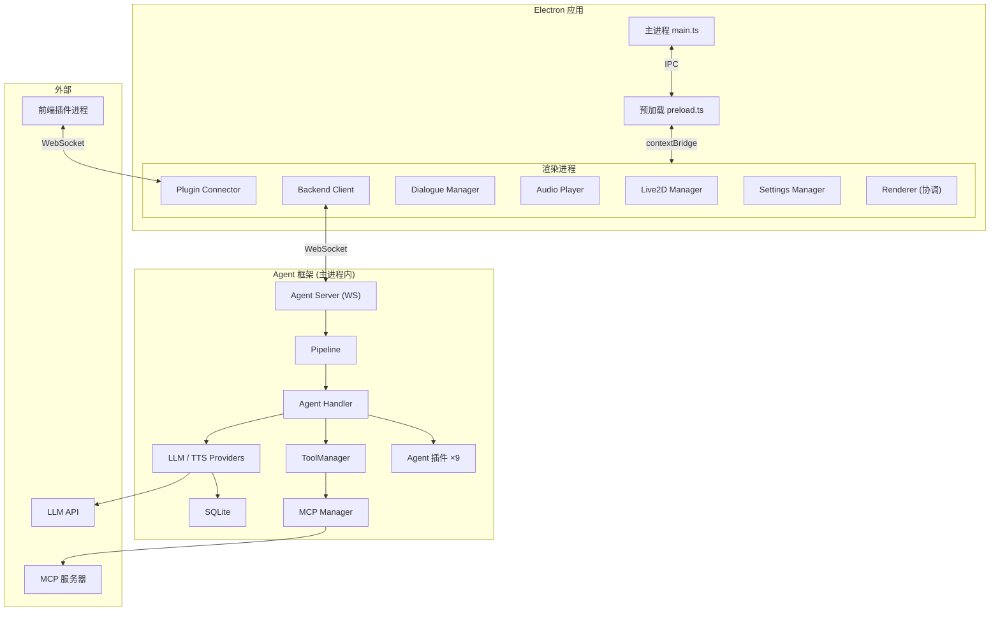
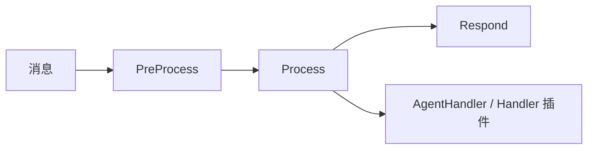
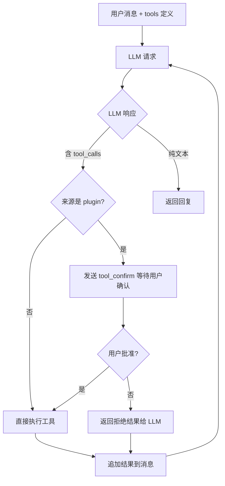

# 开发指南

本文档介绍 NyaDeskPet 的架构设计、核心模块与开发相关技术细节。

## 架构总览



## 文件结构

```
src/                        主进程 TypeScript → dist/
  main.ts                   Electron 主进程、~88 个 IPC Handler
  preload.ts                IPC 安全桥接
  agent-server.ts           内置 WebSocket Agent 服务器
  asr-service.ts            Sherpa-ONNX ASR 服务
  logger.ts                 主进程日志
  agent/                    Agent 框架
    index.ts                Barrel export
    provider.ts             LLM Provider 抽象层 + 注册表
    tts-provider.ts         TTS Provider 抽象层 + 注册表
    pipeline.ts             消息管线（3 Stage 洋葱模型）
    context.ts              PipelineContext + SessionManager
    handler.ts              业务处理器（含工具循环 + 流式输出）
    database.ts             SQLite 数据库（better-sqlite3，WAL 模式）
    tools.ts                FC 工具管理器
    mcp-client.ts           MCP 客户端（stdio / SSE）
    commands.ts             斜杠指令注册表
    agent-plugin.ts         Agent 插件框架（基类 + Manager）
    providers/              LLM 实现：openai / deepseek / openrouter / siliconflow
    tts-providers/          TTS 实现：fish-audio / edge-tts

renderer/                   渲染进程（*.ts 原地编译为 *.js）
  index.html                主页面
  styles.css                样式
  tsconfig.json             渲染进程编译配置
  types/global.d.ts         全局类型定义（所有接口唯一来源）
  locales/                  i18n：zh-CN.json / en-US.json
  lib/                      PixiJS / Live2D SDK / Lucide Icons
  js/
    renderer.ts             主协调（初始化、事件、对话管理、指令 UI）
    settings-manager.ts     设置管理（localStorage）
    live2d-manager.ts       Live2D 渲染与交互
    backend-client.ts       WebSocket + HTTP 通信
    dialogue-manager.ts     对话气泡
    audio-player.ts         MSE 流式音频 + 口型同步
    camera-manager.ts       摄像头管理
    microphone-manager.ts   麦克风 + ASR 集成
    i18n-manager.ts         国际化
    theme-manager.ts        主题切换
    plugin-connector.ts     前端插件进程 + WebSocket 管理
    plugin-ui.ts            插件管理面板
    plugin-config-manager.ts  插件配置读写
    plugin-config-ui.ts     插件配置表单（9 种类型）
    plugin-permission-manager.ts  权限审批（5 级危险度）
    response-controller.ts  响应优先级控制
    logger.ts               渲染进程日志

agent-plugins/              Agent 插件（10 个，纯 JS CommonJS）
plugins/                    前端插件（独立进程，WebSocket）
models/                     Live2D 模型 + ASR 模型
scripts/                    辅助脚本
assets/                     图标资源
docs/                       文档（固定 5 个）
```

## Agent 框架

### LLM Provider 层

**设计**：策略模式 + 注册表模式

- `LLMProvider` 抽象基类：定义 `chat()` / `chatStream()` 接口
- `providerRegistry`：全局注册表，`registerProvider()` 注册实现
- 4 种实现：`openai`、`deepseek`、`openrouter`、`siliconflow`
- 支持多实例共存，通过 `instanceId` 区分

扩展示例：

```typescript
class MyProvider extends LLMProvider {
  getMetadata(): ProviderMetadata {
    return {
      id: 'my-llm',
      name: 'My LLM',
      description: '自定义 LLM',
      configSchema: [
        { key: 'apiKey', label: 'API Key', type: 'password', required: true },
        { key: 'model', label: '模型', type: 'string', default: 'gpt-4' }
      ]
    };
  }
  async chat(request: LLMRequest): Promise<LLMResponse> {
    return { text: '回复', model: 'my-model' };
  }
}
registerProvider(new MyProvider({ id: 'my-llm', name: 'My LLM' }).getMetadata(), (config) => new MyProvider(config));
```

### TTS Provider 层

- `TTSProvider` 抽象基类：定义 `synthesize()` 流式音频合成接口
- 2 种实现：`fish-audio`、`edge-tts`
- 同样支持多实例共存与注册表

### 消息管线 (Pipeline)

**设计**：洋葱模型，每条消息经过 3 个 Stage：

| 阶段 | 职责 |
|------|------|
| `PreProcessStage` | 优先级分配、消息日志 |
| `ProcessStage` | 按消息类型路由，调用 Handler 或 Agent 插件钩子 |
| `RespondStage` | 统一发送 `ctx.replies`，错误兜底 |



每个 Stage 可在 `next()` 前后执行逻辑。可通过 `insertStageBefore()` 插入自定义 Stage。

### 会话管理 (Context)

- **PipelineContext**：单次消息上下文，贯穿整个管线
  - `message`：原始消息
  - `replies`：回复缓冲
  - `state`：Stage 间共享数据
  - `abort()`：中止管线
- **SessionManager**：多轮对话管理
  - 固定 sessionId `'builtin'`（内置 Agent 服务器）
  - 支持新建 / 切换 / 删除对话
  - 对话历史持久化到 SQLite
  - 消息类型：text / image / file / tool_call / tool_result / system
  - 自动以第一条用户消息生成对话标题

### 数据持久化 (Database)

使用 `better-sqlite3`（同步 API），数据库位于 `appData/NyaDeskPet/data/agent.db`。

| 表 | 用途 |
|----|------|
| `conversations` | 对话记录（id, session_id, title, 时间戳, metadata） |
| `messages` | 消息记录（role, type, content, extra JSON, token_count） |
| `tool_definitions` | 工具定义（name, parameters JSON Schema, source, mcp_server） |

- WAL 模式提升并发性能
- 外键约束（删除对话级联删除消息）
- 全局单例 `agentDb`

### 工具系统 (Tools)

- `ToolManager`：工具注册表 + 执行器
  - `registerFunction(schema, handler)`：注册自定义工具
  - `registerMCPTool(schema, server, handler)`：注册 MCP 工具
  - `toOpenAITools()`：生成 OpenAI API `tools` 参数
  - `executeTool(toolCall, timeout)`：带超时执行
- 工具定义持久化到 SQLite
- 支持启用/禁用单个工具

### MCP 客户端

- `MCPManager`：管理多个 MCP 服务器连接
  - 支持 stdio / SSE 两种传输
  - 自动发现服务器工具并注册到 ToolManager
  - 断连自动重试
  - 配置持久化到 `appData/NyaDeskPet/data/mcp_servers.json`

MCP 服务器配置格式：

```json
{
  "name": "my-mcp-server",
  "transport": "stdio",
  "command": {
    "darwin": ["python3", "server.py"],
    "linux": ["python3", "server.py"],
    "win32": ["python", "server.py"]
  },
  "workingDirectory": "/path/to/server",
  "autoStart": true,
  "enabled": true
}
```

### 业务处理器 (Handler)

核心消息处理逻辑，若存在 Handler 插件则委托给插件处理：

| 方法 | 职责 |
|------|------|
| `processUserInput` | 调用 LLM，维护对话历史，工具循环，流式/非流式输出 |
| `processTapEvent` | 触碰反应（有 LLM 时智能回复，否则默认文案），持久化触碰记录 + AI 回复 |
| `processFileUpload` | 文件处理（图片转述、其他文件确认），持久化上传记录 + 响应 |
| `processCommandExecute` | 执行斜杠指令，持久化指令 + 结果 |
| `processPluginMessage` | 处理前端插件主动消息，经 LLM 处理后持久化 |
| `processModelInfo` | 存储模型状态 |
| `processCharacterInfo` | 存储角色人设 |
| `processToolConfirmResponse` | 处理工具调用确认/拒绝 |

**流式输出**：当 Provider 配置 `stream: true` 时，通过 `dialogue_stream_start/chunk/end` 三段式实时推送增量文本。流式模式下工具循环正常工作，`toolCallDeltas` 积累后统一执行。

**消息持久化**：所有产生对话内容的消息类型均自动写入会话历史，重启应用后可查看历史记录：

| 消息类型 | 持久化内容 |
|----------|------------|
| `user_input` | 用户文本 + LLM 回复 |
| `tap_event` | `[触碰] 用户触碰了 "hitArea" 部位` + AI 回复或默认反应 |
| `file_upload` | `[文件上传] 文件名 (类型)` + 转述结果或确认回复 |
| `command_execute` | `/command args` + 执行结果文本 |
| `plugin_message` | `[插件 name] text` + LLM 回复 |

`model_info`、`character_info` 等控制类消息不写入会话历史。

**工具循环**：



最大迭代 10 次。

### Agent 插件系统

- `AgentPlugin`：插件基类，提供 `initialize()` / `terminate()` 生命周期钩子
- `AgentPluginManager`：扫描 agent-plugins 目录，加载、激活、管理插件
  - 自动激活（`autoActivate: true`）
  - 依赖拓扑排序（`dependencies` 数组）
  - 上下文注入（`AgentPluginContext`）
- Handler 插件钩子：`onUserInput` / `onTapEvent` / `onFileUpload` / `onPluginMessage` / `onModelInfo` / `onCharacterInfo`
- 插件间通信：`ctx.getPluginInstance(name)` 获取已激活插件实例

> 详细开发指南见 AGENT_PLUGINS.md

### 斜杠指令系统

- `CommandRegistry`：指令注册表
- Agent 插件通过 `ctx.registerCommand()` 注册指令
- 前端 Discord 风格自动补全 UI
- 连接建立时后端发送 `commands_register` 消息同步指令列表

## 渲染进程模块

### Live2D 管理器

- 模型加载、动作/表情/参数控制
- **参数映射表**（`param-map.json`）：从模型目录读取语义别名映射，构建 LLM 友好的模型信息
- **参数动画系统**：三阶段生命周期（过渡 → 保持 → 淡出释放），自动计算过渡时长
  - 过渡时长根据 `|Δvalue| / paramRange` 线性映射到 200~900ms
  - 保持 2000ms 后通过 500ms 权重衰减平滑交还 SDK 控制
  - 所有参数动画通过 `beforeModelUpdate` 事件钩子每帧持久注入
- 视线跟随（鼠标坐标 → 模型坐标映射，参数动画期间自动抑制）
- 滚轮缩放（0.3x ~ 3.0x）
- 触碰系统（可按模型独立配置各部位的启用/禁用）
- 口型同步（Web Audio API AnalyserNode，30 FPS 更新 `ParamMouthOpenY`）
- 模型加载后自动发送 `model_info` 消息（含映射信息）

### 后端通信客户端

- WebSocket 实时通信 + HTTP 回退
- 自动重连机制
- 流式对话文本积累与 UI 同步
- 插件调用转发（`plugin_invoke` → PluginConnector → `plugin_response`）

### 音频播放器

- MSE (MediaSource Extensions) 流式播放
- 三段式音频传输：`audio_stream_start` → `audio_chunk` × N → `audio_stream_end`
- 时间轴系统：按进度百分比触发动作/表情/参数
- 口型同步：实时频率分析驱动嘴巴参数

### 对话管理器

- 对话气泡显示与自动隐藏
- 字幕模式（聊天窗口关闭时底部浮现）

### 设置管理器

- localStorage 持久化
- 配置项：模型路径、后端 URL、自动连接、音量、角色自定义等
- 与设置面板双向绑定
- 角色自定义（名称 + 人设）连接时自动发送

### 插件系统

- **PluginConnector**：扫描 plugins 目录元数据，管理插件进程启停和 WebSocket 连接
- **PluginUI**：插件管理面板卡片渲染
- **PluginConfigManager / PluginConfigUI**：配置读写 + 动态表单渲染（9 种配置类型：string / text / int / float / bool / object / list / dict / template_list）
- **PluginPermissionManager**：5 级危险度权限审批，权限记录持久化

前端插件文件结构：
```
plugins/terminal-plugin/
  ├── metadata.json     # 元信息（id, url, command, permissions, i18n）
  ├── config.json       # 配置 Schema
  ├── main.py           # 插件主程序
  └── requirements.txt  # 依赖
```

### 国际化系统

- `data-i18n` 属性自动绑定
- `window.i18nManager.t(key)` 代码调用
- 语言包：zh-CN.json、`en-US.json`
- 自动检测系统语言，支持手动切换

### 主题管理器

- 三种模式：`light` / `dark` / `system`
- 通过 `body` 类名 + CSS 变量实现切换

### 摄像头管理器

- 延迟初始化，仅使用时请求权限
- 设备枚举与选择
- 实时预览窗口（240px）
- 发送消息时自动捕获画面为 Base64

### 麦克风管理器

- 延迟初始化
- 实时音量检测 + 静音检测（1.5s 自动停录）
- MediaRecorder API 录制 WebM
- ASR 集成（IPC 调用主进程 Sherpa-ONNX）
- 背景模式支持

### 响应优先级控制

- 高优先级消息可中断低优先级的流式输出
- 确保用户输入始终得到及时响应

## ASR 服务

主进程中的离线语音识别：

- **模型**：Sherpa-ONNX Sense-Voice-Small（中英日韩粤）
- **流程**：Base64 音频 → FFmpeg 转 16kHz WAV → PCM Float32 → 识别
- **IPC**：`asr-initialize` / `asr-is-ready` / `asr-recognize`
- **模型路径**：`models/asr/sense-voice-small/model.onnx` + `tokens.txt`

## 版本管理

```bash
npm run version release 1.0.0   # 正式版 → v1.0.0
npm run version beta 1.0.0      # 开发版 → v1.0.0-beta-YYMMDDHHMM
npm run version hotfix 1.0.0    # 热修复 → v1.0.0-hotfix-YYMMDDHHMM
npm run version patch           # 补丁 +1
npm run version minor           # 次版本 +1
npm run version major           # 主版本 +1
```

自动更新 package.json 版本号并创建 version.json。

## 开发辅助脚本

| 命令 | 说明 |
|------|------|
| `npm run check-i18n` | 校验 zh-CN / en-US 键一致性 |
| `npm run migrate-logger:preview` | 预览 console → logger 迁移 |
| `npm run migrate-logger` | 执行迁移（排除 logger.ts 自身） |

## 平台优化

### Windows GPU 渲染

Windows + NVIDIA 显卡可能出现 GPU 兼容性问题，已实施的优化：

- 主进程：禁用 GPU 沙箱、使用 ANGLE/D3D11、限制显存 2GB
- PixiJS：`powerPreference: 'high-performance'`、`preserveDrawingBuffer: false`
- 帧率限制：Windows 平台 60 FPS

如仍有问题，可在 `app.whenReady()` 前调用 `app.disableHardwareAcceleration()` 完全禁用硬件加速。

## 技术栈

| 组件 | 版本/技术 |
|------|----------|
| Electron | 28.0 |
| TypeScript | 5.3 |
| PixiJS | 7.3 |
| Live2D | Cubism SDK for Web |
| SQLite | better-sqlite3 |
| ASR | Sherpa-ONNX v1.6 |
| 图标 | Lucide Icons |
| 音频转换 | FFmpeg（系统依赖） |

## 添加新模块

1. js 创建 `.ts` 文件
2. global.d.ts 定义接口和 `Window` 扩展
3. index.html 引入编译后的 `.js`
4. `renderer.ts` 初始化逻辑中启动
