# 开发指南

本文档介绍 NyaDeskPet 的架构设计、核心模块实现和开发相关的技术细节。

## 版本控制规范

### 版本号格式

**正式版**：`v1.0.0`
- 三位语义化版本号
- 格式：`v主版本.次版本.补丁版本`
- 示例：`v1.0.0`, `v2.1.3`

**开发版**：`v1.0.0-beta-YYMMDDHHMM`
- 带有 beta 标识和时间戳
- 时间戳格式：年(2位).月.日.时.分
- 示例：`v1.0.0-beta-2602101530`

**热修复版**：`v1.0.0-hotfix-YYMMDDHHMM`
- 带有 hotfix 标识和时间戳
- 用于紧急修复 bug
- 示例：`v1.0.0-hotfix-2602101545`

### 版本更新脚本

使用 `npm run version` 命令管理版本：

```bash
# 指定完整版本号
npm run version release 1.0.0        # 正式版 -> v1.0.0
npm run version beta 1.0.0           # 开发版 -> v1.0.0-beta-2602101530
npm run version hotfix 1.0.0         # 热修复 -> v1.0.0-hotfix-2602101530

# 自动递增版本号
npm run version patch                # 补丁版本号+1（如 1.0.0 -> 1.0.1）
npm run version minor                # 次版本号+1（如 1.0.0 -> 1.1.0）
npm run version major                # 主版本号+1（如 1.0.0 -> 2.0.0）
```

脚本会自动更新：
- `package.json` 中的版本号
- `README.md` 中的版本徽章（如果存在）
- 创建 `version.json` 版本信息文件

### 版本发布流程

1. **开发阶段**：使用 beta 版本
   ```bash
   npm run version beta 1.1.0
   git add .
   git commit -m "chore: beta v1.1.0-beta-2602101530"
   git push
   ```

2. **发布正式版**：
   ```bash
   npm run version release 1.1.0
   git add .
   git commit -m "chore: release v1.1.0"
   git tag v1.1.0
   git push && git push --tags
   ```

3. **紧急修复**：
   ```bash
   npm run version hotfix 1.1.0
   # 修复 bug
   git add .
   git commit -m "fix: 修复XXX问题 (v1.1.0-hotfix-2602101545)"
   git push
   ```

## 开发辅助脚本

项目提供了多个辅助脚本来提升开发效率和代码质量。

### 国际化检查

**命令**：`npm run check-i18n`

**功能**：
- 检查所有语言文件的键是否一致
- 检测缺失的翻译键
- 检测多余的翻译键
- 生成详细的比对报告

**使用场景**：
- 添加新的翻译键后验证
- 定期检查国际化文件完整性
- CI/CD 流程中的自动化检查

**示例输出**：
```
🔍 检查国际化文件一致性...

✅ 所有语言文件的键完全一致！
📊 共有 111 个翻译键
```

### 日志系统迁移

**命令**：
- 预览模式：`npm run migrate-logger:preview`
- 执行模式：`npm run migrate-logger`

**功能**：
- 自动扫描所有 TypeScript 文件
- 将 `console.log/error/warn/info/debug` 替换为 `logger` 调用
- 自动识别渲染进程（`window.logger`）和主进程（`logger`）
- 保留 logger.ts 自身的 console 调用
- 生成详细的统计报告

**使用场景**：
- 项目初期统一日志系统
- 新增模块后批量迁移日志
- 代码重构时统一日志规范

**示例输出**：
```
🔍 开始扫描项目文件...

找到 18 个文件需要扫描

正在处理...

✓ renderer/js/audio-player.ts (17 处替换)
✓ renderer/js/backend-client.ts (17 处替换)
✓ src/main.ts (12 处替换)

============================================================
📊 统计信息
============================================================
总文件数: 18
修改文件数: 16
总替换数: 167

按级别分类:
  console.log   → logger.info:  85
  console.info  → logger.info:  0
  console.warn  → logger.warn:  18
  console.error → logger.error: 64
  console.debug → logger.debug: 0
============================================================

✅ 迁移完成！
   请运行 npm run compile 检查是否有编译错误
```

**注意事项**：
- 预览模式不会修改文件，用于查看将要进行的更改
- 执行模式会实际修改文件，建议先提交当前更改
- 迁移后务必运行 `npm run compile` 检查编译错误
- 对于缺少 logger 导入的文件，需要手动添加

**排除规则**：
- `renderer/js/logger.ts`：渲染进程 logger 自身
- `src/logger.ts`：主进程 logger 自身

这些文件中的 console 调用会被保留，因为它们是日志系统初始化时的必要输出。

## 架构设计

### 核心架构图

```mermaid
graph TB
    subgraph Desktop["桌面宠物应用 (Electron)"]
        Main["主进程<br/>main.ts"]
        Preload["预加载<br/>preload.ts"]
        
        subgraph Renderer["渲染进程"]
            Live2D["Live2D 管理器<br/>live2d-manager.ts"]
            Backend["后端通信<br/>backend-client.ts"]
            Dialogue["对话管理<br/>dialogue-manager.ts"]
            Audio["音频播放<br/>audio-player.ts"]
            Security["安全模块<br/>auth & crypto"]
            UI["UI 交互<br/>renderer.ts"]
        end
    end
    
    subgraph Server["后端 Agent 服务器"]
        AI["AI 对话处理"]
        TTS["语音合成"]
        Control["动作控制决策"]
    end
    
    Main -->|IPC| Preload
    Preload -->|安全桥接| Renderer
    UI --> Live2D
    UI --> Backend
    UI --> Dialogue
    UI --> Audio
    Backend -->|WebSocket/HTTP| Server
    Server -->|响应| Backend
    Backend -->|对话| Dialogue
    Backend -->|语音| Audio
    Backend -->|动作指令| Live2D
    
    style Desktop fill:#e1f5ff
    style Renderer fill:#fff4e1
    style Server fill:#ffe1f0
```



## 文件结构

```
NyaDeskPet/
├── src/                    # TypeScript 源码（主进程）
│   ├── main.ts            # Electron 主进程，负责窗口管理和 IPC
│   ├── preload.ts         # 预加载脚本，安全的 IPC 桥接
│   └── agent/             # 内置 Agent 框架
│       ├── index.ts       # 模块入口（barrel export）
│       ├── provider.ts    # LLM Provider 抽象层与注册表
│       ├── pipeline.ts    # 消息处理管线（Pipeline + Stage）
│       ├── context.ts     # PipelineContext + 会话管理（SQLite 持久化）
│       ├── handler.ts     # 业务逻辑处理器（含工具循环）
│       ├── database.ts    # SQLite 数据库管理（对话/消息/工具持久化）
│       ├── tools.ts       # 工具管理器（Function Calling 注册/执行）
│       ├── mcp-client.ts  # MCP 客户端（服务器连接/工具发现）
│       └── providers/     # LLM Provider 实现
│           ├── index.ts   # Provider 统一导出
│           ├── echo.ts    # Echo Provider（测试/兜底）
│           └── openai.ts  # OpenAI 兼容 Provider
├── dist/                   # 编译后的 JS（主进程）
├── renderer/               # 渲染进程
│   ├── index.html         # 主页面入口
│   ├── styles.css         # 全局样式
│   ├── types/             # TypeScript 类型定义
│   │   └── global.d.ts    # 全局接口和类型定义
│   └── js/                # 渲染进程核心模块
│       ├── renderer.ts        # 主协调脚本，初始化应用
│       ├── settings-manager.ts  # 设置管理器，配置存储和读取
│       ├── live2d-manager.ts  # Live2D 模型加载、渲染和动画控制
│       ├── backend-client.ts  # WebSocket/HTTP 后端通信
│       ├── dialogue-manager.ts# 对话框和文本展示
│       └── audio-player.ts    # 音频播放和 TTS 支持
├── docs/                   # 项目文档
│   ├── API.md              # 接口协议规范
│   ├── USAGE.md            # 安装和使用说明
│   └── DEVELOPMENT.md      # 开发细节（本文档）
├── models/                # 本地测试模型文件
├── assets/                # 图标和静态资源
├── package.json           # 项目配置和依赖
└── tsconfig.json          # TypeScript 编译配置
```

## 核心模块

### 内置 Agent 框架

内置 Agent 框架参考 AstrBot 的架构设计，采用 **Provider + Pipeline + Context** 三层架构。

#### 整体架构

```
前端消息 → AgentServer → PipelineContext → Pipeline → 回复
                                            │
                               ┌────────────┼────────────┐
                               ↓            ↓            ↓
                          PreProcess    Process      Respond
                                         │
                                    AgentHandler
                                         │
                                    LLMProvider
```

#### LLM Provider 层 (`src/agent/provider.ts`)

**设计模式**：策略模式 + 注册表模式

- `LLMProvider`：抽象基类，定义 `chat()` / `chatStream()` 接口
- `providerRegistry`：全局注册表，通过 `registerProvider()` 注册实现
- `EchoProvider`：内置回显 Provider，用于测试或无 LLM 时的兜底

**扩展 LLM Provider**：
```typescript
import { LLMProvider, registerProvider, type LLMRequest, type LLMResponse, type ProviderMetadata } from './agent/provider';

class MyProvider extends LLMProvider {
  getMetadata(): ProviderMetadata {
    return {
      id: 'my-llm',
      name: 'My LLM',
      description: '自定义 LLM',
      configSchema: [
        { key: 'apiKey', label: 'API Key', type: 'password', required: true },
        { key: 'model', label: '模型', type: 'string', default: 'gpt-4' }
      ]
    };
  }

  async chat(request: LLMRequest): Promise<LLMResponse> {
    // 调用你的 LLM API
    return { text: '回复内容', model: 'my-model' };
  }
}

// 注册
registerProvider(
  new MyProvider({id: 'my-llm', name: 'My LLM'}).getMetadata(),
  (config) => new MyProvider(config)
);
```

#### 消息管线 (`src/agent/pipeline.ts`)

**设计模式**：洋葱模型（参考 AstrBot 的 AsyncGenerator 管线）

每条消息经过一系列 Stage 处理，每个 Stage 可在 `next()` 前后执行逻辑：

| 阶段 | 职责 |
|------|------|
| `PreProcess` | 消息日志、时间戳标准化 |
| `Process` | 核心逻辑：路由消息类型，调用 AgentHandler |
| `Respond` | 将 `ctx.replies` 统一发送，处理错误兜底 |

**插入自定义 Stage**：
```typescript
import { Stage, type PipelineContext } from './agent/index';

class MyStage extends Stage {
  readonly name = 'my-stage';
  async process(ctx: PipelineContext, next: () => Promise<void>): Promise<void> {
    // 前置逻辑
    console.log('消息即将被处理:', ctx.message.type);
    await next();
    // 后置逻辑
    console.log('回复数量:', ctx.replies.length);
  }
}

// 在 Process 之前插入
agentServer.insertStageBefore('process', new MyStage());
```

#### 会话管理 (`src/agent/context.ts`)

**参考**：AstrBot 的 UMO + ConversationManager

- `PipelineContext`：单次消息的上下文，贯穿整个管线
  - `message`：原始消息
  - `replies`：待发送回复缓冲
  - `state`：Stage 间共享数据
  - `abort()`：中止管线
- `SessionManager`：管理多轮对话历史（SQLite 持久化）
  - 每个 WebSocket 连接自动创建 Session（运行时状态在内存）
  - 对话消息持久化到 SQLite 数据库（`appData/NyaDeskPet/data/agent.db`）
  - 支持新建对话 (`newConversation`)、切换对话 (`switchConversation`)、对话列表 (`getConversationList`)
  - 消息支持多种类型：text / image / file / tool_call / tool_result / system
  - 自动为新对话生成标题（来自第一条用户消息）

#### 数据持久化 (`src/agent/database.ts`)

**SQLite 数据库层**，使用 `better-sqlite3`（同步 API，适合 Electron 主进程）。

数据库位置：`appData/NyaDeskPet/data/agent.db`

| 表名 | 用途 |
|------|------|
| `conversations` | 对话记录（id, session_id, title, 时间戳, metadata） |
| `messages` | 消息记录（role, type, content, extra JSON, token_count） |
| `tool_definitions` | 工具定义（name, parameters JSON Schema, source, mcp_server） |

- WAL 模式提升并发性能
- 外键约束（删除对话时级联删除消息）
- 全局单例 `agentDb`，在 `app.whenReady()` 时初始化，退出时关闭

#### 工具系统 (`src/agent/tools.ts`)

**Function Calling + MCP 工具管理器**，参考 AstrBot 的 FunctionToolManager。

- `ToolManager`：工具注册表 + 执行器
  - `registerFunction(schema, handler)`：注册自定义工具
  - `registerMCPTool(schema, server, handler)`：注册 MCP 工具
  - `toOpenAITools()`：生成 OpenAI API 的 tools 参数
  - `executeTool(toolCall, timeout)`：执行工具调用（带超时）
  - `executeToolCalls(toolCalls)`：批量执行
- 全局单例 `toolManager`
- 工具定义持久化到 SQLite

**注册自定义工具示例**：
```typescript
import { toolManager } from './agent/tools';

toolManager.registerFunction(
  {
    name: 'get_weather',
    description: '获取天气信息',
    parameters: {
      type: 'object',
      properties: {
        city: { type: 'string', description: '城市名' }
      },
      required: ['city']
    }
  },
  async (args) => ({
    toolCallId: '',
    content: `${args.city}：晴天，25°C`,
    success: true
  })
);
```

#### MCP 客户端 (`src/agent/mcp-client.ts`)

**Model Context Protocol 客户端**，参考 AstrBot 的 MCPClient。

- `MCPManager`：管理多个 MCP 服务器连接
  - 支持 stdio 和 SSE 两种传输方式
  - 自动发现服务器工具并注册到 ToolManager
  - 断连自动重试（`callTool` 调用失败时重连）
  - 配置持久化到 `appData/NyaDeskPet/data/mcp_servers.json`
- 全局单例 `mcpManager`，在 `app.whenReady()` 时初始化

**MCP 服务器配置格式**（`mcp_servers.json`）：
```json
[
  {
    "name": "my-mcp-server",
    "transport": "stdio",
    "command": {
      "darwin": ["python3", "server.py"],
      "linux": ["python3", "server.py"],
      "win32": ["python", "server.py"]
    },
    "workingDirectory": "/path/to/server",
    "autoStart": true,
    "enabled": true
  }
]
```

#### 业务处理器 (`src/agent/handler.ts`)

- `processUserInput(ctx)`：调用 LLM Provider，维护对话历史，**支持 Function Calling 工具循环**
- `processTapEvent(ctx)`：触碰反应（有 LLM 时智能回复，无 LLM 时默认文案）
- `processModelInfo(ctx)` / `processCharacterInfo(ctx)`：存储模型/角色状态
- `setActiveProvider(id, config)`：动态切换 LLM Provider
- `setToolCallingEnabled(enabled)`：启用/禁用工具调用

**工具循环流程**（参考 AstrBot 的 ToolLoopAgentRunner）：
```
用户消息 → LLM 请求（含 tools 定义）
            ↓
         LLM 响应
            ↓
    ┌── 有 tool_calls? ──┐
    │ 是                  │ 否
    ↓                     ↓
  执行工具             返回文本回复
    ↓
  追加结果到消息
    ↓
  重新发送给 LLM
    ↓
  （循环，最多 10 次）
```

### 插件系统架构

**插件连接器** (plugin-connector.ts)：
- 扫描和加载插件元数据（`metadata.json`）
- 启动/停止插件进程
- 管理 WebSocket 连接
- 处理配置请求和权限请求
- 自动重连机制
- **插件-后端通信桥接**：
  - 自动转发插件响应到后端 Agent（`plugin_response` 消息）
  - 处理后端的插件调用请求（`plugin_invoke` 消息）
  - 生成唯一 requestId 关联请求和响应
  - 支持超时控制和错误处理

**插件配置管理器** (plugin-config-manager.ts)：
- 读取和保存插件配置
- 配置默认值合并
- 配置持久化到 `userData/plugins/{id}/config.json`

**插件配置 UI** (plugin-config-ui.ts)：
- 动态渲染配置表单（9 种配置类型）
- 配置验证和错误提示
- Tooltip 提示系统
- 响应式配置对话框

**插件权限管理器** (plugin-permission-manager.ts)：
- 权限审批对话框（5 级危险度）
- 权限记录管理
- 记住选择功能
- 权限持久化到 `userData/plugin-permissions.json`

**插件文件结构**：
```
plugins/
├── terminal-plugin/
│   ├── metadata.json          # 插件元信息（必需）
│   ├── config.json            # 配置 Schema 定义（可选）
│   ├── main.py               # 插件主程序
│   ├── i18n.py               # 国际化支持
│   └── requirements.txt      # Python 依赖
└── ui-automation-plugin/
    └── ...
```

**metadata.json 格式**：
```json
{
  "id": "terminal",
  "name": "terminal",
  "version": "1.0.0",
  "url": "ws://localhost:8765",
  "autoStart": false,
  "command": {
    "darwin": ["venv/bin/python3", "main.py"],
    "win32": ["venv\\Scripts\\python.exe", "main.py"],
    "linux": ["venv/bin/python3", "main.py"]
  },
  "workingDirectory": "plugins/terminal-plugin",
  "permissions": [
    {
      "id": "terminal.execute",
      "dangerLevel": "high",
      "i18n": {
        "zh-CN": {"name": "执行命令", "description": "执行系统命令"},
        "en-US": {"name": "Execute Command", "description": "Execute system commands"}
      }
    }
  ],
  "i18n": {
    "zh-CN": {
      "displayName": "终端控制",
      "description": "执行系统命令、管理Shell会话"
    }
  }
}
```

**config.json 格式**：
```json
[
  {
    "key": "commandTimeout",
    "type": "int",
    "default": 30,
    "min": 1,
    "max": 300,
    "i18n": {
      "zh-CN": {
        "label": "命令超时（秒）",
        "hint": "命令执行的最大等待时间"
      }
    }
  },
  {
    "key": "dangerousCommands",
    "type": "list",
    "default": ["rm -rf", "del /f", "format"],
    "i18n": {
      "zh-CN": {
        "label": "危险命令列表",
        "hint": "包含这些关键字的命令需要权限确认"
      }
    }
  }
]
```

**插件开发流程**：

1. **配置读取**：
   ```python
   # 插件启动时请求配置
   await websocket.send(json.dumps({
       "action": "getConfig",
       "pluginId": "terminal"
   }))
   
   # 接收配置
   if data.get("type") == "plugin_config":
       self.config = data.get("config", {})
   
   # 使用配置
   timeout = self.config.get("commandTimeout", 30)
   ```

2. **权限请求**：
   ```python
   # 请求权限
   async def request_permission(self, websocket, permission_id, operation, details):
       request_id = str(uuid.uuid4())
       await websocket.send(json.dumps({
           "type": "permission_request",
           "requestId": request_id,
           "permissionId": permission_id,
           "operation": operation,
           "details": details
       }))
       # 等待响应
       return await self.wait_for_response(request_id)
   
   # 使用权限
   if self.is_dangerous_command(command):
       granted = await self.request_permission(
           websocket, "terminal.execute", "execute_command", {"command": command}
       )
       if not granted:
           return {"success": False, "error": "权限被拒绝"}
   ```

3. **响应格式**：
   ```python
   # 所有响应必须包含 requiredPermission 和 requestId 字段
   return {
       "type": "plugin_response",
       "requestId": request_id,  # 必须：用于关联请求
       "success": True,
       "action": "execute",
       "result": {...},
       "locale": "zh-CN",
       "requiredPermission": "terminal.execute"
   }
   ```

**插件与后端 Agent 的通信流程**：

1. **Agent 调用插件**：
   ```
   后端 Agent → (plugin_invoke) → 前端 BackendClient
                                      ↓
                                   PluginConnector
                                      ↓
                                   插件进程
                                      ↓
   后端 Agent ← (plugin_response) ← BackendClient ← PluginConnector
   ```

2. **通信细节**：
   - Agent 发送 `plugin_invoke` 消息（包含 requestId、pluginId、action、params）
   - 前端 BackendClient 接收后转发给 PluginConnector
   - PluginConnector 调用对应插件并等待响应
   - 插件返回响应后，PluginConnector 自动转发给 BackendClient
   - BackendClient 将 `plugin_response` 发送回 Agent
   - Agent 根据 requestId 关联请求和响应

3. **错误处理**：
   - 插件未启动：前端立即返回错误响应
   - 插件超时：前端在超时后返回超时错误
   - 插件执行失败：插件返回 success=false 的响应
   - 权限被拒绝：插件请求权限失败后返回错误

4. **实现示例（Agent 端）**：
   ```python
   # Agent 调用插件
   request_id = str(uuid.uuid4())
   await websocket.send(json.dumps({
       "type": "plugin_invoke",
       "data": {
           "requestId": request_id,
           "pluginId": "terminal",
           "action": "execute",
           "params": {"command": "ls -la"},
           "timeout": 30000
       }
   }))
   
   # 等待响应
   response = await wait_for_plugin_response(request_id)
   if response["success"]:
       result = response["result"]
   ```

### 设置管理器 (settings-manager.ts)

负责应用配置的持久化存储和管理：

- **存储方式**: localStorage
- **配置项**: 模型路径、后端URL、自动连接、音量等
- **角色自定义**: 
  - 支持自定义桌宠名称和人设描述
  - 配置项: `useCustomCharacter`, `customName`, `customPersonality`
  - 连接时自动发送给后端，用于调整 AI 对话风格
- **验证**: 自动验证配置有效性（URL格式、路径等）
- **API**: 提供 get/set/update/reset 等操作
- **UI集成**: 与设置面板双向绑定

### Live2D 管理器 (live2d-manager.ts)

负责 Live2D 模型的加载、渲染与交互：

- **依赖**: PixiJS 7.3 + Live2D Cubism SDK。
- **功能**: 模型加载、动作播放、表情控制、视线跟随、实时缩放。
- **状态管理**: 维护当前动作、表情及用户缩放系数。
- **窗口自适应与交互**: 
  - **基础缩放**: 初始化时根据窗口高度自动计算 `baseScale`，确保模型始终居中且高度合适。
  - **交互缩放**: 支持鼠标滚轮事件，动态调整 `userScale` (0.3x - 3.0x)，缩放过程平滑。
  - **Resize 处理**: 监听窗口大小变化，实时同步画布尺寸并重新计算模型位移值，保持模型视觉一致性。
  - **视线追踪**: 将鼠标位置映射至 Pixi 局部坐标系，驱动模型头部和眼睛追踪。
- **模型信息同步**:
  - 模型加载完成后，自动提取动作组、表情列表、命中区域等信息。
  - 通过 `model_info` 消息将模型元数据发送给后端 Agent，让后端掌握可用的控制参数。
- **触碰系统**:
  - 支持可视化配置触碸区域，通过设置面板启用/禁用特定部位的触摸反应。
  - 每个模型拥有独立的触碸配置，存储在 `localStorage` 中。
  - 点击模型时，前端检测命中区域并发送 `tap_event` 到后端，包含触碰部位和位置信息。
  - **触摸反应由后端Agent处理**：后端接收触摸事件后，决定播放的动作、表情和消息，并通过 `sync_command` 返回给前端执行。
- **同步指令系统**:
  - 支持执行组合指令 (`sync_command`)，可同时或顺序播放文字、音频、动作、表情。
  - 通过 `waitComplete` 和 `duration` 参数精确控制各个元素的播放时序。
- **口型同步**:
  - 集成 Web Audio API 频率分析，实现音频播放时的实时口型动画。
  - 通过 `AnalyserNode` 分析音频频率数据，30 FPS 更新 `ParamMouthOpenY` 参数。
  - 支持平滑插值，确保口型动画自然流畅。
  - 音频播放结束后自动停止口型同步。
- **视线跟随**:
  - 支持启用/禁用鼠标视线跟随功能。
  - 实时将鼠标位置映射到模型坐标系，驱动 `lookAt()` 方法更新视线方向。
  - 可通过设置面板中的"显示"标签页进行开关控制。
- **参数直接控制**:
  - Agent可通过 `parameter` 指令直接设置模型底层参数（如眼睛开合度、嘴巴张开、头部角度等）。
  - 支持单个参数设置和批量参数设置，参数值支持混合权重（blend）实现平滑过渡。
  - 提供 `getAvailableParameters()` 方法获取模型所有可控参数列表及其范围。
  - 不依赖预设表情文件，Agent可自由组合创造任意表情和动作效果。
  - 与预设的 motion/expression 系统完全兼容，可混合使用。

### 国际化系统 (i18n-manager.ts)

支持多语言动态切换：

- **实现**: 基于 `data-i18n` 属性的自动绑定系统。
- **语言包**: 存放于 `renderer/locales/*.json`。
- **特性**: 
  - 支持嵌套键值（如 `settings.tabs.general`）。
  - 支持 JS 代码中通过 `t(key)` 手动获取翻译。
  - 自动检测系统语言，并支持用户在设置中手动切换。
  - 与设置管理器联动，修改语言后立即刷新 UI 文本。

### 主题管理器 (theme-manager.ts)

可扩展的主题切换系统：

- **模式**: 支持 `light` (浅色), `dark` (深色), `system` (跟随系统)。
- **实现**: 通过在 `body` 标签切换 `theme-light`/`theme-dark` 类名，并配合 CSS 变量实现无缝切换。
- **颜色规范**: 深色模式统一使用优雅的 `#2a2a2a` 作为背景色调，确保视觉舒适。

### 后端通信客户端 (backend-client.ts)

WebSocket 和 HTTP 双协议支持：

- **WebSocket**: 实时双向通信
- **HTTP**: Fallback 和 REST API 调用
- **自动重连**: 断线后自动重连机制
- **配置热更新**: 从设置管理器读取最新配置

### 摄像头管理器 (camera-manager.ts)

负责摄像头设备管理和图像捕获：

- **设备枚举**: 自动检测并列出可用的摄像头设备
- **设备选择**: 支持从多个摄像头设备中选择
- **实时预览**: 在应用左下角显示摄像头预览窗口（240px宽）
- **图像捕获**: 发送消息时自动捕获当前画面作为 Base64 图片
- **生命周期管理**: 自动管理 MediaStream 的创建和释放
- **延迟初始化**: 避免应用启动时立即请求摄像头权限，只在用户主动使用时才连接设备
- **API**: 
  - `initialize()`: 初始化摄像头管理器（不立即请求权限）
  - `enumerateDevices()`: 枚举可用设备（首次启动时调用）
  - `start(deviceId?)`: 启动摄像头（可选指定设备ID）
  - `stop()`: 停止摄像头并释放资源
  - `captureFrame()`: 捕获当前帧为 Base64 图片

### 麦克风管理器 (microphone-manager.ts)

负责音频录制和语音识别：

- **设备管理**: 枚举和选择麦克风设备
- **音量检测**: 实时监测音量，根据阈值触发录音
- **静音检测**: 检测静音时长（默认1.5秒），自动停止录音
- **录音控制**: MediaRecorder API 录制音频为 WebM 格式
- **ASR 集成**: 集成 Sherpa-ONNX 进行本地语音识别
- **延迟初始化**: 避免应用启动时立即请求麦克风权限，只在用户主动使用时才连接设备
- **配置选项**:
  - `micBackgroundMode`: 背景模式，未打开对话窗口时也可录音
  - `micVolumeThreshold`: 音量阈值（0-100）
  - `micAutoSend`: 识别后自动发送或填充输入框
- **API**:
  - `initialize()`: 初始化麦克风管理器（不立即请求权限）
  - `startListening()`: 开始监听和录音（首次调用时枚举设备）
  - `stopListening()`: 停止录音
  - `setASRCallback(callback)`: 设置识别结果回调
  - `setVolumeThreshold(threshold)`: 设置音量阈值

### ASR 服务 (asr-service.ts)

主进程中的语音识别服务，使用 Sherpa-ONNX 框架：

- **模型**: Sense-Voice-Small（支持中英日韩粤语）
- **推理引擎**: ONNX Runtime
- **音频要求**: 16kHz, 单声道, 16-bit PCM
- **格式转换**: 使用 FFmpeg 将 WebM 转换为 WAV
- **初始化流程**:
  1. 检查模型文件（`models/asr/sense-voice-small/model.onnx`）
  2. 加载 sherpa-onnx-node 模块
  3. 创建离线识别器（Offline Recognizer）
  4. 配置特征提取参数（80维梅尔频率倒谱系数）
- **识别流程**:
  1. 接收渲染进程发送的 Base64 音频数据
  2. FFmpeg 转换为 16kHz WAV
  3. 提取 PCM 数据并转换为 Float32Array
  4. 调用 Sherpa-ONNX 识别器进行解码
  5. 返回识别文本和置信度
- **IPC 接口**:
  - `asr-initialize`: 初始化 ASR 服务
  - `asr-is-ready`: 检查服务是否就绪
  - `asr-recognize`: 识别音频数据

---
## 🛠️ 技术栈

- **Electron 28.0**: 应用外壳。
- **TypeScript 5.3**: 开发语言。
- **PixiJS 7.3**: 2D 渲染引擎，用于承载 Live2D 画布。
- **Live2D Cubism SDK**: Live2D 原生支持层。
- **Sherpa-ONNX**: 本地语音识别框架（v1.6）。
- **Lucide Icons**: 现代化 SVG 图标库，提供一致的视觉体验。
- **Web Crypto API**: 用于本地高性能加解密。
- **IndexedDB**: 用于存储大数据块（10MB+ 模型）。
- **FFmpeg**: 音频/视频格式转换（系统依赖）。

---

## ⚙️ 平台优化

### GPU 渲染优化（Windows）

**背景问题**：
在 Windows 平台（特别是 NVIDIA 显卡）上，Electron 的 GPU 进程可能会出现 `command_buffer_proxy_impl.cc` 相关错误：
```
GPU state invalid after WaitForGetOffsetInRange
```

这是由于：
1. NVIDIA 显卡驱动与 Chromium GPU 加速的兼容性问题
2. 透明窗口 + WebGL 渲染带来的额外 GPU 压力
3. Chromium GPU 沙箱在某些显卡上的不稳定性

**实施的优化**：

1. **主进程 GPU 命令行开关**（[main.ts](../src/main.ts)）：
   ```typescript
   // 仅在 Windows 平台启用以下优化
   app.commandLine.appendSwitch('disable-gpu-sandbox');          // 禁用 GPU 沙箱
   app.commandLine.appendSwitch('disable-gpu-process-crash-limit'); // 禁用崩溃限制
   app.commandLine.appendSwitch('use-angle', 'd3d11');          // 使用 ANGLE/D3D11
   app.commandLine.appendSwitch('disable-software-rasterizer');  // 禁用软件光栅化
   app.commandLine.appendSwitch('force-gpu-mem-available-mb', '2048'); // 限制显存使用
   ```

2. **窗口 WebPreferences 优化**（[main.ts](../src/main.ts)）：
   ```typescript
   webPreferences: {
     webgl: true,                    // 显式启用 WebGL
     backgroundThrottling: false     // 禁用后台节流，保持渲染流畅
   }
   ```

3. **PixiJS 渲染器配置**（[live2d-manager.ts](../renderer/js/live2d-manager.ts)）：
   ```typescript
   new PIXI.Application({
     powerPreference: 'high-performance',  // 优先使用独立显卡
     antialias: true,
     preserveDrawingBuffer: false,         // 不保留绘图缓冲（提高性能）
     clearBeforeRender: true,              // 每帧清除画布（避免残影）
     sharedTicker: true                    // 共享 Ticker 降低开销
   })
   ```

4. **帧率限制**（Windows 平台）：
   ```typescript
   ticker.maxFPS = 60;  // Live2D 动画不需要超过 60 FPS
   ```

**效果说明**：
- ✅ 减少 GPU 相关错误信息的出现频率
- ✅ 降低显存占用（限制在 2GB 以内）
- ✅ 提高透明窗口 + WebGL 渲染的稳定性
- ✅ 不影响正常渲染质量和流畅度

**进一步排查**：
如果问题仍然存在，可以尝试：
1. **完全禁用硬件加速**：在 `app.whenReady()` 前添加 `app.disableHardwareAcceleration()`
2. **更新显卡驱动**：访问 NVIDIA/AMD/Intel 官网下载最新驱动
3. **调整电源模式**：确保笔记本使用高性能模式并使用独立显卡
4. **检查显存占用**：使用任务管理器查看 GPU 内存使用情况

**相关参考**：
- [Electron GPU 加速文档](https://www.electronjs.org/docs/latest/tutorial/offscreen-rendering)
- [Chromium GPU 命令行开关](https://peter.sh/experiments/chromium-command-line-switches/)
- [PixiJS 性能优化指南](https://pixijs.download/release/docs/guides/basics/render-loop.html)

---

## 🛠️ 后续开发

### 添加新模块

1. 在 `renderer/js/` 创建新 `.ts` 文件。
2. 在 `renderer/types/global.d.ts` 定义接口和 `Window` 扩展。
3. 在 `renderer/index.html` 中引入编译后的 `.js` 文件。
4. 在 `renderer.ts` 的初始化逻辑中启动。

### 核心功能迭代计划

- [x] 实现 Live2D 视线跟随鼠标
- [x] Live2D 模型窗口大小自适应
- [x] 系统托盘支持和快速交互菜单
- [x] 对话界面和多模态输入支持
- [x] 现代化UI布局和拖动控制
- [x] 语音输入识别功能
- [x] 视频输入和视觉识别功能
- [x] 优化模型切换时的内存释放
- [x] 增加开机自启动配置项

### 系统托盘功能

主进程（main.ts）新增功能：

- **托盘图标**: 应用启动时创建系统托盘图标
- **动态托盘菜单**: 
  - 菜单按钕根据当前状态动态更新文字
  - “显示UI”/“隐藏UI” 单个按钮切换
  - “打开对话”/“关闭对话” 单个按钮切换
  - 通过 IPC 消息 (`ui-state-changed`) 同步渲染进程状态
- **窗口生命周期**: 
  - 关闭窗口时隐藏到托盘而不是退出
  - 通过托盘菜单完全退出应用
  - 支持双击托盘图标切换窗口显示
- **图标配置**: 
  - macOS: `assets/tray-icon-mac.png`（模板图标，黑白）
  - Windows/Linux: `assets/tray-icon.png`
  - 未提供图标时使用默认占位图标
- **IPC通信**: 新增 `show-window`、`hide-window`、`toggle-window`、`ui-state-changed` 等IPC方法

### 对话界面功能

渲染进程 (`renderer.ts`) 对话系统升级：

- **侧边栏 UI**: 对话窗口改为左侧滑出式，采用 Flex 布局。
- **对话逻辑**: 由 `dialogue-manager.ts` 管理历史记录，支持深色模式气泡。
- **字幕显示**: 支持在对话框关闭时，于屏幕底部浮现最近一次对话的字幕预览。

### 摄像头和麦克风功能

多模态输入系统：

- **摄像头**:
  - 发送消息时开启摄像头，捕获当前画面
  - 左下角实时预览窗口（240px × 180px）
  - 支持多摄像头设备选择
  - 点击关闭按钮停止摄像头
  
- **麦克风**:
  - 点击 🎤 按钮开始/停止录音
  - 实时音量监测，低于阈值视为静音
  - 静音 1.5 秒后自动停止录音并识别
  - 识别结果自动发送或填充输入框
  - 背景模式下无需打开对话窗口即可录音

- **语音识别**:
  - 使用 Sherpa-ONNX Sense-Voice-Small 模型
  - 支持中文、英文、日语、韩语、粤语
  - 本地离线识别，无需网络
  - 模型大小约 200MB

### 辅助工具

#### i18n 检查工具 (scripts/check-i18n.js)

扫描 `index.html` 中的 `data-i18n` 并校验语言包完整性。
运行：`npm run check-i18n`

### UI 图标系统 (Lucide Icons)

集成专业图标库，提供一致的几何风格图标体验。使用方式：`<i data-lucide="icon-name"></i>`。

---

**注意**: 本项目已建立严格的文档规范。后续开发细节请在此文档内更新，严禁创建新的文档。
