# 开发指南

本文档包含 NyaDeskPet 的底层架构、核心模块实现、安全系统设计以及开发者相关的技术细节。

## 🏗️ 架构设计

### 核心架构图

```mermaid
graph TB
    subgraph Desktop["桌面宠物应用 (Electron)"]
        Main["主进程<br/>main.ts"]
        Preload["预加载<br/>preload.ts"]
        
        subgraph Renderer["渲染进程"]
            Live2D["Live2D 管理器<br/>live2d-manager.ts"]
            Backend["后端通信<br/>backend-client.ts"]
            Dialogue["对话管理<br/>dialogue-manager.ts"]
            Audio["音频播放<br/>audio-player.ts"]
            Security["安全模块<br/>auth & crypto"]
            UI["UI 交互<br/>renderer.ts"]
        end
    end
    
    subgraph Server["后端 Agent 服务器"]
        AI["AI 对话处理"]
        TTS["语音合成"]
        Control["动作控制决策"]
    end
    
    Main -->|IPC| Preload
    Preload -->|安全桥接| Renderer
    UI --> Live2D
    UI --> Backend
    UI --> Dialogue
    UI --> Audio
    Backend -->|WebSocket/HTTP| Server
    Server -->|响应| Backend
    Backend -->|对话| Dialogue
    Backend -->|语音| Audio
    Backend -->|动作指令| Live2D
    
    style Desktop fill:#e1f5ff
    style Renderer fill:#fff4e1
    style Server fill:#ffe1f0
```



---

## 📁 文件结构

```
NyaDeskPet/
├── src/                    # TypeScript 源码（主进程）
│   ├── main.ts            # Electron 主进程，负责窗口管理和 IPC
│   └── preload.ts         # 预加载脚本，安全的 IPC 桥接
├── dist/                   # 编译后的 JS（主进程）
├── renderer/               # 渲染进程
│   ├── index.html         # 主页面入口
│   ├── styles.css         # 全局样式
│   ├── types/             # TypeScript 类型定义
│   │   └── global.d.ts    # 全局接口和类型定义
│   └── js/                # 渲染进程核心模块
│       ├── renderer.ts        # 主协调脚本，初始化应用
│       ├── settings-manager.ts  # 设置管理器，配置存储和读取
│       ├── live2d-manager.ts  # Live2D 模型加载、渲染和动画控制
│       ├── backend-client.ts  # WebSocket/HTTP 后端通信
│       ├── dialogue-manager.ts# 对话框和文本展示
│       └── audio-player.ts    # 音频播放和 TTS 支持
├── docs/                   # 项目文档
│   ├── API.md              # 接口协议规范
│   ├── USAGE.md            # 安装和使用说明
│   └── DEVELOPMENT.md      # 开发细节（本文档）
├── models/                # 本地测试模型文件
├── assets/                # 图标和静态资源
├── package.json           # 项目配置和依赖
└── tsconfig.json          # TypeScript 编译配置
```

---
## 🎨 核心模块说明

### 设置管理器 (settings-manager.ts)

负责应用配置的持久化存储和管理：

- **存储方式**: localStorage
- **配置项**: 模型路径、后端URL、自动连接、音量等
- **验证**: 自动验证配置有效性（URL格式、路径等）
- **API**: 提供 get/set/update/reset 等操作
- **UI集成**: 与设置面板双向绑定

### Live2D 管理器 (live2d-manager.ts)

负责 Live2D 模型的加载和渲染：

- **依赖**: PixiJS 7.3 + Live2D Cubism SDK
- **功能**: 模型加载、动画播放、表情控制、视线跟随
- **状态管理**: 当前动作、表情状态追踪

### 后端通信客户端 (backend-client.ts)

WebSocket 和 HTTP 双协议支持：

- **WebSocket**: 实时双向通信
- **HTTP**: Fallback 和 REST API 调用
- **自动重连**: 断线后自动重连机制
- **配置热更新**: 从设置管理器读取最新配置

---
##  技术栈

- **Electron 28.0**: 应用外壳。
- **TypeScript 5.3**: 开发语言。
- **PixiJS 7.3**: 2D 渲染引擎，用于承载 Live2D 画布。
- **Live2D Cubism SDK**: Live2D 原生支持层。
- **Web Crypto API**: 用于本地高性能加解密。
- **IndexedDB**: 用于存储大数据块（10MB+ 模型）。

---

## 🛠️ 后续开发

### 添加新模块

1. 在 `renderer/js/` 创建新 `.ts` 文件。
2. 在 `renderer/types/global.d.ts` 定义接口和 `Window` 扩展。
3. 在 `renderer/index.html` 中引入编译后的 `.js` 文件。
4. 在 `renderer.ts` 的初始化逻辑中启动。

### 核心功能迭代计划

- [ ] 实现 Live2D 视线跟随鼠标。
- [ ] 增加自定义快捷键。
- [ ] 系统托盘快速交互菜单。
- [ ] 优化模型切换时的内存释放。
- [ ] 增加开机自启动配置项。

---

**注意**: 本项目已建立严格的文档规范。后续开发细节请在此文档内更新，严禁创建新的文档。
