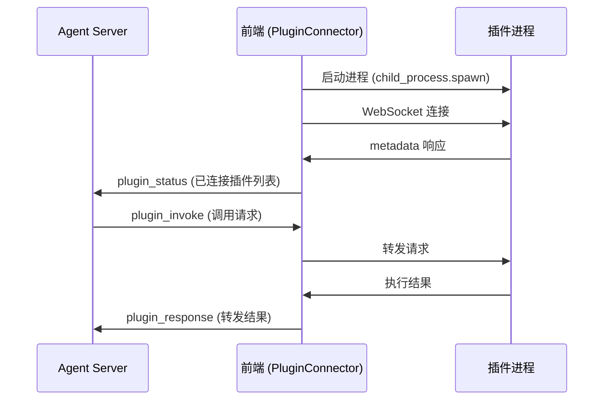
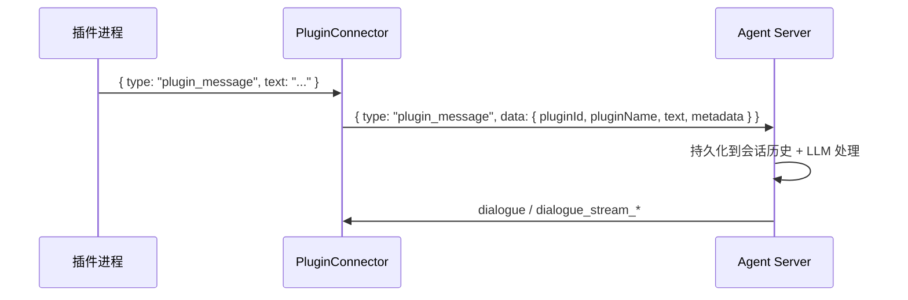

# 前端插件开发指南

本文档介绍如何为 NyaDeskPet 开发前端插件。前端插件作为独立进程运行，通过 WebSocket 与应用通信，语言不限。

## 目录
- [前端插件开发指南](#前端插件开发指南)
  - [目录](#目录)
  - [架构概述](#架构概述)
  - [内置插件](#内置插件)
  - [插件目录结构](#插件目录结构)
  - [metadata.json](#metadatajson)
  - [通信协议](#通信协议)
    - [握手](#握手)
    - [配置请求](#配置请求)
    - [权限请求](#权限请求)
    - [操作请求与响应](#操作请求与响应)
    - [语言切换](#语言切换)
  - [响应内容类型](#响应内容类型)
    - [text — 文本](#text--文本)
    - [image — 图片](#image--图片)
    - [file — 文件](#file--文件)
    - [data — 结构化数据](#data--结构化数据)
    - [mixed — 混合内容](#mixed--混合内容)
    - [错误响应](#错误响应)
  - [权限系统](#权限系统)
    - [危险等级](#危险等级)
    - [权限管理](#权限管理)
  - [配置系统](#配置系统)
  - [Python 插件示例](#python-插件示例)
  - [插件管理](#插件管理)
    - [启动流程](#启动流程)
  - [最佳实践](#最佳实践)
  - [主动发送消息](#主动发送消息)
    - [消息格式](#消息格式)
    - [处理流程](#处理流程)
    - [Python 示例](#python-示例)

## 架构概述



- 前端启动插件进程并主动连接其 WebSocket 服务
- 后端 Agent 通过 `plugin_invoke` / `plugin_response` 与插件间接通信
- `plugin-tool-bridge` Agent 插件自动将已连接插件的 capabilities 注册为 FC 工具

## 内置插件

| 插件 | 目录 | 功能 |
|------|------|------|
| 终端控制 | `plugins/terminal-plugin` | 执行系统命令、管理 Shell 会话 |
| UI 自动化 | `plugins/ui-automation-plugin` | 鼠标键盘模拟、屏幕截图 |
| 文件编辑器 | `plugins/file-editor-plugin` | 读取、创建、编辑文件内容，列出目录，图形化 Diff 展示 |

## 插件目录结构

```
plugins/my-plugin/
  ├── metadata.json       # [必须] 插件元信息
  ├── config.json         # [可选] 配置 Schema（前端自动生成配置 UI）
  ├── main.py             # 插件主程序（语言不限）
  └── requirements.txt    # 依赖
```

## metadata.json

```json
{
  "id": "my-plugin",
  "name": "my-plugin",
  "version": "1.0.0",
  "url": "ws://localhost:8770",
  "autoStart": false,
  "command": {
    "darwin": ["venv/bin/python3", "main.py"],
    "win32": ["venv\\Scripts\\python.exe", "main.py"],
    "linux": ["venv/bin/python3", "main.py"]
  },
  "workingDirectory": "plugins/my-plugin",
  "permissions": [
    {
      "id": "my-plugin.action",
      "dangerLevel": "medium",
      "i18n": {
        "zh-CN": { "name": "执行操作", "description": "执行某项操作" },
        "en-US": { "name": "Execute Action", "description": "Execute an action" }
      }
    }
  ],
  "i18n": {
    "zh-CN": { "displayName": "我的插件", "description": "插件功能描述" },
    "en-US": { "displayName": "My Plugin", "description": "Plugin description" }
  }
}
```

| 字段 | 必须 | 说明 |
|------|------|------|
| `id` | ✅ | 插件唯一标识 |
| `name` | ✅ | 插件名称 |
| `version` | ✅ | 版本号 |
| `url` | ✅ | WebSocket 监听地址 |
| `command` | ✅ | 按平台区分的启动命令数组 |
| `workingDirectory` | ✅ | 工作目录（相对应用根目录） |
| `autoStart` | ❌ | 是否随应用自动启动，默认 `false` |
| `permissions` | ❌ | 权限定义列表 |
| `i18n` | ❌ | 国际化显示名和描述 |

## 通信协议

插件作为 WebSocket 服务端，前端主动连接。所有消息为 JSON 格式。

### 握手

前端连接后发送 `getMetadata`：

**前端 → 插件**
```json
{ "action": "getMetadata", "locale": "zh-CN" }
```

**插件 → 前端**
```json
{
  "type": "metadata",
  "plugin": "my-plugin",
  "locale": "zh-CN",
  "defaultLocale": "en-US",
  "metadata": {
    "name": "my-plugin",
    "version": "1.0.0",
    "displayName": "我的插件",
    "description": "插件功能描述",
    "author": "YourName",
    "type": "external",
    "permissions": ["my-plugin.action"],
    "capabilities": ["doSomething"]
  }
}
```

语言回退：请求的 locale 不支持时，回退到 `defaultLocale`。

### 配置请求

**插件 → 前端**
```json
{ "action": "getConfig", "pluginId": "my-plugin" }
```

**前端 → 插件**
```json
{
  "type": "plugin_config",
  "config": { "key1": "value1", "key2": 42 }
}
```

配置存储位置：`userData/plugins/{id}/config.json`

### 权限请求

危险操作执行前须请求权限：

**插件 → 前端**
```json
{
  "type": "permission_request",
  "requestId": "uuid",
  "permissionId": "my-plugin.action",
  "operation": "do_something",
  "details": { "target": "..." }
}
```

**前端 → 插件**
```json
{
  "type": "permission_response",
  "requestId": "uuid",
  "granted": true
}
```

### 操作请求与响应

**前端 → 插件**（来自 Agent 的 `plugin_invoke` 转发）
```json
{
  "action": "doSomething",
  "requestId": "uuid",
  "params": { "key": "value" }
}
```

**插件 → 前端**
```json
{
  "type": "plugin_response",
  "requestId": "uuid",
  "success": true,
  "action": "doSomething",
  "result": {
    "type": "text",
    "content": { "text": "执行结果" }
  },
  "locale": "zh-CN",
  "requiredPermission": "my-plugin.action"
}
```

### 语言切换

**前端 → 插件**
```json
{ "action": "setLocale", "params": { "locale": "en-US" } }
```

## 响应内容类型

`result` 字段支持 5 种类型：

### text — 文本

```json
{
  "type": "text",
  "content": { "text": "结果文本", "format": "plain" }
}
```

`format` 可选：`plain` / `markdown` / `html`

### image — 图片

```json
{
  "type": "image",
  "content": {
    "data": "<base64>",
    "format": "png",
    "width": 1920,
    "height": 1080,
    "filename": "screenshot.png"
  }
}
```

### file — 文件

```json
{
  "type": "file",
  "content": {
    "filename": "report.pdf",
    "size": 102400,
    "mimeType": "application/pdf",
    "data": "<base64>"
  }
}
```

### data — 结构化数据

```json
{
  "type": "data",
  "content": { "key": "value", "nested": { "data": "here" } }
}
```

### mixed — 混合内容

```json
{
  "type": "mixed",
  "content": [
    { "type": "text", "content": { "text": "执行完成" } },
    { "type": "image", "content": { "data": "<base64>", "format": "png", "width": 800, "height": 600 } }
  ]
}
```

> 所有响应必须包含 `result.type` 字段，不符合规范的响应将被视为错误。

### 错误响应

```json
{
  "type": "plugin_response",
  "requestId": "uuid",
  "success": false,
  "action": "doSomething",
  "error": "操作失败原因",
  "errorKey": "error.some_key",
  "locale": "zh-CN"
}
```

- `errorKey` 可选，供前端国际化错误提示

## 权限系统

### 危险等级

| 等级 | 说明 | 确认策略 |
|------|------|---------|
| `safe` | 无风险 | 自动允许 |
| `low` | 低风险 | 首次确认 |
| `medium` | 中等风险 | 每次确认 |
| `high` | 高风险 | 每次确认 + 显著警告 |
| `critical` | 极度危险 | 每次确认 + 强调警告 |

### 权限管理

- 用户可选「记住选择」避免重复确认
- 权限记录存储在 `userData/plugin-permissions.json`
- 可在插件管理面板撤销已授予的权限

## 配置系统

提供 `config.json` 即可自动生成配置 UI，支持 9 种配置类型：

| type | 说明 |
|------|------|
| `string` | 单行文本 |
| `text` | 多行文本 |
| `int` | 整数（可设 min/max） |
| `float` | 浮点数（可设 min/max） |
| `bool` | 开关 |
| `object` | 嵌套配置 |
| `list` | 字符串列表 |
| `dict` | 键值对列表 |
| `template_list` | 模板化列表（多字段） |

config.json 示例：

```json
[
  {
    "key": "timeout",
    "type": "int",
    "default": 30,
    "min": 1,
    "max": 300,
    "i18n": {
      "zh-CN": { "label": "超时时间（秒）", "hint": "操作最大等待时间" },
      "en-US": { "label": "Timeout (seconds)", "hint": "Max wait time" }
    }
  },
  {
    "key": "dangerousOps",
    "type": "list",
    "default": ["rm -rf", "format"],
    "i18n": {
      "zh-CN": { "label": "危险操作列表" },
      "en-US": { "label": "Dangerous operations" }
    }
  }
]
```

## Python 插件示例

```python
import asyncio
import json
import websockets

class MyPlugin:
    def __init__(self):
        self.config = {}

    async def handle(self, websocket):
        async for raw in websocket:
            msg = json.loads(raw)

            if msg.get("action") == "getMetadata":
                await websocket.send(json.dumps({
                    "type": "metadata",
                    "plugin": "my-plugin",
                    "locale": msg.get("locale", "en-US"),
                    "defaultLocale": "en-US",
                    "metadata": {
                        "name": "my-plugin",
                        "version": "1.0.0",
                        "displayName": "My Plugin",
                        "description": "Example plugin",
                        "author": "Dev",
                        "type": "external",
                        "permissions": [],
                        "capabilities": ["greet"]
                    }
                }))

            elif msg.get("type") == "plugin_config":
                self.config = msg.get("config", {})

            elif msg.get("action") == "greet":
                name = msg.get("params", {}).get("name", "World")
                await websocket.send(json.dumps({
                    "type": "plugin_response",
                    "requestId": msg.get("requestId"),
                    "success": True,
                    "action": "greet",
                    "result": {
                        "type": "text",
                        "content": { "text": f"Hello, {name}!" }
                    }
                }))

    async def start(self):
        # 启动时请求配置
        async with websockets.serve(self.handle, "localhost", 8770):
            await asyncio.Future()

if __name__ == "__main__":
    plugin = MyPlugin()
    asyncio.run(plugin.start())
```

## 插件管理

用户通过以下方式管理插件：

- **顶栏 🧩 按钮** 或 **系统托盘菜单 → 插件管理**
- 面板功能：启动/停止进程、连接/断开 WebSocket、打开目录、配置、权限管理

### 启动流程

1. 用户点击「启动」→ 主进程 `child_process.spawn` 执行 `command`
2. 等待 3 秒后前端连接 `url` 指定的 WebSocket
3. 发送 `getMetadata` 握手
4. 连接成功 → 发送 `plugin_status` 通知后端

## 最佳实践

- **输入验证**：校验所有参数，拒绝非法输入
- **权限检查**：危险操作前先请求权限
- **超时控制**：长时间操作设置合理超时
- **资源清理**：进程退出时释放所有资源
- **错误处理**：捕获所有异常，返回结构化错误响应
- **输出缓冲**：Python 中 `sys.stdout.flush()` 确保输出及时
- **日志**：使用标准错误输出 `stderr` 打印调试信息，避免干扰 JSON 通信

## 主动发送消息

前端插件除了被动响应 Agent 的工具调用外，还可以**主动向 Agent 发送消息**。例如：监控到系统事件、定时提醒、检测到异常等场景。

### 消息格式

插件发送类型为 `plugin_message` 的 WebSocket 消息给前端：

```json
{
  "type": "plugin_message",
  "text": "检测到用户桌面发生了变化",
  "metadata": {
    "source": "desktop-monitor",
    "details": "窗口切换至 VSCode"
  }
}
```

| 字段 | 必须 | 说明 |
|------|------|------|
| `type` | ✅ | 固定为 `plugin_message` |
| `text` | ✅ | 消息正文，将作为用户消息发送给 LLM |
| `metadata` | ❌ | 可选的附加结构化数据 |

### 处理流程



- 前端 PluginConnector 自动补充 `pluginId` 和 `pluginName`
- 消息以 `[插件 pluginName] text` 格式写入会话历史
- Agent 经过完整的 LLM 处理流程（含工具调用、流式输出）后回复

### Python 示例

```python
# 在插件的 WebSocket 处理中，主动发送消息
async def send_proactive_message(websocket, text, metadata=None):
    message = {
        "type": "plugin_message",
        "text": text
    }
    if metadata:
        message["metadata"] = metadata
    await websocket.send(json.dumps(message))

# 使用示例：定时通知
async def monitor_loop(websocket):
    while True:
        event = await check_some_condition()
        if event:
            await send_proactive_message(
                websocket,
                f"检测到事件: {event.description}",
                {"eventType": event.type, "timestamp": event.time}
            )
        await asyncio.sleep(60)
```
